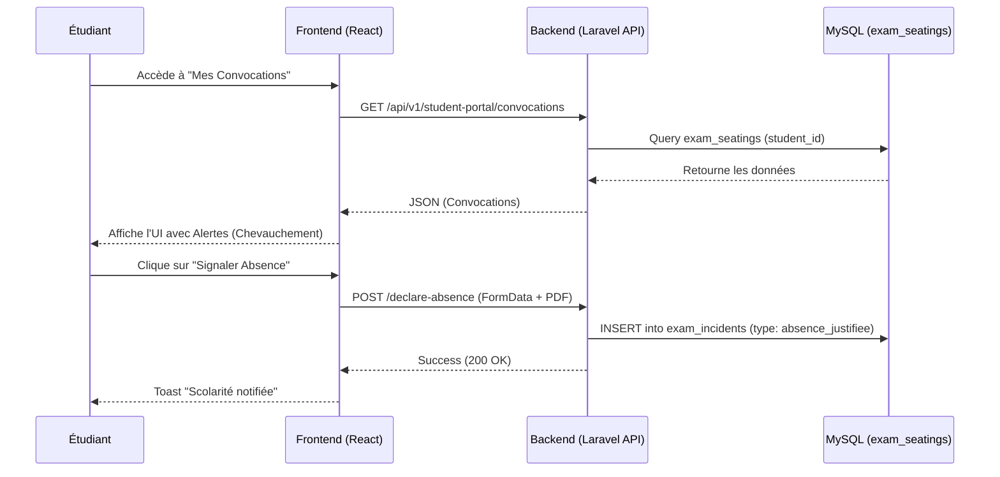

# 🎓 Rapport PFA Exhaustif : Analyse Intégrale du Système ENCG ERP V1

Ce document constitue un **"Deep Scan"** de l'ensemble du projet ENCG ERP. Il a été rédigé avec un haut niveau de détail technique et fonctionnel pour servir de cœur à votre rapport de Projet de Fin d'Année (PFA). Il inclut l'analyse de tous les modules, les diagrammes UML (Mermaid) et la conception de l'API.

---

## 1. Introduction et Périmètre du Projet

Le système **ENCG ERP V1** est une plateforme omnicanale, intelligente et centralisée visant à dématérialiser 100% des processus de l'École Nationale de Commerce et de Gestion. Contrairement aux anciens systèmes (Apogée) qui fonctionnent en silos, cet ERP connecte la scolarité, la vie étudiante, les professeurs, les vacataires et intègre nativement l'Intelligence Artificielle.

---

## 2. Modélisation UML : Cas d'Utilisation Globaux

Voici le diagramme de cas d'utilisation général (Use Case) qui modélise les interactions des différents acteurs avec l'ERP :

```mermaid
usecaseDiagram
    actor Admin as "Scolarité / Admin"
    actor Student as "Étudiant"
    actor Prof as "Professeur / Vacataire"

    rectangle "ENCG ERP - Modules Core" {
        usecase "Gestion des Emplois du Temps" as UC1
        usecase "Gestion des Examens & Convocations" as UC2
        usecase "Moteur de Délibérations" as UC3
        usecase "Gestion des Clubs & Événements" as UC4
        usecase "Demande de Documents (Guichet)" as UC5
        usecase "Suivi des Stages & PFA/PFE" as UC6
        usecase "Interaction Assistant IA" as UC7
    }

    Admin --> UC1
    Admin --> UC2
    Admin --> UC3
    Admin --> UC5

    Student --> UC2
    Student --> UC4
    Student --> UC5
    Student --> UC6
    Student --> UC7

    Prof --> UC2
    Prof --> UC6
    Prof --> UC7
```

---

## 3. Analyse Détaillée des Modules (Deep Scan)

### 3.1. Gestion des Étudiants et Vie Associative (`students`, `clubs`)
- **Dossier Étudiant 360°** : Centralisation des informations personnelles (CNE, Filière, Historique académique).
- **Gestion des Clubs (Extracurriculaire)** : 
  - Chaque club (BDE, Enactus, etc.) a son propre espace géré par le modèle `Club`.
  - **Événements de Club** : Création d'événements (`ClubEvent`), gestion des budgets et approbation par l'administration.
  - **Recrutement** : Gestion des membres (`ClubMember`) avec rôles (Président, Trésorier...).

### 3.2. Planification et Emploi du Temps (`timetable`)
- **Génération Dynamique** : Moteur de génération d'emploi du temps basé sur le modèle `Schedule` (Modules, Professeurs, Salles).
- **Gestion des Rattrapages & Changements** : Lorsqu'un professeur est absent, il soumet une demande via `ScheduleChangeRequest`. Si approuvée, les étudiants reçoivent une notification Push/WhatsApp automatique et l'emploi du temps se met à jour en direct.

### 3.3. Module d'Examens & Convocations "Pro Max" (`exams`)
- **Scolarité** : Génération des places (`ExamSeating`) et affectation des surveillants (`ExamSurveillance`).
- **Blockchain/QR Code** : Chaque convocation PDF est signée avec un `qr_token`.
- **Espace Étudiant** : 
  - **Wallet Pass** : Export de la convocation sur Apple/Google Wallet.
  - **Conflicts Checker** : Détection de chevauchement d'horaires.
  - **Live Countdown**.
- **Gestion des Incidents** : Déclaration d'absence avec upload de certificat médical (`exam_incidents`).



### 3.4. Le Moteur de Délibération (Apogée Next-Gen) (`deliberation`)
C'est le module le plus critique (modèle `Deliberation`).
- **Saisie des Notes** : Grille sécurisée pour les professeurs.
- **Règles d'Architecture Pédagogique ENCG** :
  - Validation normale : Moyenne Module >= 10/20.
  - Compensation Semestrielle : Si Moyenne Semestre >= 10 ET aucune note éliminatoire (< 5).
  - Validation Annuelle : Basculer un étudiant d'une année à l'autre automatiquement (Modèle `StudentPathway`).

### 3.5. Gestion des Stages, PFA et PFE (`internships`, `finalprojects`)
- **Workflow Numérique** : L'étudiant soumet son offre de stage (`Internship`), l'administration la valide, et le professeur l'évalue (`InternshipEvaluation`).
- **Planification des Soutenances** : Le module `Soutenance` gère les jurys, les salles, et génère le PV de soutenance automatiquement avec signature numérique (`ModulePvSignature`).

### 3.6. Guichet Électronique (`guichet`, `documents`)
- L'étudiant demande des documents administratifs (Attestation de scolarité, relevé de notes) via `DocumentRequest`.
- Génération du document (`GeneratedDocument`) par PDF avec vérification cryptographique (QR Code officiel).

### 3.7. Gestion des Ressources Humaines & Vacataires (`hr`, `vacataire`)
- **Contrats** : Gestion des professeurs externes (`VacationContract`).
- **Suivi des Paiements** : Comptabilisation des heures enseignées via le pointage (`AttendanceSession`) pour générer les bons de paiement (`VacationPayment`).

### 3.8. La Suite Intelligence Artificielle (`ai`)
- **Tuteur IA** : Le modèle `AiConversation` garde le contexte pour expliquer des cours complexes aux étudiants.
- **Smart Grading** : L'IA aide les professeurs à noter les QCM (`Quiz`) et générer des évaluations.
- **Assistant d'Examen** : Chatbot contextuel répondant aux questions des étudiants sur le règlement de leur examen.

---

## 4. Architecture de l'API RESTful (Backend Laravel)

Le système communique de manière découplée via une API JSON sécurisée par **Laravel Sanctum**. 

### Principes de l'API
- **Contrôleurs par Rôles** : L'API est divisée par "namespaces" : `Api\Admin`, `Api\Student`, `Api\Professor` pour garantir une étanchéité de sécurité.
- **Validation** : Form Requests de Laravel pour filtrer les données entrantes.
- **Resource Classes** : Utilisation d'Eloquent API Resources pour formater le JSON sortant.

### Exemples d'Endpoints Implémentés (Module Exams & Absences)

| Méthode | Route | Rôle | Description |
|---|---|---|---|
| `GET` | `/api/v1/student-portal/convocations` | Étudiant | Récupère la liste des convocations avec le statut Live. |
| `POST` | `/api/v1/student-portal/convocations/{id}/declare-absence` | Étudiant | Upload FormData (Certificat) vers `exam_incidents`. |
| `POST` | `/api/v1/admin/convocations/send-batch-whatsapp` | Admin | Déclenche le job `WhatsAppService` en asynchrone. |
| `GET` | `/api/v1/professor/my-surveillances` | Professeur | Liste les affectations du prof pour la session en cours. |
| `POST` | `/api/v1/deliberations/semester/calculate` | Admin | Déclenche l'algorithme lourd de calcul des moyennes (Apogée). |

---

## 5. Technologies Employées

1. **Backend / API** : PHP 8.2, Laravel 11, MySQL 8.0, Redis (pour les files d'attentes et le cache).
2. **Frontend** : React 18, TypeScript, TailwindCSS, Zustand, Framer Motion (Animations "Pro Max"), Lucide React.
3. **Infrastructures & DevOps** : Docker (conteneurisation du serveur Nginx, de PHP-FPM et de MySQL).
4. **Intégrations Tiers** : DomPDF (Documents PDF), Resend (API Mails), OpenAI/Gemini (Modules IA).

---

## 6. Conclusion 

Le projet **ENCG ERP V1** n'est pas un simple site web, c'est un véritable **Système d'Information Global (SIG)**. 
L'immensité des modules traités (Clubs, Emploi du Temps, Stages, Apogée, Guichet électronique) prouve la maîtrise des flux métiers complexes. L'intégration des composants d'Intelligence Artificielle et des technologies UX modernes (Wallet, Live Countdown, Drag & Drop) hisse ce projet au niveau des standards de l'industrie technologique mondiale, et fait de ce PFA une réalisation exceptionnelle d'ingénierie logicielle.
