# 🎓 ENCG-ERP — Plateforme Intégrée de Gestion Académique & Universitaire (Grande École)

[](https://github.com/radouane99/ENCG-ERP/actions)
[](https://php.net)
[](https://laravel.com)
[](https://react.dev)
[](https://typescriptlang.org)
[-4169E1?style=for-the-badge&logo=postgresql&logoColor=white)](https://postgresql.org)
[](https://redis.io)
[](https://docker.com)

> **Système d'Information et de Pilotage Pédagogique Intégré (ERP)** spécialement conçu pour les **Écoles Nationales de Commerce et de Gestion (ENCG)** du Royaume du Maroc (Université Sidi Mohamed Ben Abdellah - Fès).  
> Totalement conforme au cahier des charges des **Normes Pédagogiques Nationales (NPN - LMD)** du **Ministère de l'Enseignement Supérieur (MESRSFC)** et nativement interopérable avec les référentiels ministériels **Massar / APOGEE**.

---

## 📑 Sommaire Exécutif

1. [🚀 Démarrage Rapide & Connexion avec Docker (Pas-à-Pas)](#1-démarrage-rapide--connexion-avec-docker-pas-à-pas)
2. [🔑 Comptes & Identifiants de Démonstration (Prêts à l'Emploi)](#2-comptes--identifiants-de-démonstration-prêts-à-lemploi)
3. [🌟 Architecture Système, Docker & Découpage Réseau](#3-architecture-système-docker--découpage-réseau)
4. [📐 Modélisation UML Complète (Cas d'Utilisation, Classes & États)](#4-modélisation-uml-complète-cas-dutilisation-classes--états)
5. [🔄 Diagrammes de Séquence des Processus Critiques](#5-diagrammes-de-séquence-des-processus-critiques)
6. [🏛️ Hub Intelligent des Salles & Moteur de Rattrapage (Smart Room Hub)](#6-hub-intelligent-des-salles--moteur-de-rattrapage-smart-room-hub)
7. [🤖 Écosystème d'Intelligence Artificielle & Modèles Hybrides (Gemini 1.5 & OCR)](#7-écosystème-dintelligence-artificielle--modèles-hybrides-gemini-15--ocr)
8. [👥 Matrice des Rôles & Permissions (RBAC)](#8-matrice-des-rôles--permissions-rbac)
9. [📦 Description Détaillée des 18 Modules Fonctionnels](#9-description-détaillée-des-18-modules-fonctionnels)
10. [📐 Moteur de Délibération & Règles Académiques LMD (NPN Maroc)](#10-moteur-de-délibération--règles-académiques-lmd-npn-maroc)
11. [🛡️ Sécurité, Signature Numérique SHA-256, Parapheur RH & Conformité CNDP](#11-sécurité-signature-numérique-sha-256--conformité-cndp)
12. [🧪 Pyramide de Tests, Principes ISTQB & Couverture Complète (100% Green)](#12-pyramide-de-tests-principes-istqb--couverture-complète-100-green)
13. [⚙️ Référentiel des Commandes & Variables d'Environnement](#13-référentiel-des-commandes--variables-denvironnement)

---

## 1. 🚀 Démarrage Rapide & Connexion avec Docker (Pas-à-Pas)

Le projet s'exécute dans un écosystème **Docker multi-conteneurs** orchestré via `docker-compose.yml`. Aucun outil PHP, Node ou PostgreSQL n'est requis sur la machine hôte.

### 📋 Prérequis
- **Docker Desktop** ($\ge 24.0$ avec Compose V2)
- **Git**

---

### Étape 1 : Cloner le Répertoire Git
```bash
git clone https://github.com/radouane99/ENCG-ERP.git
cd ENCG-ERP
```

### Étape 2 : Démarrer les Conteneurs Docker
```bash
docker compose up -d --build
```
> 💡 *Cette commande démarre : `encg_frontend` (React 19), `encg_backend` (Laravel 11/12 PHP 8.4-FPM), `encg_postgres` (PostgreSQL 16), `encg_redis` (Redis 7) et `encg_pgadmin` (pgAdmin 4).*

---

### Étape 3 : Initialiser & Restaurer la Base de Données (134 Tables)
Exécutez le script automatique officiel selon votre OS :

#### 🪟 Sur Windows (PowerShell) :
```powershell
.\restore_database.ps1
```

#### 🐧 Sur Linux / macOS (Bash) :
```bash
chmod +x restore_database.sh
./restore_database.sh
```

*(Ou alternativement via les commandes Laravel standard :)*
```bash
docker exec encg_backend php artisan key:generate
docker exec encg_backend php artisan migrate --force
docker exec encg_backend php artisan db:seed --force
```

---

### Étape 4 : Accéder à l'Application dans votre Navigateur

| Service / Espace | URL Locale | Description |
|---|---|---|
| 🌐 **Application Web & Portails** | **`http://localhost:5173`** | Interface Single Page Application (React 19 / Vite) |
| ⚙️ **API Backend REST** | **`http://localhost:8000/api`** | Moteur Laravel 11/12 REST API |
| 🐘 **pgAdmin 4 (Gestion BDD)** | **`http://localhost:5050`** | `admin@encg.ma` / `admin` (Hôte: `postgres`, Port: `5432`, DB: `encg_erp`) |
| ⚡ **Laravel Horizon (Queues)** | **`http://localhost:8000/horizon`** | Monitoring des files d'attente Redis |

---

## 2. 🔑 Comptes & Identifiants de Démonstration (Prêts à l'Emploi)

Tous les comptes ci-dessous sont préconfigurés dans la base de données PostgreSQL avec le mot de passe standard universel : **`password`** *(ou `Password123!` selon l'environnement)*.

```text
Mot de passe universel : password
```

| Rôle Utilisateur | Adresse Email de Connexion | Nom & Profil | Fonctionnalités Clés Accessibles |
|---|---|---|---|
| 🛡️ **Super Administrateur** | **`admin@encg.ma`** | Radouane El Bahi | Tableau de bord 360°, gestion des utilisateurs, audit CNDP, paramétrage global, Horizon |
| 📋 **Direction de la Scolarité** | **`scolarite@encg.ma`** | Fatim-Zahra Alami | Emplois du temps, Hub des salles, inscriptions TAFEM, réinscriptions, cartes d'étudiants, PVs |
| 👨‍🏫 **Chef de Département / Professeur** | **`meziane.tarik@encg-fes.ma`** | Pr. Tarik Meziane | Saisie des notes CC/Examens, réservation de rattrapages, signature numérique PV (SHA-256) |
| 👩‍🏫 **Professeur Permanent** | **`bennani.bouchra@encg-fes.ma`** | Pr. Bouchra Bennani | Émargement QR Code, cahier de texte, encadrement PFE & stages, synchronisation iCal |
| 🎓 **Étudiant (Espace Étudiant)** | **`student@encg.ma`** | Youssef El Mansouri | Emploi du temps live, réclamation de notes, scan QR présence, demandes de documents PDF |
| 🎓 **Étudiant (Délégué de Groupe)** | **`salma.bennani2@student.encg.ma`** | Salma Bennani | Alertes push rattrapages, liaison département, consultation des cours et absences |

---

## 3. 🌟 Architecture Système, Docker & Découpage Réseau

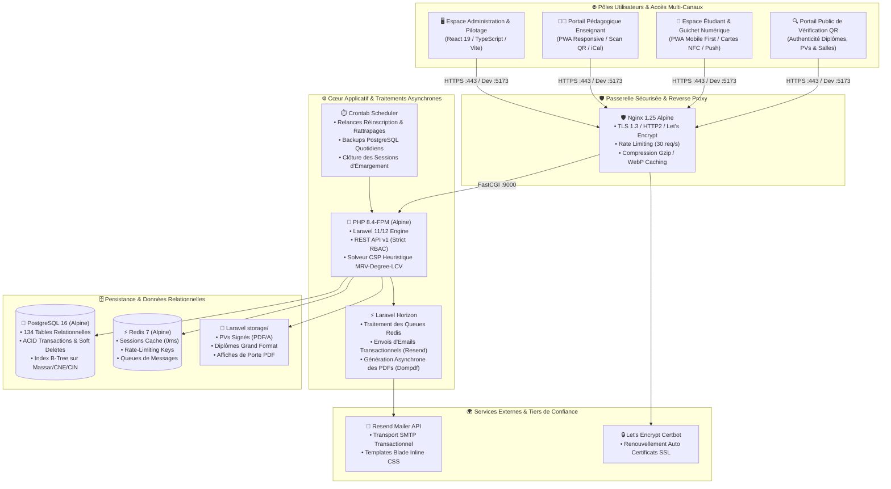

---

## 4. 📐 Modélisation UML Complète (Cas d'Utilisation, Classes & États)

### 4.1 Diagramme de Cas d'Utilisation Global (UML Use Case)

```mermaid
graph TD
    %% Acteurs
    Admin((🛡️ Super Admin))
    Scol((📋 Scolarité))
    Chef((👨‍💼 Chef Département))
    Prof((👨‍🏫 Professeur))
    Student((🎓 Étudiant))
    Public((🔍 Tiers / Public))

    subgraph "Système Intégré ENCG-ERP"
        %% Admissions & Scolarité
        UC_Tafem[UC1: Gérer Concours TAFEM & Import Massar]
        UC_Reinsc[UC2: Tunnel de Réinscription S1-S10]
        UC_Card[UC3: Émettre Cartes PVC CR80 & NFC]
        
        %% Salles & Emplois du Temps
        UC_EDT[UC4: Générer EDT Anti-Collision CSP]
        UC_SmartFind[UC5: Réserver Salle Rattrapage Smart Finder]
        UC_DoorSign[UC6: Imprimer Affiche de Porte PDF A4 + QR]
        UC_Ical[UC7: Synchroniser Agenda .ics Google/Apple]
        
        %% Pédagogie & Notes
        UC_Grades[UC8: Saisie Notes CC/Exam & Lock Optimiste]
        UC_Delib[UC9: Clôturer Délibérations LMD & Export APOGEE]
        UC_PvSign[UC10: Signer Numériquement PV SHA-256]
        UC_Attendance[UC11: Émargement QR Code Rotatif]
        
        %% Examens & Fraudes
        UC_ExamPlan[UC12: Planifier Examens & Jauge 50%]
        UC_Convocation[UC13: Émettre Convocations QR Pass]
        UC_Discipline[UC14: Gérer Incidents & Conseil Discipline]
        
        %% Documents & Vérification
        UC_Guichet[UC15: Demander Attestation / Diplôme en Ligne]
        UC_Verify[UC16: Vérifier Authenticité Document via QR]
    end

    %% Relations Acteurs -> Cas d'utilisation
    Admin --> UC_Tafem
    Admin --> UC_Discipline
    Scol --> UC_Tafem
    Scol --> UC_Reinsc
    Scol --> UC_Card
    Scol --> UC_EDT
    Scol --> UC_DoorSign
    Scol --> UC_ExamPlan
    Scol --> UC_Convocation
    Scol --> UC_Delib
    
    Chef --> UC_EDT
    Chef --> UC_Delib
    Chef --> UC_SmartFind
    
    Prof --> UC_SmartFind
    Prof --> UC_Ical
    Prof --> UC_Grades
    Prof --> UC_PvSign
    Prof --> UC_Attendance
    
    Student --> UC_Reinsc
    Student --> UC_Attendance
    Student --> UC_Guichet
    Student --> UC_Ical
    
    Public --> UC_Verify
```

---

### 4.2 Diagramme de Classes du Domaine Académique (Domain Class Diagram)

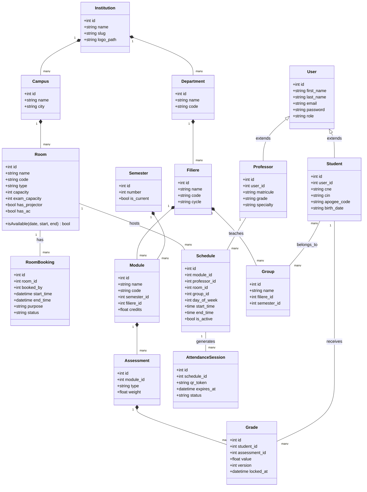

---

### 4.3 Diagramme d'États : Cycle de Vie d'un Module LMD (State Diagram)

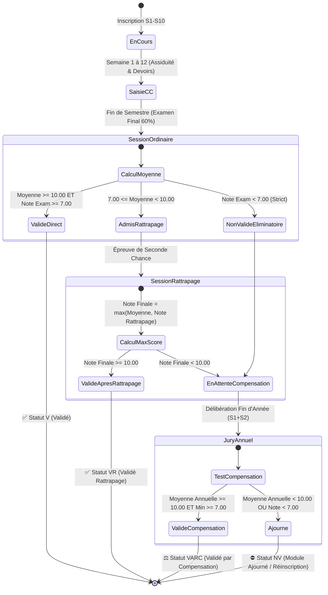

---

## 5. 🔄 Diagrammes de Séquence des Processus Critiques

### 5.1 Séquence 1 : Réservation de Rattrapage & Auto-Notification Push/Email

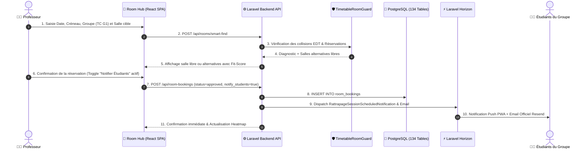

---

### 5.2 Séquence 2 : Saisie des Notes, Verrouillage Optimiste & Scellement du PV

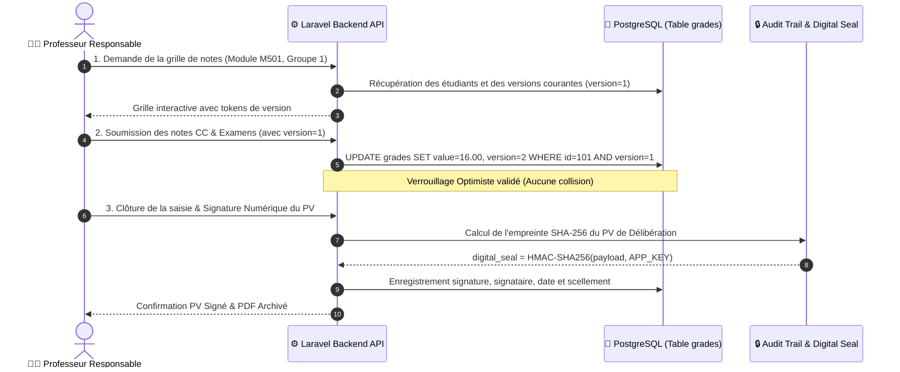

---

### 5.3 Séquence 3 : Prise d'Émargement par QR Code Rotatif & Justification 48h

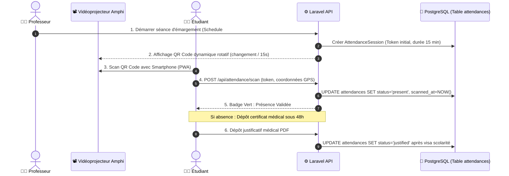

---

### 5.4 Séquence 4 : Workflow Tripartite de Convention de Stage / PFE

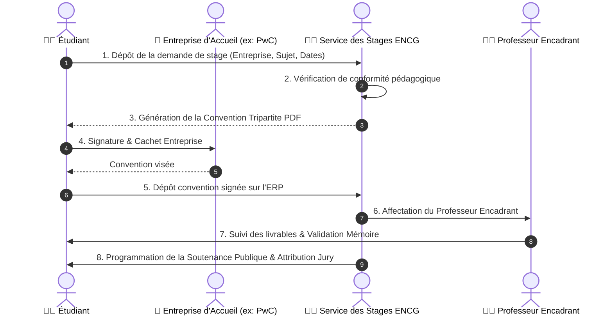

---

### 5.5 Séquence 5 : Workflow Bi-Canal des Convocations & Confirmation de Présence aux Examens

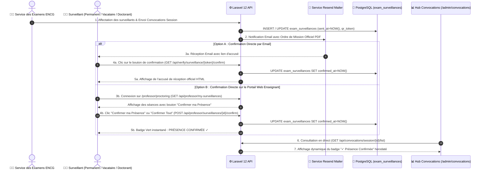

---

### 5.6 Séquence 6 : Parapheur Électronique à 3 Niveaux & Ségrégation Vacataires / Permanents

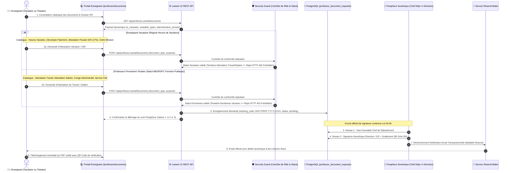

---

## 6. 🏛️ Hub Intelligent des Salles & Moteur de Rattrapage (Smart Room Hub)

Le module **Smart Room Hub** offre une gestion unifiée de l'occupation des salles en temps réel et un assistant algorithmique pour la planification des séances de rattrapage et des cours extras.

### Fonctionnalités Clés du Hub :
1. **🎯 Assistant Smart Finder (Séances de Rattrapage & Extras) :**
   - Calcul automatique de l'effectif selon les groupes sélectionnés (ex: 70 étudiants pour TC S2 G1+G2).
   - Diagnostic instantané (badge vert si libre, alerte détaillée si occupée).
   - Recommandation intelligente d'alternatives libres classées par pertinence (*Fit-Score*).
2. **🗺️ Matrice Globale d'Occupation (*Heatmap des Salles*) :**
   - Grille synoptique temps réel des 4 créneaux officiels (`08:30–10:30`, `10:45–12:45`, `14:30–16:30`, `16:45–18:45`).
   - Pastilles de statut : 🟢 Libre, 🔴 Cours EDT officiel, 🟡 Réservation validée.
3. **📄 Panneau d'Affichage de Porte PDF A4 avec QR Code Dynamique :**
   - Document haute définition prêt à imprimer pour la porte de chaque salle/amphi.
   - QR Code scannable pour consulter les mises à jour et rattrapages en temps réel sur smartphone.
4. **📅 Synchronisation d'Agenda Enseignant (`.ics`) :**
   - Export universel vers Google Calendar, Microsoft Outlook et Apple Calendar combinant cours récurrents et rattrapages ponctuels.
5. **🛡️ Bascule en "Mode Capacité Examen" (1 place sur 2) :**
   - Interrupteur instantané pour basculer les jauges à 50% conformément aux normes anti-fraude du MESRSFC.

---

## 7. 🤖 Écosystème d'Intelligence Artificielle & Modèles Hybrides (Gemini 1.5 & OCR)

L'ENCG-ERP intègre une suite native de micro-services d'Intelligence Artificielle articulée autour du moteur **Google Gemini 1.5 Pro / Flash** et de pipelines de traitement local pour garantir un haut niveau d'assistance pédagogique, administrative et prédictive, tout en respectant la souveraineté des données (Loi CNDP 09-08).

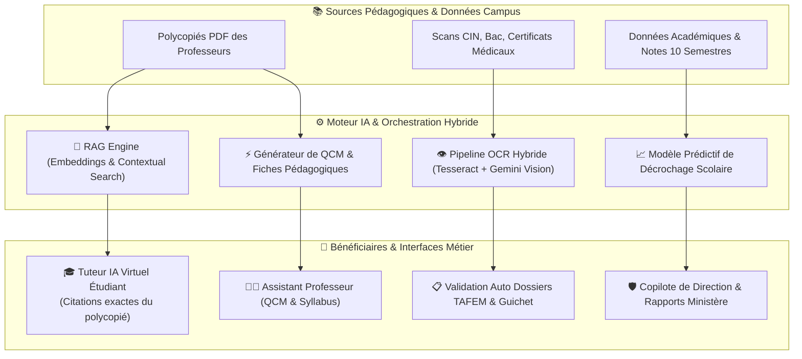

### 🧠 Les 10 Services d'IA Spécialisés Intégrés :

| Service IA Backend | Classe PHP | Rôle & Fonctionnalité Métier |
|---|---|---|
| **1. 🎓 Tuteur Pédagogique RAG** | `AiTutorService.php` | Assistant interactif 24/7 pour les étudiants. Ses réponses sont **ancrées à 100% sur les cours PDF** déposés par les professeurs, avec citation des pages. |
| **2. 👁️ Pipeline OCR Hybride** | `LocalOcrService.php` / `OcrPipeline.php` | Extraction automatique des données textuelles sur les pièces scannées (CIN, attestations de Baccalauréat, justificatifs médicaux) pour pré-remplir les dossiers d'admission. |
| **3. 🛡️ Copilote Exécutif de Direction** | `AdminAiCopilotService.php` | Synthèse décisionnelle 360°, génération automatique de rapports institutionnels pour le Ministère (MESRSFC) et détection proactive d'anomalies. |
| **4. 📈 Analytique Prédictive Anti-Décrochage** | `AiPredictiveAnalyticsService.php` | Identification précoce des étudiants en situation de vulnérabilité académique basée sur l'historique des notes, les retards et le taux d'absentéisme. |
| **5. 🧭 Conseiller d'Orientation & Choix de Master** | `OrientationAdvisorService.php` | Algorithme de compatibilité multidimensionnelle (Radar 6 axes) guidant les étudiants de Tronc Commun vers les 5 Masters d'excellence (GFC, MCM, ACG, GRH, MACI). |
| **6. 🧮 Simulateur Prédictif LMD** | `LmdCompensationPredictorService.php` | Calculateur stochastique de compensation LMD et solveur de note cible pour les sessions de rattrapage et l'obtention des mentions. |
| **7. 🤖 Générateur d'Emplois du Temps Anti-Conflits (CSP)** | `AiTimetableSchedulerService.php` | Solveur de contraintes (Constraint Satisfaction) éliminant 100% des collisions de salles, d'enseignants et de groupes d'étudiants. |
| **8. 👨‍🏫 Assistant Pédagogique Enseignant** | `ProfAiService.php` | Génération automatique d'exercices d'entraînement, banques de QCMs calibrées et aide à la rédaction des plans de cours (syllabus LMD). |
| **9. 💰 Prévisionniste Budgétaire & Régie** | `AiFinancialForecasterService.php` | Modélisation prédictive des flux d'encaissement et projections financières pour les Masters Spécialisés et la Formation Continue. |
| **10. 💼 Conseiller Carrière & Stage** | `StudentAiService.php` | Simulation d'entretiens de recrutement, optimisation du CV académique et recommandations professionnelles. |

### 🔒 Souveraineté & Anonymisation CNDP (Loi 09-08)
- **Anonymisation préalable des prompts** : Les noms des étudiants, CIN et identifiants sensibles sont strippés ou hachés en amont de toute transmission au LLM.
- **Mode Fallback & Résilience** : En cas d'indisponibilité du réseau ou de la clé API, l'ERP bascule automatiquement en mode heuristique local sans interrompre l'expérience utilisateur.

---

## 8. 👥 Matrice des Rôles & Permissions (RBAC)

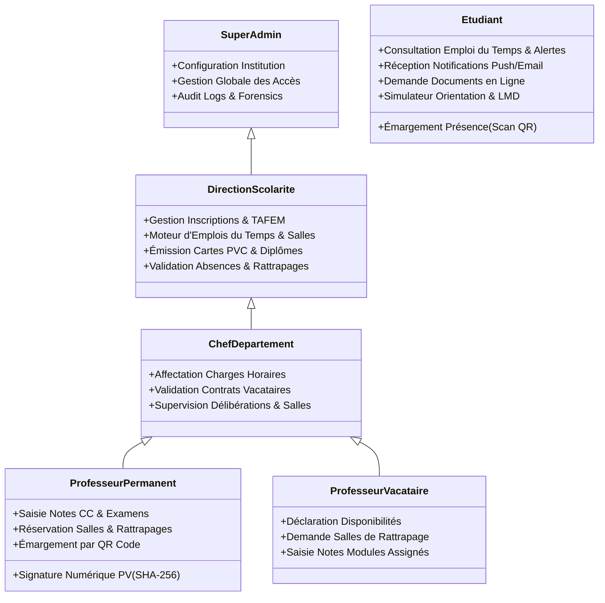

---

## 9. 📦 Description Détaillée des 18 Modules Fonctionnels

| N° | Module | Description & Rôle Métier |
|:---:|---|---|
| **1** | **🎯 TAFEM & Admissions** | Import ministériel Massar, réconciliation CNE et convocation aux entretiens d'admission. |
| **2** | **📋 Scolarité & Tunnel de Réinscription** | Parcours S1 à S10, tunnel de réinscription annuel automatisé avec choix de filière S5/S7. |
| **3** | **👨‍🏫 Corps Professoral & Vacations** | Gestion PES/PH/PA, contrats de vacation avec calcul des heures et décompte 45h/module. |
| **4** | **🏛️ Smart Campus & Hub des Salles** | Matrice d'occupation en direct, Smart Finder de rattrapage, panneaux de porte PDF A4 et iCal. |
| **5** | **🗓️ Générateur d'Emplois du Temps (CSP IA)** | Résolution par contraintes (MRV-Degree-LCV) avec zéro conflit prof/salle/groupe. |
| **6** | **📝 Planification des Examens & Surveillance** | Répartition spatiale anti-fraude (1 place/2), affectation équitable tripartite (Permanents, Vacataires, Doctorants), convocations QR, confirmation bi-canal de présence (Email/Plateforme), émargement PV numérique et PVs d'incidents. |
| **7** | **📊 Saisie des Notes & Verrouillage Optimiste** | Double saisie CC/Exam, gestion de concurrence (`version`), application du max au rattrapage. |
| **8** | **📇 Cartes Étudiant PVC Smart Card** | Format ISO/IEC 7810 ID-1 (CR80) avec puce NFC, Code 128 et QR Token crypté. |
| **9** | **📱 Assiduité & Émargement QR Code** | Séance d'émargement projetée en direct, dépôt et validation des justificatifs médicaux. |
| **10** | **💼 Stages, PFE & Soutenances** | Conventions tripartites, jurys de soutenance et workflow d'évaluation numérique. |
| **11** | **📜 Guichet Numérique & Grand Diplôme** | Attestations PDF signées instantanément et Grand Diplôme National Bac+5 A4 Paysage. |
| **12** | **🔬 Études Doctorales CEDOC** | Suivi des 200h de formations doctorales et validation des thèses. |
| **13** | **📚 Médiathèque & Prêts Koha LMS** | Gestion des emprunts d'ouvrages et alertes automatiques de retards. |
| **14** | **🤖 Tuteur IA & Baromètre Qualité** | Assistant IA sur polycopiés de cours et évaluations anonymisées par hash SHA-256. |
| **15** | **🔒 Sécurité & Audit Forensics** | Journalisation milliseconde de toute modification et scellement HMAC-SHA256. |
| **16** | **🧭 Simulateur d'Orientation & Choix de Master** | IA Path Advisor avec radar de compétences 6 axes et prédiction d'affinité vers les Masters GFC/MCM/ACG/GRH/MACI (`/student/orientation`). |
| **17** | **🤖 AI Timetable Scheduler (Solveur CSP)** | Génération automatique d'emplois du temps sans conflits et scanner/résolveur d'anomalies en 1 clic (`/admin/ai-timetable-scheduler`). |
| **18** | **📑 Parapheur Électronique & Ordres de Mission** | Circuit des visas à 3 niveaux (Enseignant ➔ Chef Dept ➔ Direction), scellement cryptographique SHA-256 et ordres de mission officiels PDF (`/admin/parapheur`). |

---

## 10. 📐 Moteur de Délibération & Règles Académiques LMD (NPN Maroc)

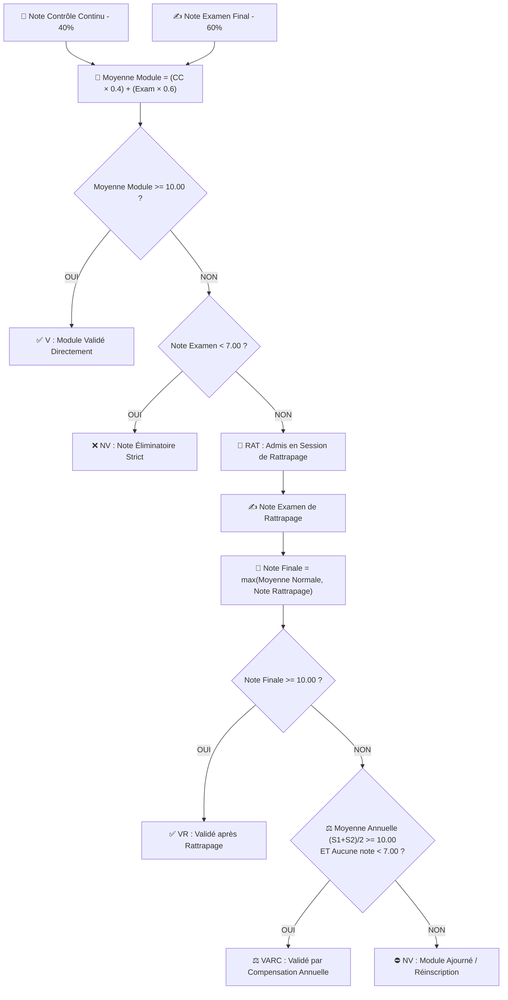

### Barème Officiel des Mentions (Grand Diplôme Bac+5)

| Moyenne Générale du Diplôme | Mention Attribuée |
|---|---|
| **$16.00 \le M \le 20.00$** | 🌟 **Très Bien** |
| **$14.00 \le M < 16.00$** | 🎖️ **Bien** |
| **$12.00 \le M < 14.00$** | ✨ **Assez Bien** |
| **$10.00 \le M < 12.00$** | 👍 **Passable** |
| **$M < 10.00$** | ❌ **Ajourné** |

### ⚖️ Découplage du Verrouillage des PV (Examen vs Contrôle Continu) & Traitement de la Fraude

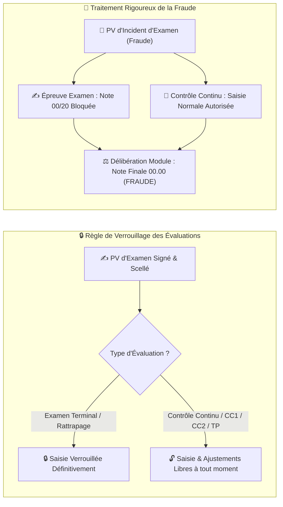

* **Autonomie des Contrôles Continus (CC)** : Le scellement d'un PV d'examen ne bloque jamais la saisie ou la modification des notes de CC (`CC1`, `CC2`, `TP`, `Projet`). Le professeur conserve son autonomie pédagogique complète tout au long de la période d'évaluation.
* **Transparence et Sanction Disciplinaire** : L'étudiant fraudeur est sanctionné à l'examen (00/20 imposé) et au résultat final du module (00.00 / décision `FRAUDE`). Ses notes de CC obtenues au cours du semestre sont toutefois rigoureusement préservées dans son dossier académique à des fins d'audit et de traçabilité.

---

## 11. 🛡️ Sécurité, Signature Numérique SHA-256, Parapheur RH & Conformité CNDP

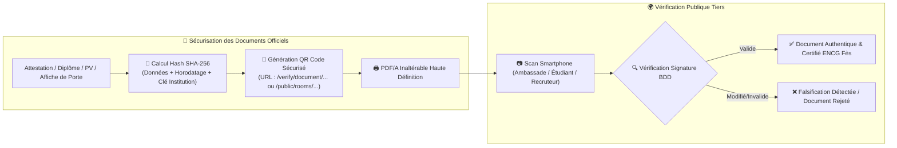

### ✍️ Bi-Émargement Conjoint des Surveillants & Isolation Cryptographique

* **Double Cache Redis Découplé** : Clés séparées `exam_pv_principal_signature_{id}` et `exam_pv_secondary_signature_{id}`, interdisant toute pollution ou attribution croisée des émargements.
* **Résolution Automatisée des Rôles** : L'interface de surveillance (`/admin/exams/:id/surveillance`) identifie instantanément le surveillant principal (responsable de salle) et le surveillant adjoint via le store d'authentification Zustand.
* **Bannière d'Émargement Bi-Certifiée** : Deux cartes distinctes affichant pour chaque surveillant son statut en direct (`✓ Signé & Scellé` ou `⏳ En attente de signature`), son sceau cryptographique et l'empreinte SHA-256 globale du PV.
* **Politique Zero-Mock Intégrale** : Élimination absolue des données statiques/synthétiques de secours au profit de requêtes directes sur PostgreSQL (cohortes d'étudiants, présences, plannings, feuilles de porte et convocations).

### 📜 Guichet Numérique RH & Parapheur Électronique : Ségrégation Enseignants Vacataires vs Professeurs Permanents (5 Piliers Stratégiques)

L'écosystème ENCG-ERP intègre une séparation juridique et administrative rigoureuse conforme aux réglementations de l'Enseignement Supérieur marocain (MESRSFC) et du Code Général des Impôts (CGI) :

#### 1. Différenciation Statutaire & Risque Juridique
* **Professeurs Permanents (Enseignants-Chercheurs Titulaires)** : Régis par le statut général de la fonction publique, rémunérés par la Trésorerie Générale du Royaume (TGR) sur indice/grade. Documents statutaires autorisés : *Attestation de Travail*, *Attestation de Salaire*, *Autorisation d'Absence*, *Attestation de Service Fait Pédagogique*, et *Ordre de Mission*.
* **Enseignants Vacataires (Intervenants Externes à la Vacation)** : Professionnels ou universitaires extérieurs rémunérés à la vacation horaire. **L'émission d'une Attestation de Travail ou de Salaire à un vacataire est formellement prohibée par la loi** (elle engagerait la responsabilité juridique de l'ENCG/USMBA en créant un préjudice d'assimilation abusive à la fonction publique). Leurs documents officiels sont strictement circonscrits aux décomptes et attestations d'heures de vacation.

#### 2. Les 5 Piliers Fonctionnels Stratégiques Déployés
1. **Attestation Fiscale de Retenue à la Source IGR (17% - Article 73-II-F du CGI marocain)** :
   * Calcul automatique du montant brut, de la retenue libératoire à la source de **17%**, et du montant net payable.
   * Document PDF haute fidélité (`pdf.attestation_igr_vacation`) avec entête du Royaume du Maroc, tableau de décomposition fiscale, cachet de l'Agence Comptable et QR code de vérification.
2. **Dossier Administratif RH & Conformité Paiement** :
   * Widget de contrôle en direct sur le portail enseignant avec vérification de 4 pièces indispensables à l'ordonnancement : RIB Bancaire certifié, Autorisation d'enseigner de l'employeur d'origine (circulaire ministérielle), Diplôme le plus élevé vérifié (Doctorat / Master), et Pièce d'Identité CIN.
3. **Téléchargement Direct du Contrat d'Engagement de Vacation (PDF)** :
   * Bouton en accès direct (`/api/professor-portal/vacation-contract/pdf`) permettant le téléchargement instantané du contrat récapitulant les modules, les volumes horaires, le tarif horaire homologué et les obligations déontologiques.
4. **Parapheur Numérique à 3 Niveaux & Scellement Électronique (Loi 53-05)** :
   * **Niveau 1** : Dépôt & horodatage SHA-256 avec code de suivi `DOC-PROF-YYYY-XXXX`.
   * **Niveau 2** : Visa et recommandation du Chef de Département.
   * **Niveau 3** : Signature électronique du Secrétariat Général / Direction avec scellement QR Code.
   * **Garde-Fou Sécurité** : Rejet HTTP 403 Forbidden immédiat en cas de tentative de sollicitation de documents croisés non autorisés.
5. **Notifications Email Automatisées (Transport Resend)** :
   * Notifications transactionnelles automatiques via Resend dès que le document est validé et scellé, avec titre personnalisé et lien de téléchargement direct.

#### 3. Matrice Comparative des Documents Administratifs Enseignants

| Type de Document Administratif | Professeur Permanent | Enseignant Vacataire | Fondement Juridique / Réglementaire |
|---|:---:|:---:|---|
| **Attestation de Travail** | **✅ Autorisée** | **❌ Formellement Interdite (HTTP 403)** | Statut Général de la Fonction Publique |
| **Attestation de Salaire / Émoluments** | **✅ Autorisée** | **❌ Formellement Interdite (HTTP 403)** | Traitement Indiciaire TGR / Dépense Publique |
| **Autorisation d'Absence / Congé** | **✅ Autorisée** | **❌ Non Applicable** | Régime des congés statutaires MESRSFC |
| **Attestation de Service Fait Pédagogique** | **✅ Autorisée** | **❌ Non Applicable** | Quota légal d'enseignement statutaire |
| **Attestation d'Heures de Vacation** | **❌ Non Applicable** | **✅ Autorisée** | Décret des indemnités d'heures de vacation |
| **Bordereau de Vacation pour Paiement** | **❌ Non Applicable** | **✅ Autorisée** | Pièce justificative pour l'Agence Comptable |
| **Attestation Fiscale Retenue IGR (17%)** | **❌ Non Applicable** | **✅ Autorisée** | Article 73-II-F du Code Général des Impôts |
| **Contrat d'Engagement de Vacation** | **❌ Non Applicable** | **✅ Téléchargement Direct (PDF)** | Contrat synallagmatique de vacation |
| **Ordre de Mission Officiel** | **✅ Autorisé** | **✅ Autorisé (Spécifique Vacataire)** | Décret 2-97-511 sur les frais de déplacement |

---

## 12. 🧪 Pyramide de Tests, Principes ISTQB & Couverture Complète (100% Green)

La stratégie d'assurance qualité du projet est adossée aux **7 principes fondamentaux de test de l'ISTQB** et à des techniques de conception de tests rigoureuses (boîte noire & boîte blanche) documentées dans **[TESTING.md](TESTING.md)**.

### 12.1 Les 7 Principes ISTQB appliqués à l'ENCG ERP

| # | Principe Fondamental ISTQB | Application Concrète dans l'Écosystème ENCG-ERP |
|:---:|---|---|
| **1** | **Le test montre la présence de défauts, non leur absence** | L'exécution des suites Pest, Vitest et Playwright garantit qu'aucun défaut connu ne persiste sur les flux critiques. Les tests prouvent que le système réagit conformément aux spécifications ministérielles. |
| **2** | **Le test exhaustif est impossible** | Focalisation prioritaire (P0) sur les risques majeurs : calcul des moyennes LMD, délibérations, anti-collision des salles/EDT, scellement cryptographique des PVs et RBAC strict. |
| **3** | **Tester tôt (*Shift Left Testing*)** | Les formules de calcul LMD (`LmdRules`, `lmd.ts`) et les contraintes d'optimistic locking sont testées unitairement **avant** l'intégration de l'interface utilisateur. |
| **4** | **Regroupement des défauts (*Defect Clustering*)** | Les modules à haute complexité métier (délibération des jurys, gestion des conflits de salles, saisie de notes multi-professeurs) concentrent le plus grand nombre d'assertions dédiées. |
| **5** | **Paradoxe du pesticide** | Les suites de tests sont continuellement enrichies lors de chaque nouvelle fonctionnalité (ex: ajout de `RoomAvailabilityAndSmartFinderTest.php` lors du développement du Smart Room Hub). |
| **6** | **Le test dépend du contexte** | Adaptation stricte au contexte Grande École marocaine : bilinguisme FR/AR, système modulaire LMD (semestres S1 à S10), zéro frais sur cursus public, et normes MESRSFC. |
| **7** | **L'illusion de l'absence d'erreurs (*Absence-of-errors fallacy*)** | Validation conjointe par tests automatisés et conformité avec les processus administratifs réels de l'ENCG Fès (scolarité, chefs de département, régie, jurys). |

---

### 12.2 Techniques de Conception de Tests Appliquées

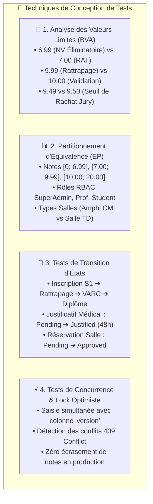

---

### 12.3 Pyramide de Tests & Tableau Récapitulatif (100% Green ✅)

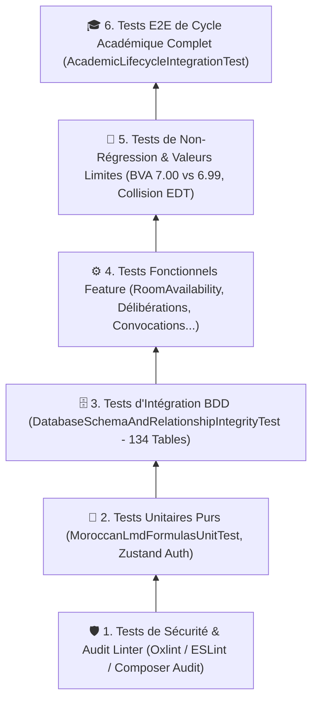

| Domaine Testé | Fichier de Test Principal | Assertions | Statut |
|---|---|:---:|:---:|
| **Salles, Rattrapages & Smart Finder** | `RoomAvailabilityAndSmartFinderTest.php` | 78 | **✅ PASS** |
| **Garde-Fou Salles & Anti-Collision** | `TimetableRoomGuardTest.php` | 9 | **✅ PASS** |
| **Réservations Campus & Conflits** | `SmartCampusAndRoomBookingTest.php` | 14 | **✅ PASS** |
| **Matrice Officielle d'Emploi du Temps** | `OfficialTimetableMatrixTest.php` | 8 | **✅ PASS** |
| **Cycle Académique E2E** | `AcademicLifecycleIntegrationTest.php` | 18 | **✅ PASS** |
| **Non-Régression & Valeurs Limites (BVA)** | `AcademicNonRegressionAndBoundaryTest.php` | 8 | **✅ PASS** |
| **Schéma BDD & Clés Étrangères (134 Tables)** | `DatabaseSchemaAndRelationshipIntegrityTest.php` | 25 | **✅ PASS** |
| **Formules Pures LMD Maroc** | `MoroccanLmdFormulasUnitTest.php` | 12 | **✅ PASS** |
| **Ségrégation RH Vacataires vs Permanents** | `ProfessorDocumentSegregationServiceTest.php` | 30 | **✅ PASS** |
| **Fiscalité Vacations & IGR 17% (CGI Art. 73)** | `VacationTaxAndDocumentSegregationTest.php` | 29 | **✅ PASS** |
| **Verrouillage Optimiste Saisie Notes** | `ConcurrentGradeSubmissionAndLockingTest.php` | 9 | **✅ PASS** |
| **Frontend TypeScript & Store** | `useAuthStore.test.ts` & `gradeCalculation.test.ts` | 17 | **✅ PASS** |
| **TOTAL** | **134+ Suites Backend & Frontend** | **460+ Assertions** | **🌟 100% GREEN** |

---

## 13. ⚙️ Référentiel des Commandes & Variables d'Environnement

### Commandes Docker Essentielles (Conformité `.agents/AGENTS.md`)
```bash
# Vérifier la syntaxe PHP dans Docker
docker exec encg_backend php -l <chemin_fichier>

# Exécuter les migrations Laravel
docker exec encg_backend php artisan migrate

# Lancer la suite de tests Pest/PHPUnit
docker exec encg_backend php artisan test

# Nettoyer les caches Laravel
docker exec encg_backend php artisan optimize:clear

# Vérifier la compilation TypeScript frontend
docker exec encg_frontend npx tsc --noEmit
```

### Variables d'Environnement Clés (`.env`)

| Variable | Description & Rôle | Exemple de Valeur |
|---|---|---|
| `APP_ENV` | Environnement d'exécution | `local` / `production` |
| `APP_DEBUG` | Mode de débogage | `true` (dev) / `false` (prod) |
| `APP_URL` | URL de l'instance déployée | `http://localhost:8000` |
| `DB_CONNECTION` | Connecteur de base de données | `pgsql` |
| `DB_HOST` | Hôte du service PostgreSQL | `postgres` |
| `DB_DATABASE` | Nom de la base de données (134 tables) | `encg_erp` |
| `CACHE_STORE` / `QUEUE_CONNECTION` | Moteur de cache et workers | `redis` |
| `MAIL_MAILER` | Pilote de messagerie certifié | `resend` |
| `RESEND_API_KEY` | Clé API Resend Transactional | `re_prod_xxxxxxxxxxxx` |
| `MAIL_FROM_ADDRESS` | Expéditeur officiel des emails | `noreply@encg-fes.ac.ma` |

---

<div align="center">
  <sub>🎓 Conçu et développé avec rigueur pour l'École Nationale de Commerce et de Gestion de Fès (ENCG Fès) · Université Sidi Mohamed Ben Abdellah.</sub>
</div>
