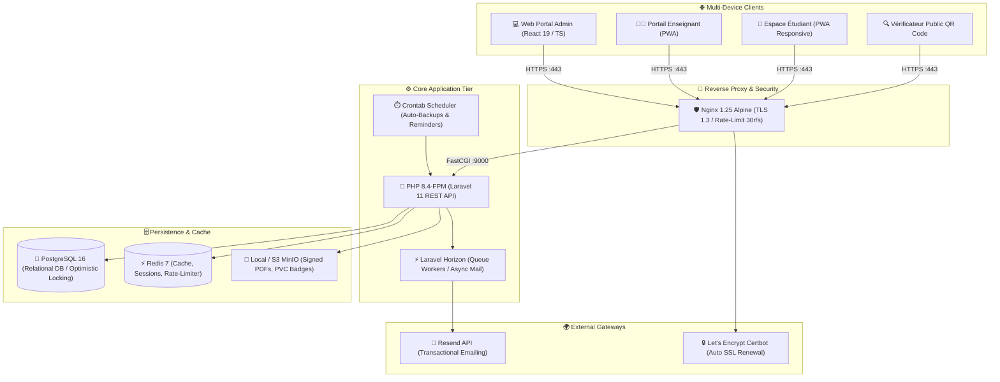
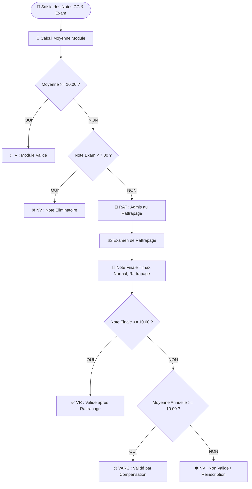
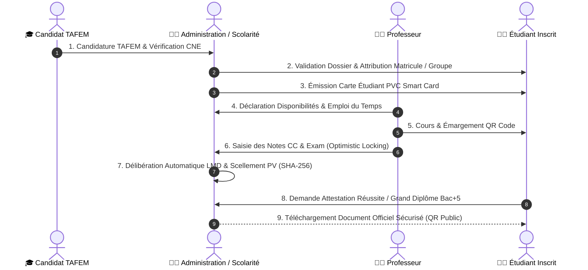

# 🎓 ENCG-ERP — Système Intégré de Gestion Universitaire (ERP Grande École)

[](https://github.com/radouane99/ENCG-ERP/actions)
[](https://php.net)
[](https://laravel.com)
[](https://react.dev)
[](https://typescriptlang.org)
[](https://postgresql.org)
[](https://redis.io)
[](https://docker.com)

> **Système d'Information et de Gestion Académique de Nouvelle Génération** conçu sur mesure pour les **Écoles Nationales de Commerce et de Gestion (ENCG)** du Royaume du Maroc (Université Sidi Mohamed Ben Abdellah - Fès), strictement conforme aux **Normes Pédagogiques Nationales (NPN - LMD)** du **MESRSFC** et interopérable avec le système ministériel **APOGEE / Massar**.

---

## 📑 Table des Matières

1. [🌟 Présentation Générale](#-présentation-générale)
2. [🏛️ Architecture Globale & Diagramme Système](#️-architecture-globale--diagramme-système)
3. [📦 Modules Métier & Périmètre Fonctionnel](#-modules-métier--périmètre-fonctionnel)
4. [📐 Règles Académiques LMD & Moteur de Délibération](#-règles-académiques-lmd--moteur-de-délibération)
5. [🔄 Diagramme des Flux & Cycle de Vie Étudiant (E2E)](#-diagramme-des-flux--cycle-de-vie-étudiant-e2e)
6. [🛡️ Sécurité, Cachet Électronique SHA-256 & Conformité CNDP](#️-sécurité-cachet-électronique-sha-256--conformité-cndp)
7. [🧪 Stratégie de Tests & Assurance Qualité (ISTQB)](#-stratégie-de-tests--assurance-qualité-istqb)
8. [💻 Guide d'Installation en Local (Développement Docker)](#-guide-dinstallation-en-local-développement-docker)
9. [🚀 Déploiement en Production (1-Click Production Deployment)](#-déploiement-en-production-1-click-production-deployment)
10. [⚙️ Variables d'Environnement Clés](#️-variables-denvironnement-clés)

---

## 🌟 Présentation Générale

L'ERP de l'ENCG centralise, digitalise et sécurise l'intégralité des processus pédagogiques, administratifs, et logistiques de l'établissement :
- **Admission & Concours National TAFEM** avec import automatisé des listes ministérielles.
- **Gestion des 10 Semestres (S1 à S10)** : Tronc commun (1A à 3A) et 7 filières de spécialisation (4A et 5A - *Audit & Contrôle de Gestion*, *Gestion Financière et Comptable*, *Marketing et Commerce International*, *Management des RH*, *Publicité et Communication*, *Management de la Relation Client*, *Supply Chain Management*).
- **Moteur de Délibération Hybride & PVs Numériques** scellés cryptographiquement.
- **Emplois du Temps Intelligents sans collision** (Détection automatique de conflits de salles, professeurs et groupes).
- **Guichet Numérique de Scolarité & Cartes Étudiant PVC Smart Card (NFC + QR Token)**.
- **Réseau des Lauréats, Stages/PFE Big 4, Études Doctorales CEDOC, et Tuteur IA**.

---

## 🏛️ Architecture Globale & Diagramme Système



---

## 📦 Modules Métier & Périmètre Fonctionnel

### 1. 🎓 Scolarité & Concours National TAFEM
- Traitement des admissions post-bac, vérification Massar/CNE/CIN, prise de rendez-vous pour dépôt de dossier physique.
- Tunnel de réinscription annuel (S3, S5, S7, S9) avec choix de filières et génération du reçu horodaté `REC-REINSC-2026-XXXX`.

### 2. 👨‍🏫 Gestion du Corps Professoral & Charges Horaires
- Enseignants Permanents (PES, PH, PA) et Vacataires externes (`visiting`).
- Déclaration des disponibilités, affectation de modules (45h), génération des contrats de vacation et suivi des états de paiement.

### 3. 📊 Moteur de Saisie des Notes & Délibérations LMD
- Grilles de saisie interactives pour CC (40-50%) et Examens (50-60%).
- Gestion des rattrapages avec application de la règle du maximum $\max(M_N, M_R)$.
- Verrouillage optimiste (`version` column) pour empêcher les collisions lors de la saisie simultanée.
- Signature électronique des PVs de délibération avec calcul d'empreinte SHA-256 inaltérable.

### 4. 🏢 Smart Campus & Emplois du Temps Anti-Collision
- Cartographie des bâtiments, amphithéâtres, salles de TD et laboratoires informatiques.
- Algorithme de détection de conflits empêchant l'assignation multiple d'une même salle ou d'un même enseignant sur le même créneau horaire.
- Export dynamique FullCalendar, iCal (.ics) et PDF vectoriel.

### 5. 📇 Cartes Étudiant PVC Smart Card & Émargement QR
- Cartes d'étudiant numériques et physiques PVC au format standard ISO/IEC 7810 ID-1 (CR80) avec puce NFC intégrée.
- Émargement des cours et examens par scan de QR Code dynamique horodaté.
- Gestion des justificatifs d'absence médicaux avec workflow de validation administrative.

### 6. 💼 Conventions de Stage & PFE
- Gestion tripartite des conventions de stage (Initiation 2A, Application 4A, PFE 5A) avec partenaires renommés (PwC, EY, KPMG, Deloitte, banques).
- Dépôt de mémoire, désignation du jury et organisation des soutenances publiques.

### 7. 🔬 Études Doctorales CEDOC
- Suivi du parcours doctoral, comptabilisation des 200 heures de formation obligatoires (MESRSFC), dépôt des articles scientifiques et validation par le directeur de thèse.

### 8. 🌐 Réseau des Lauréats (Alumni) & Tuteur Pédagogique IA
- Enquêtes d'insertion professionnelle, suivi des salaires d'embauche et offres d'emploi exclusives.
- Tuteur IA connecté aux polycopiés de cours pour générer des synthèses et des QCM d'entraînement.

---

## 📐 Règles Académiques LMD & Moteur de Délibération

### Formules de Calcul Officielles (Normes MESRSFC)

1. **Note d'un Module en Session Normale ($M_N$) :**
   $$\text{Moyenne Module} = (\text{Note CC} \times 0.40) + (\text{Note Examen} \times 0.60)$$
2. **Note Finale après Session de Rattrapage ($M_F$) :**
   $$M_F = \max(M_N, M_{\text{Rattrapage}})$$
3. **Validation Semestrielle ($V$) :**
   $$\text{Moyenne Semestrielle} \ge 10.00/20 \quad \text{ET} \quad \forall \text{ Module}, \text{ Note} \ge 7.00/20$$
4. **Compensation Annuelle ($VARC$) :**
   $$\frac{\text{Moyenne}(S_n) + \text{Moyenne}(S_{n+1})}{2} \ge 10.00/20 \quad \text{ET} \quad \text{Aucune note éliminatoire } < 7.00/20$$
5. **Seuil de Rachat / Bienveillance Jury :**
   $$[9.50, 10.00[\text{ éligible à la délibération souveraine du jury.}$$



---

## 🔄 Diagramme des Flux & Cycle de Vie Étudiant (E2E)



---

## 🛡️ Sécurité, Cachet Électronique SHA-256 & Conformité CNDP

- **Scellement Cryptographique des PVs :** Chaque délibération finale calcule une empreinte `SHA-256` incluant l'ID du module, la liste ordonnée des étudiants, leurs notes, et l'identifiant du signataire :
  $$\text{Digital Seal} = \text{HMAC-SHA256}(\text{Payload JSON}, \text{APP\_KEY})$$
- **Vérification Universelle par QR Code :** Tout tiers (employeur, ambassade, université étrangère) peut scanner le QR code présent sur une attestation ou un diplôme pour vérifier instantanément son authenticité en ligne sur `/verify/universal-verify`.
- **Conformité CNDP (Loi 09-08) :** Protection des données à caractère personnel, traçabilité intégrale via `audit_logs` (qui a modifié quelle note, depuis quelle IP, et à quelle seconde), et anonymisation cryptographique des évaluations de cours par les étudiants.

---

## 🧪 Stratégie de Tests & Assurance Qualité (ISTQB)

Le projet respecte rigoureusement la **Pyramide des Tests** et les **7 Principes Fondamentaux de l'ISTQB** :

```text
       128 Suites Backend (361 Assertions) + 17 Tests Frontend = 100% Green ✅
```

### Exécution des Tests

```bash
# Exécuter l'intégralité des 128 suites de tests backend dans Docker
docker exec encg_backend php artisan test

# Exécuter les tests unitaires frontend (Vitest)
docker exec encg_frontend npm run test -- --run

# Exécuter l'analyse statique haute performance (Oxlint)
docker exec encg_frontend npm run lint
```

---

## 💻 Guide d'Installation en Local (Développement Docker)

### 1. Prérequis
- [Docker Desktop](https://www.docker.com/products/docker-desktop/) (avec Docker Compose v2)
- Git

### 2. Cloner le Dépôt
```bash
git clone -b docker-v2 https://github.com/radouane99/ENCG-ERP.git
cd ENCG-ERP
```

### 3. Démarrer l'Environnement
```bash
docker compose up -d --build
```

### 4. Initialiser la Base de Données
```bash
docker exec encg_backend php artisan key:generate
docker exec encg_backend php artisan migrate --seed
```

### 5. Accès aux Services
- 🌐 **Application Web :** [http://localhost](http://localhost)
- 🔌 **API REST :** [http://localhost/api/v1](http://localhost/api/v1)
- 📬 **Serveur Mail (Mailpit UI) :** [http://localhost:8025](http://localhost:8025)
- 🗄️ **Base de Données PostgreSQL :** `localhost:5432` (`encg_user` / `encg_password`)

---

## 🚀 Déploiement en Production (1-Click Production Deployment)

Le déploiement en production est entièrement automatisé via [`deploy.sh`](file:///c:/Users/najlae/Desktop/ENCG-ERP-V1/deploy.sh) et [`docker-compose.prod.yml`](file:///c:/Users/najlae/Desktop/ENCG-ERP-V1/docker-compose.prod.yml) :

### Sur votre Serveur VPS (Ubuntu 22.04 / 24.04 LTS) :

```bash
# 1. Cloner la branche de production
git clone -b docker-v2 https://github.com/radouane99/ENCG-ERP.git /var/www/encg-erp
cd /var/www/encg-erp

# 2. Configurer les variables d'environnement de production
cp .env.production.example backend/.env
nano backend/.env  # Renseigner APP_URL, DB_PASSWORD, RESEND_API_KEY

# 3. Lancer le déploiement automatique
chmod +x deploy.sh
./deploy.sh
```

Le script configure automatiquement :
- Les conteneurs isolés **PostgreSQL 16**, **Redis 7**, **PHP 8.4-FPM**, **Laravel Horizon**, et **Scheduler**.
- La compilation du bundle de production **React 19 / Vite**.
- Le serveur **Nginx** avec **TLS 1.3**, HTTP/2, compression gzip, et rate limiting.
- L'émission et le renouvellement automatique de la **certification SSL Let's Encrypt**.

---

## ⚙️ Variables d'Environnement Clés

| Variable | Description | Valeur Exemple (Prod) |
|---|---|---|
| `APP_ENV` | Environnement d'exécution | `production` |
| `APP_DEBUG` | Mode de débogage (Strictement false en prod) | `false` |
| `APP_URL` | URL publique sécurisée | `https://erp.encg-fes.ma` |
| `DB_CONNECTION` | Driver de base de données relationnelle | `pgsql` |
| `DB_HOST` | Hôte du conteneur PostgreSQL | `postgres` |
| `DB_DATABASE` | Nom de la base de données | `encg_erp_prod` |
| `CACHE_STORE` / `QUEUE_CONNECTION` | Moteur de cache et de files d'attente | `redis` |
| `MAIL_MAILER` | Moteur d'envoi d'emails transactionnels | `resend` |
| `RESEND_API_KEY` | Clé API Resend certifiée | `re_prod_xxxxxxxxxxxx` |
| `MAIL_FROM_ADDRESS` | Adresse expéditrice officielle | `no-reply@benadadarentcar.com` |

---

<div align="center">
  <sub>Développé avec excellence pour l'École Nationale de Commerce et de Gestion de Fès (ENCG Fès) · Université Sidi Mohamed Ben Abdellah.</sub>
</div>
