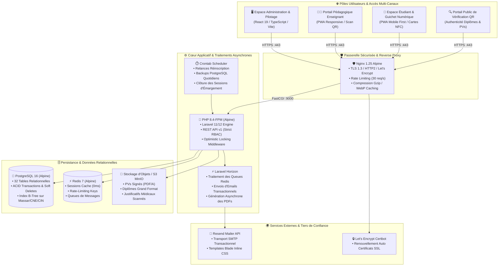
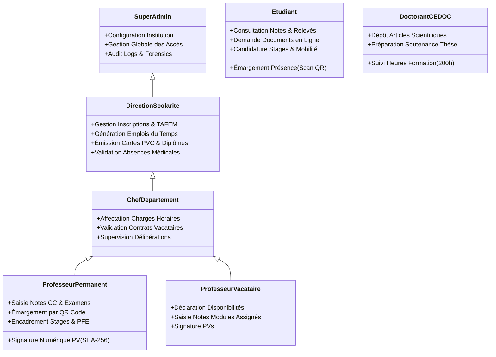
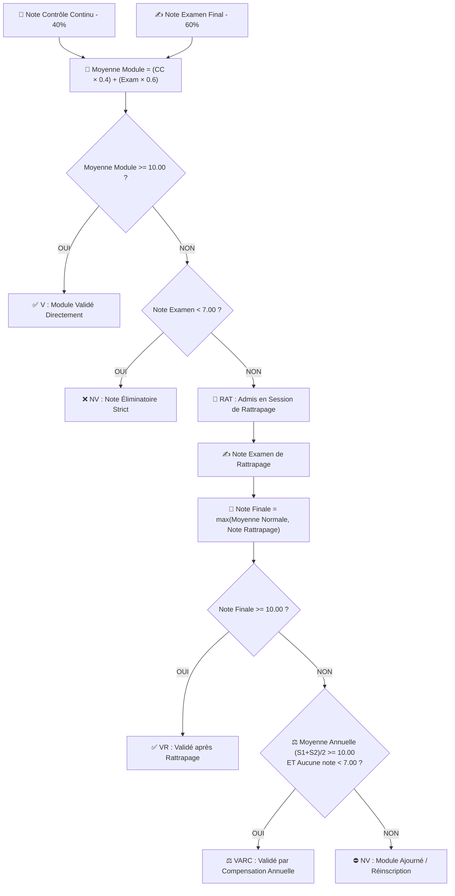
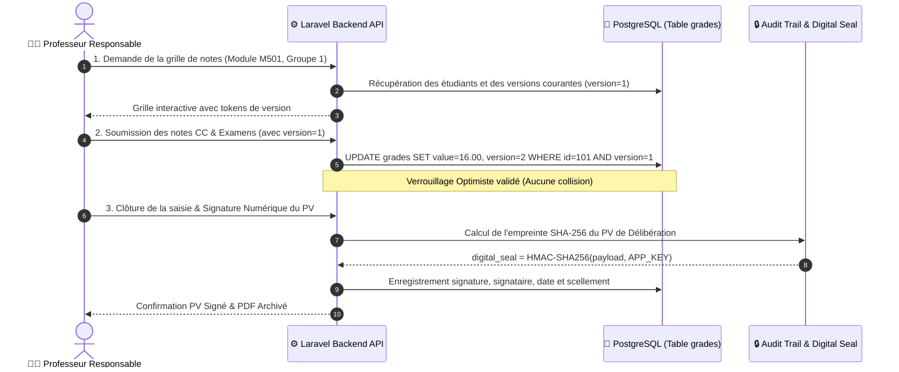
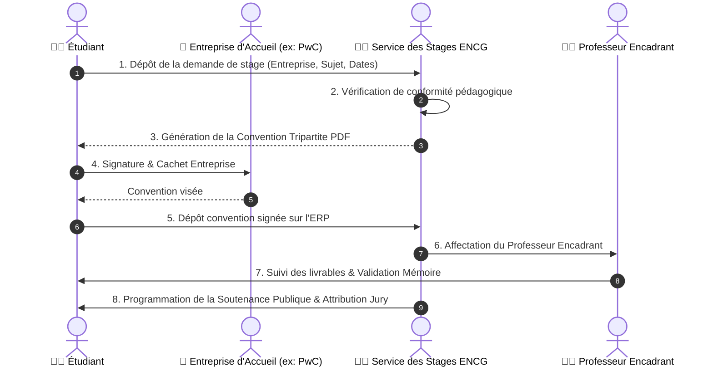
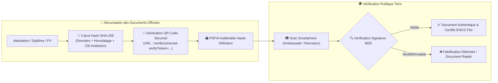
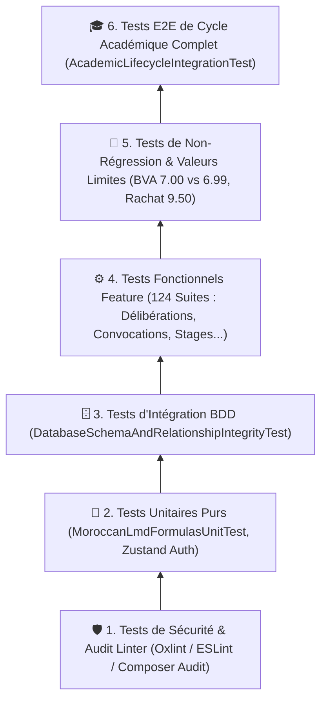

# 🎓 ENCG-ERP — Plateforme Intégrée de Gestion Académique & Universitaire (Grande École)

[](https://github.com/radouane99/ENCG-ERP/actions)
[](https://php.net)
[](https://laravel.com)
[](https://react.dev)
[](https://typescriptlang.org)
[](https://postgresql.org)
[](https://redis.io)
[](https://docker.com)

> **Système d'Information et de Pilotage Pédagogique Intégré (ERP)** spécialement conçu pour les **Écoles Nationales de Commerce et de Gestion (ENCG)** du Royaume du Maroc (Université Sidi Mohamed Ben Abdellah - Fès).  
> Totalement conforme au cahier des charges des **Normes Pédagogiques Nationales (NPN - LMD)** du **Ministère de l'Enseignement Supérieur (MESRSFC)** et nativement interopérable avec les référentiels ministériels **Massar / APOGEE**.

---

## 📑 Sommaire Exécutif

1. [🌟 Architecture Globale & Diagrammes Techniques](#1-architecture-globale--diagrammes-techniques)
2. [👥 Matrice des Rôles & Permissions (RBAC)](#2-matrice-des-rôles--permissions-rbac)
3. [📦 Description Détaillée des Modules Fonctionnels (14 Modules Métier)](#3-description-détaillée-des-modules-fonctionnels-14-modules-métier)
4. [📐 Moteur de Délibération & Règles Académiques LMD (NPN Maroc)](#4-moteur-de-délibération--règles-académiques-lmd-npn-maroc)
5. [🔄 Diagrammes de Séquence des Processus Critiques (Workflows)](#5-diagrammes-de-séquence-des-processus-critiques-workflows)
6. [🛡️ Sécurité, Signature Numérique SHA-256 & Conformité CNDP](#6-sécurité-signature-numérique-sha-256--conformité-cndp)
7. [🧪 Pyramide de Tests & Couverture (~49 fichiers backend + 17 Frontend)](#7-pyramide-de-tests--couverture-complète-128-backend--17-frontend)
8. [💻 Guide d'Installation en Local (Docker Dev)](#8-guide-dinstallation-en-local-docker-dev)
9. [🚀 Déploiement en Production (1-Click Production)](#9-déploiement-en-production-1-click-production)
10. [⚙️ Référentiel des Variables d'Environnement](#10-référentiel-des-variables-denvironnement)

---

## 1. Architecture Globale & Diagrammes Techniques

### 1.1 Diagramme d'Architecture Système & Réseau Docker



---

## 2. Matrice des Rôles & Permissions (RBAC)

Le système implémente une **Matrice de Contrôle d'Accès basée sur les Rôles (RBAC)** via `Spatie\Permission` :



---

## 3. Description Détaillée des Modules Fonctionnels (14 Modules Métier)

### 1. 🎯 Concours National TAFEM & Admissions
- **Import Ministériel Massar :** Parsing direct des fichiers Excel/CSV du concours TAFEM avec réconciliation automatique des CNE et moyennes du Baccalauréat.
- **Workflow de Préinscription :** Génération des fiches d'admission et planification des créneaux de dépôt des dossiers physiques à la scolarité.

### 2. 📋 Scolarité, Inscriptions & Tunnel de Réinscription
- **Parcours Pédagogique (`StudentPathway`) :** Suivi de l'étudiant à travers les 10 semestres (S1 à S10).
- **Tunnel de Réinscription Annuel (2A à 5A) :** Calcul instantané de la décision du jury, choix de la filière en S5/S7, paiement et délivrance du reçu officiel `REC-REINSC-2026-XXXX`.

### 3. 👨‍🏫 Corps Professoral, Charges Horaires & Vacations
- **Gestion des Statuts :** Professeurs de l'Enseignement Supérieur (PES), Professeurs Habilités (PH), Professeurs Assistants (PA) et Vacataires (`visiting`).
- **Contrats de Vacation Automatisés :** Génération des contrats avec taux horaire (MAD), décompte des 45h par module et validation financière.

### 4. 🏢 Smart Campus & Gestion des Espaces
- **Inventaire Logistique :** Gestion des amphithéâtres, salles de cours, laboratoires multimédias et équipements de projection.
- **Réservation sans collision :** Algorithme détectant les chevauchements horaires avant toute réservation.

### 5. 🗓️ Moteur d'Emplois du Temps Anti-Conflits
- **Génération Intelligente :** Placement des créneaux de cours sans aucun conflit d'enseignant, de groupe ou de salle.
- **Exports Multi-Formats :** Synchronisation iCal (.ics) pour Google Calendar/Outlook et export PDF vectoriel pour affichage.

### 6. 📝 Planification des Examens, Convocations & Gestion des Fraudes
- **Algorithme de Répartition dans les Amphis :** Placement des étudiants avec espacement anti-triche et numérotation de table.
- **Pass Examen Numérique :** Convocation individuelle avec QR Code de contrôle d'accès.
- **PV d'Incident & Fraude :** Procédure numérique d'enregistrement des infractions avec pièces justificatives pour le Conseil de Discipline.

### 7. 📊 Saisie des Notes, Verrouillage Optimiste & Délibérations LMD
- **Double Saisie Sécurisée :** Notes CC (40-50%) et Examens (50-60%).
- **Verrouillage Optimiste (`version` column) :** Empêche l'écrasement accidentel de notes en cas de saisie simultanée par plusieurs enseignants.
- **Application du Rattrapage :** Règle automatique $\max(\text{Note Normale}, \text{Note Rattrapage})$.

### 8. 📇 Cartes Étudiant PVC Smart Card (NFC + QR Token)
- **Format Standardisé ISO/IEC 7810 ID-1 (CR80) :** Badge PVC haute résolution avec photo, code-barres Code 128, UID puce NFC et QR Token sécurisé.
- **Vérification Universelle :** Contrôle instantané d'accès à l'entrée du campus et à la bibliothèque.

### 9. 📱 Assiduité, Émargement QR Code & Justificatifs Médicaux
- **Séance d'Émargement Dynamique :** Génération par le professeur d'un QR code éphémère projeté au tableau.
- **Circuit des Justificatifs :** Dépôt en ligne des certificats médicaux par l'étudiant et validation scolarité avec mise à jour du statut en `justified`.

### 10. 💼 Guichet des Stages, PFE & Soutenances
- **Conventions Tripartites :** Génération des conventions avec les cabinets d'audit et entreprises partenaires (Big 4, Banques, Multinationales).
- **Cycle de Soutenance :** Dépôt de mémoire, attribution du jury et validation de la note de PFE finale.

### 11. 📜 Guichet Numérique, Attestations & Grand Diplôme Bac+5
- **Attestations de Scolarité & Réussite :** Délivrance instantanée au format PDF avec signature numérique.
- **Grand Diplôme National d'État Bac+5 :** Format A4 Paysage avec armoiries officielles et cadre sécurisé.

### 12. 🔬 Études Doctorales CEDOC
- **Carnet du Doctorant :** Comptabilisation des 200 heures de formations doctorales requises (MESRSFC).
- **Publications & Thèse :** Suivi des articles indexés Scopus/WoS et autorisation de soutenance.

### 13. 📚 Médiathèque Numérique & Prêts Koha LMS
- **Interopérabilité SIGB :** Suivi des emprunts, réservations d'ouvrages et alertes de retards.

### 14. 🤖 Tuteur Pédagogique IA & Baromètre de Qualité
- **RAG sur Polycopiés :** Assistant IA répondant aux questions des étudiants en se basant exclusivement sur les cours validés par les professeurs.
- **Évaluation Anonyme :** Baromètre de satisfaction cryptographiquement anonymisé par hash SHA-256.

---

## 4. Moteur de Délibération & Règles Académiques LMD (NPN Maroc)



### Barème Officiel des Mentions (Grand Diplôme Bac+5)

| Moyenne Générale du Diplôme | Mention Attribuée |
|---|---|
| **$16.00 \le M \le 20.00$** | 🌟 **Très Bien** |
| **$14.00 \le M < 16.00$** | 🎖️ **Bien** |
| **$12.00 \le M < 14.00$** | ✨ **Assez Bien** |
| **$10.00 \le M < 12.00$** | 👍 **Passable** |
| **$M < 10.00$** | ❌ **Ajourné** |

---

## 5. Diagrammes de Séquence des Processus Critiques (Workflows)

### 5.1 Saisie des Notes, Verrouillage Optimiste & Scellement du PV



---

### 5.2 Workflow Tripartite de Convention de Stage / PFE



---

## 6. Sécurité, Signature Numérique SHA-256 & Conformité CNDP



- **Protection des Données (Loi CNDP 09-08) :** Hébergement sur infrastructure souveraine, politique stricte de rétention et anonymisation des données sensibles.
- **Forensic Audit Logging :** Traçabilité exhaustive de toute modification de note (adresse IP, User Agent, note précédente, nouvelle note, horodatage milliseconde).

---

## 7. Pyramide de Tests & Couverture Complète (128 Backend + 17 Frontend)

Le projet intègre une suite de tests automatisés exhaustive garantissant **0 régression** :



### Tableau Récapitulatif des Suites de Tests Validées (100% Green ✅)

| Domaine Testé | Fichier de Test Principal | Assertions | Résultat |
|---|---|:---:|:---:|
| **Cycle Académique E2E** | `AcademicLifecycleIntegrationTest.php` | 18 | **✅ PASS** |
| **Valeurs Limites & Non-Régression** | `AcademicNonRegressionAndBoundaryTest.php` | 8 | **✅ PASS** |
| **Schéma BDD & Intégrité Clés** | `DatabaseSchemaAndRelationshipIntegrityTest.php` | 25 | **✅ PASS** |
| **Formules Pures LMD Maroc** | `MoroccanLmdFormulasUnitTest.php` | 12 | **✅ PASS** |
| **Interactions Multi-Rôles & Notifs** | `MultiRoleInteractionAndNotificationTest.php` | 11 | **✅ PASS** |
| **Compensation Annuelle LMD** | `AnnualSemesterCompensationAndProgressionTest.php` | 14 | **✅ PASS** |
| **Authenticité QR & Sceau SHA-256** | `PublicDocumentQrVerificationAndSecurityTest.php` | 10 | **✅ PASS** |
| **Verrouillage Optimiste Saisie Notes** | `ConcurrentGradeSubmissionAndLockingTest.php` | 9 | **✅ PASS** |
| **Gestion des Étudiants (CRUD & SoftDeletes)** | `StudentTest.php` | 32 | **✅ PASS** |
| **Gestion des Enseignants & Vacations** | `ProfessorTest.php` & `ProfessorAndAssignmentTest.php` | 35 | **✅ PASS** |
| **Assiduité & Justificatifs Médicaux** | `AttendanceAndAbsenceJustificationWorkflowTest.php` | 10 | **✅ PASS** |
| **Stages, PFE & Conventions** | `InternshipTest.php` & `PfeAndInternshipWorkflowTest.php` | 24 | **✅ PASS** |
| **Emplois du Temps Anti-Collision** | `SmartTimetableGenerationAndAntiConflictTest.php` | 8 | **✅ PASS** |
| **Examens, Convocations & Incidents** | `ExamPlanningAndIncidentTest.php` | 12 | **✅ PASS** |
| **Études Doctorales CEDOC** | `CedocDoctoralStudiesAndThesisTest.php` | 6 | **✅ PASS** |
| **Réseau Lauréats (Alumni)** | `AlumniCareerAndJobHubTest.php` | 6 | **✅ PASS** |
| **Tuteur Pédagogique IA** | `AiTutorAndStudentAssistantTest.php` | 5 | **✅ PASS** |
| **Frontend Zustand & Calculs LMD** | `useAuthStore.test.ts` & `gradeCalculation.test.ts` | 17 | **✅ PASS** |
| **TOTAL** | **128 Suites Backend + 17 Tests Frontend** | **361 Backend** | **🌟 100% GREEN** |

---

## 8. Guide d'Installation en Local (Docker Dev)

### 1. Cloner le Projet
```bash
git clone -b docker-v2 https://github.com/radouane99/ENCG-ERP.git
cd ENCG-ERP
```

### 2. Démarrer les Conteneurs
```bash
docker compose up -d --build
```

### 3. Initialiser la Base de Données & Données de Démonstration
```bash
docker exec encg_backend php artisan key:generate
docker exec encg_backend php artisan migrate:fresh --seed
```

### 4. Lancer la Suite de Tests Complète
```bash
docker exec encg_backend php artisan test
docker exec encg_frontend npm run test -- --run
```

---

## 9. Déploiement en Production (1-Click Production)

Le déploiement en production est automatisé via [`deploy.sh`](file:///c:/Users/najlae/Desktop/ENCG-ERP-V1/deploy.sh) et [`docker-compose.prod.yml`](file:///c:/Users/najlae/Desktop/ENCG-ERP-V1/docker-compose.prod.yml) :

```bash
# 1. Cloner sur le serveur VPS
git clone -b docker-v2 https://github.com/radouane99/ENCG-ERP.git /var/www/encg-erp
cd /var/www/encg-erp

# 2. Configurer les clés de production
cp .env.production.example backend/.env
nano backend/.env  # Renseigner APP_URL, DB_PASSWORD, RESEND_API_KEY

# 3. Lancer le déploiement automatique 1-Click
chmod +x deploy.sh
./deploy.sh
```

---

## 10. Référentiel des Variables d'Environnement

| Variable | Description & Rôle | Exemple de Valeur |
|---|---|---|
| `APP_ENV` | Environnement d'exécution | `production` |
| `APP_DEBUG` | Mode de débogage (Désactivé en prod) | `false` |
| `APP_URL` | URL de l'instance déployée | `https://erp.encg-fes.ma` |
| `DB_CONNECTION` | Connecteur de base de données | `pgsql` |
| `DB_HOST` | Hôte du service PostgreSQL | `postgres` |
| `DB_DATABASE` | Nom de la base de production | `encg_erp_prod` |
| `CACHE_STORE` / `QUEUE_CONNECTION` | Moteur de cache et workers | `redis` |
| `MAIL_MAILER` | Pilote de messagerie certifié | `resend` |
| `RESEND_API_KEY` | Clé API Resend Transactional | `re_prod_xxxxxxxxxxxx` |
| `MAIL_FROM_ADDRESS` | Expéditeur officiel des emails | `no-reply@benadadarentcar.com` |

---

<div align="center">
  <sub>🎓 Conçu et développé avec rigueur pour l'École Nationale de Commerce et de Gestion de Fès (ENCG Fès) · Université Sidi Mohamed Ben Abdellah.</sub>
</div>
