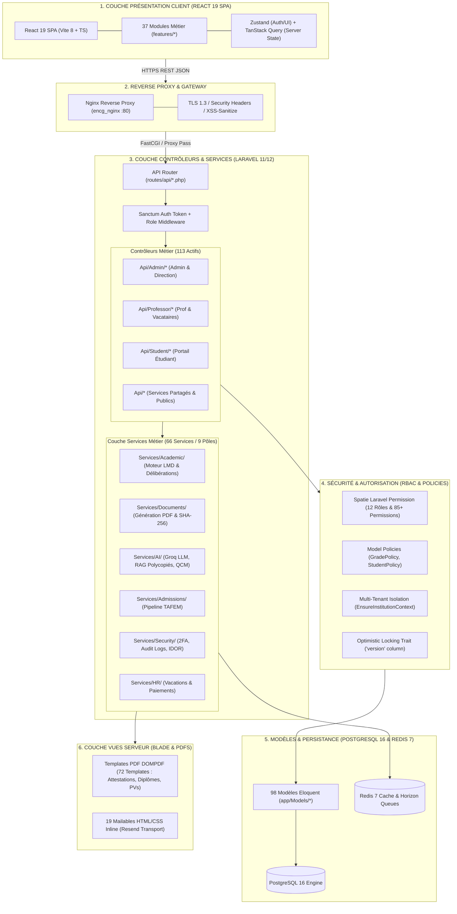
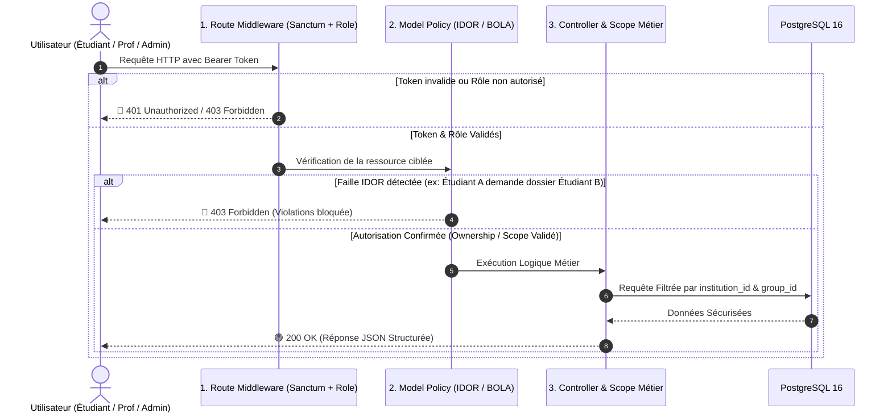

# CONTEXTE TECHNIQUE ET FONCTIONNEL MONUMENTAL ET ABSOLU — ENCG ERP V1

> **Document de Référence Majeur & Manuel de Conception Consolidé (28 Visual Workflows ; 8 parcours Playwright + suites Pest/Vitest)**  
> **Établissement :** École Nationale de Commerce et de Gestion (ENCG Fès)  
> **Conformité :** Système LMD Marocain (Semestres S1 à S10), Normes APOGEE Ministérielles & **Loi 09-08 CNDP Maroc**  
> **Architecture :** Découplée Professionnelle (Backend Laravel REST API ⟷ Frontend React SPA)  
> **Version :** 1.0.0 — Laravel 12 / React 19 (scan 2026-08-24 : P0 sécurité ; P2 Playwright, Sentry, DSAR CNDP)

---

## 1. ARCHITECTURE DÉCOUPLÉE & ÉCOSYSTÈME INFRASTRUCTURE DOCKER

### 1.1 Principe d'Architecture Découplée Professionnelle (Backend API ⟷ Frontend SPA)
L'application repose sur un **découplage architectural strict et professionnel** entre la couche serveur (Backend) et la couche présentation (Frontend).

```
┌────────────────────────────────────────────────────────────────────────────────────────┐
│                                 NAVIGATEUR / CLIENT WEB                                │
│                     Single Page Application (React 19 / TypeScript / Vite)              │
└───────────────────────────────────────────┬────────────────────────────────────────────┘
                                            │
                                            ▼ (Requêtes Asynchrones HTTP REST / JSON)
                               ┌─────────────────────────┐
                               │ NGINX REVERSE PROXY     │
                               │ (encg_nginx - Port 80)  │
                               └────────────┬────────────┘
                                            │
                    ┌───────────────────────┴───────────────────────┐
                    │                                               │
                    ▼ (/api/*)                                      ▼ (WebSockets ws://)
┌───────────────────────────────────────┐               ┌───────────────────────────────────────┐
│ LARAVEL 12 RESTFUL API BACKEND        │               │ LARAVEL REVERB WEBSOCKET SERVER       │
│ (encg_backend - PHP 8.4 FPM)          │               │ (encg_reverb - Port 8080)             │
│ Sanctum Bearer Token Auth             │               │ Communication Temps Réel              │
└───────────────────┬───────────────────┘               └───────────────────┬───────────────────┘
                    │                                                       │
         ┌──────────┴───────────┬───────────────────────┬───────────────────┘
         ▼                      ▼                       ▼
┌──────────────────┐  ┌──────────────────┐
│ POSTGRESQL DB    │  │ REDIS CACHE      │
│ (encg_postgres)  │  │ (encg_redis)     │
│ Port 5432        │  │ Port 6379        │
└──────────────────┘  └──────────────────┘
```

#### Principes Clés du Découplage :
- **Backend Pure REST API (`backend/`) :** Développé avec Laravel 12 / PHP 8.4-FPM. Il expose des endpoints RESTful stricts retournant exclusivement des réponses structurées en JSON. L'authentification est gérée via des tokens Bearer Laravel Sanctum (`Authorization: Bearer <sanctum_token>`).
- **Frontend SPA Indépendant (`frontend/`) :** Application Web monopage (SPA) construite avec React 19, TypeScript et Vite. Le frontend est totalement indépendant du backend et consomme les API REST de manière asynchrone (Axios / Fetch API).
- **Communication Temps Réel bi-directionnelle :** Laravel Reverb sur le port 8080 gère les événements WebSockets pour la mise à jour instantanée du tableau de bord (émargement QR scan en direct, notifications push).
- **Nginx Reverse Proxy Entrypoint (`encg_nginx`) :** Redirige de façon transparente le trafic HTTP `/api/*` vers le conteneur backend PHP-FPM et sert l'application React SPA frontend.

---

### 1.2 Écosystème Officiel des Conteneurs Docker (`docker-compose.yml`)
Le système s'exécute dans un écosystème Docker 100% conteneurisé. Voici la liste officielle des conteneurs en cours d'exécution :

| Nom du Conteneur | Service / Rôle | Image / Technologies | Ports Exposés |
| :--- | :--- | :--- | :--- |
| **`encg_nginx`** | Reverse Proxy Web & Router | `nginx:alpine` | `80:80` |
| **`encg_backend`** | Core API RESTful Backend | `PHP 8.4-FPM Alpine` (Laravel 12) | Interne |
| **`encg_frontend`** | Interface SPA Client React | `node:22-alpine` (React 19 / Vite) | `5173:5173` |
| **`encg_reverb`** | Serveur WebSockets Temps Réel | Laravel Reverb (`reverb:start`) | `8080:8080` |
| **`encg_queue_worker`** | Worker Asynchrone Queues | Laravel Horizon (`horizon`) | Interne |
| **`encg_postgres`** | Base de Données Relationnelle | `postgres:16-alpine` | `5432:5432` |
| **`encg_pgadmin`** | GUI Administration Postgres | `dpage/pgadmin4` | `5050:80` |
| **`encg_redis`** | Cache In-Memory & Queues | `redis:7-alpine` | `6379:6379` |
| **`encg_mailpit`** | Sandbox Envoi Emails Dev | `axllent/mailpit` | `1025:1025` / `8025` |

---

### 1.3 Commandes d’Exploitation Docker Obligatoires
- **Vérification de Syntaxe PHP :** `docker exec encg_backend php -l app/Http/Controllers/Api/MonController.php`
- **Exécution des Migrations :** `docker exec encg_backend php artisan migrate`
- **Lancement de la Suite de Tests :** `docker exec encg_backend php artisan test`
- **Statut des Files d'Attente Horizon :** `docker exec encg_backend php artisan horizon:status`
- **Régénération du Cache de Configuration :** `docker exec encg_backend php artisan config:cache`

---

### 1.4 Matrice des Variables d'Environnement Critiques (`.env`)
- **Base de Données :** `DB_CONNECTION=pgsql`, `DB_HOST=postgres` (hôte Docker ; le conteneur s'appelle `encg_postgres`), `DB_PORT=5432`, `DB_DATABASE=encg_erp`.
- **Cache & Queues :** `CACHE_DRIVER=redis`, `QUEUE_CONNECTION=redis`, `REDIS_HOST=encg_redis`, `REDIS_PORT=6379`.
- **Emailing (Resend Transport) :**
  - `MAIL_MAILER=resend`
  - `RESEND_API_KEY=re_xxxxxxxxxxxxxxxxx`
  - `MAIL_FROM_ADDRESS=noreply@encg-fes.ac.ma` *(Strictement configuré)*
  - `MAIL_FROM_NAME="ENCG Portail"`
  - *Règle : Interdiction formelle d'utiliser `Mail::raw()`. Seules des classes `Mailable` avec templates Blade HTML inline sont autorisées.*
- **Google SSO OAuth 2.0 :** `GOOGLE_CLIENT_ID=xxxxxxxx.apps.googleusercontent.com`, `GOOGLE_CLIENT_SECRET=xxxxxxx`, `GOOGLE_REDIRECT_URI=http://localhost/api/v1/auth/google/callback`.
- **Moteur IA Gemini :** `GEMINI_API_KEY=AIzaSy...`, `GEMINI_MODEL=gemini-1.5-flash`.
- **Serveur WebSockets Reverb :** `REVERB_APP_ID=xxx`, `REVERB_APP_KEY=xxx`, `REVERB_APP_SECRET=xxx`, `REVERB_HOST=encg_reverb`, `REVERB_PORT=8080`.
- **Observabilité :** `SENTRY_LARAVEL_DSN` (API) et `VITE_SENTRY_DSN` (SPA). Laisser vide en local ; renseigner en production uniquement.

---

## 2. STACK TECHNIQUE ET OUTILS INNOVANTS UTILISÉS

### 2.1 Backend & Architecture System
- **Framework & Runtime :** PHP 8.4 / Laravel 12 (Architecture RESTful API découplée).
- **Authentification Hybride & Sécurité Avancée :**
  - 🌐 **Connexion Google Socialite SSO (`@encg-fes.ac.ma`) :** Connexion OAuth 2.0 rapide et sécurisée via les adresses institutionnelles Google Workspace de l'établissement.
  - 🔐 **Double Authentification 2FA TOTP (`RequireAdmin2FA`) :** Activation obligatoire de la 2FA pour les comptes administrateurs avec Google Authenticator / Authy.
  - 🔑 **Laravel Sanctum :** Tokens API Bearer sécurisés avec expiration et révocation.
  - 🛡️ **Middlewares Sécurité Custom :** `XssSanitizer`, `StrictIpWhitelisting`, `EnsureInstitutionContext`.

### 2.2 Conformité Légale CNDP — Protection des Données Personnelles (Loi N° 09-08 Maroc)
L'ERP applique rigoureusement les normes de la **Commission Nationale de contrôle de la protection des Données à caractère Personnel (CNDP)** conformément à la Loi marocaine N° 09-08 :
1. 📝 **Consentement Éclairé Préalable :** Case à cocher obligatoire d'acceptation de traitement des données lors de la pré-inscription TAFEM, des demandes de documents et de la création de compte.
2. 👁️ **Droit d'Accès, de Rectification et d'Opposition (Articles 7, 8, 9) :** Endpoints authentifiés `POST /api/v1/privacy/export` (accès / DSAR), `POST /api/v1/privacy/rectification`, `POST /api/v1/privacy/opposition`. L'export JSON est asynchrone ; la rectification et l'opposition sont enregistrées pour instruction de la scolarité (pas d'anonymisation automatique des dossiers académiques).
3. 🔐 **Chiffrement & Anonymisation des Pièces Sensibles :** Chiffrement des mots de passe (Bcrypt/Argon2), commande `cndp:enforce-retention` pour les comptes inactifs, stockage Laravel `storage/` (disque `private` / `local`) avec contrôle d'accès restreint (`documents.serve`).
4. 📜 **Registre des Traitements Académiques :** Journalisation d'audit complète (`ValidationAudit`, `GradeAudit`) des modifications apportées aux données personnelles et académiques.

---

### 2.3 Moteur d'Extraction OCR & IA Hybride (`App\OCR\OcrPipeline`)
- **Moteur Multimodal IA :** **Google Gemini 1.5 Flash Vision** avec fallback intelligent vers **Tesseract OCR**.
- **Pipeline d'Extraction Automatique :**
  - Parsing et détection automatique des pièces d'identité (CNIE), relevés de notes du Baccalauréat, actes de naissance et certificats médicaux.
  - Extraction structurée JSON des champs biographiques (CNE, CIN, Nom/Prénom en Français & Arabe, Date/Ville de naissance, Série du Bac, Note du Bac, Groupe sanguin, Données des tuteurs).
  - Calcul du score de confiance (`quickConfidence`) et détection des doublons/tentatives de falsification.

### 2.4 Registre Blockchain & Certification des Diplômes (`AdminBlockchainController`)
- **Ancrage Cryptographique des Diplômes :** Génération d'un Hash SHA-256 immuable et d'un ID de transaction (`transaction_id`) enregistrés dans le registre Blockchain pour chaque lauréat.
- **Certification par Promotion (`certifyPromo`) :** Certification en masse d'une promotion complète de diplômés avec vérification d'authenticité infalsifiable.

### 2.5 Frontend & Architecture UI / UX
- **Core Stack :** React 19, TypeScript, Vite.
- **State Management & Data Fetching :**
  - **TanStack React Query v5 :** Gestion du cache asynchrone, mutations avec mise à jour optimiste, invalidation ciblée des requêtes (`admin-dashboard-stats`, `admin-document-requests`), et polling intelligent d'arrière-plan (5s - 15s).
  - **Zustand :** Store global d'authentification (`authStore`), gestion de session Sanctum et persistance locale.
- **Design System & Esthétique Exécutive :**
  - **Bento Grid Architecture :** Grilles asymétriques modulaires avec verre dépoli (*Glassmorphism* `backdrop-blur-2xl bg-white/80 dark:bg-slate-900/80`), mesh de lumière ambiante et bordures luminescentes subtiles.
  - **Micro-Interactions & Icônes :** Lucide React avec états de survol interactifs (`hover:-translate-y-1`, `hover:scale-105`), indicateurs de statut pulsants en direct et badges dynamiques.
  - **Visualisations SVG sur-mesure :** Courbes d'aire à gradients dégradés, barres de présence journalière animées et graphiques donut à sections circulaires vectorielles.
  - **Notifications Visuelles Riches :** Sonner Toasts interactifs avec boutons d'action instantanée `[Consulter]`.
  - **Support Bi-Thème & Bilingue :** Dark / Light mode instantané et bascule fluide Français / Arabe (RTL natif).
- **Composants Avancés :**
  - **FullCalendar :** Plannings interactifs pour cours, examens et réservations de salles.
  - **Grille de Saisie de Notes Excel-like :** Navigation au clavier et validation instantanée.
  - **Scan QR Code Intégré :** Scanner caméra web/mobile pour le contrôle des convocations, l'émargement et le scan des enveloppes TAFEM.

### 2.6 Moteur Transactionnel d'Emailing & Signatures PDF
- **Fournisseur Officiel d'Emailing (Resend Transport) :**
  - Intégration de l'API Resend (`MAIL_MAILER=resend`, `RESEND_API_KEY`) pour l'acheminement sécurisé des emails transactionnels avec taux de délivrabilité maximal.
  - Modèles d'emails Blade HTML conformes avec CSS inline, en-tête officiel ENCG Fès et pièces jointes PDF générées.
- **Moteur de Génération PDF Certifié (DomPDF + SVG QR) :**
  - Rendu A4 officiel avec métadonnées d'ancrage, empreinte cryptographique SHA-256, QR code vectoriel scannable et zone dédiée au cachet du Secrétariat Général.

---

## 3. MATRICE COMPLÈTE DES RÔLES ET PERMISSIONS (RBAC)

```
                                  ┌────────────────────────┐
                                  │      SUPER-ADMIN       │ (Permission '*')
                                  └───────────┬────────────┘
                                              │
         ┌────────────────────────────────────┼────────────────────────────────────┐
         ▼                                    ▼                                    ▼
┌──────────────────┐                ┌──────────────────┐                ┌──────────────────┐
│ INSTITUTION ADMIN│                │     DIRECTOR     │                │ DEPARTMENT HEAD  │
│(Gestion Opérations)              │ (Gouvernance/PVs)│                │ (Filières/Profs) │
└────────┬─────────┘                └────────┬─────────┘                └────────┬─────────┘
         │                                   │                                   │
         ├───────────────────────────────────┴───────────────────────────────────┤
         ▼                                                                       ▼
┌──────────────────┐                                                    ┌──────────────────┐
│    PROFESSOR     │                                                    │    VACATAIRE     │
│(Notes/Présences) │                                                    │ (Notes/Séances)  │
└────────┬─────────┘                                                    └────────┬─────────┘
         │                                                                       │
         └───────────────────────────────────┬───────────────────────────────────┘
                                             ▼
                                  ┌────────────────────┐
                                  │      STUDENT       │
                                  │(Portail Dossier360)│
                                  └────────────────────┘
```

### 3.1 Description Granulaire des Acteurs
1. **Super-Admin (`super-admin`) :** Accès illimité (`*`), maintenance serveur, gestion des clés API, inspection des logs système.
2. **Institution Admin (`institution-admin`) :** Gestion des utilisateurs, structure académique (filières, semestres, modules), examens, guichet électronique.
3. **Directeur / Direction (`director`) :** Validation finale et signature numérique des PVs de délibération, rapports d'audit ministériels (MESRSFC).
4. **Chef de Département (`department-head`) :** Affectation des enseignants aux modules, validation des notes du département, plannings.
5. **Professeur Permanent (`professor`) :** Saisie/Import des notes, appel de présence QR rotatif, LMS, surveillance examens, encadrement PFE/Stages.
6. **Professeur Vacataire (`vacataire`) :** Saisie des notes attribuées, pointage des séances de vacation pour paie.
7. **Étudiant (`student`) :** Portail 360°, emploi du temps, notes, convocations QR, justificatifs d'absences 48h, guichet électronique, Tuteur IA.
8. **Officier Finance (`finance-officer`) :** Validation des heures vacataires, bordereaux de paie PDF/Excel.
9. **Officier RH (`hr-officer`) :** Contrats des enseignants permanents et vacataires, charges horaires.
10. **Responsable Bibliothèque (`library-manager`) :** Gestion du catalogue, prêts/retours d'ouvrages.
11. **Conseil de Discipline (`discipline-committee`) :** Instruction des fraudes et manquements, prononcé des 6 niveaux de sanctions.

---

## 4. ZOOM DÉTAILLÉ ET EXHAUSTIF SUR TOUS LES MODULES MÉTIERS

### 4.1 🏛️ GESTION DES FILIÈRES, SEMESTRES & MODULES (`FiliereController`, `ModuleController`)
- Structuration de l'offre de formation ENCG (Tronc commun S1-S6, Spécialités S7-S10 : Finance-Comptabilité, Marketing, Audit & Contrôle de Gestion, Management RH).
- Découpage modulaire LMD avec éléments de modules (Element de Module - EM), coefficients et crédits ECTS.

### 4.2 👨‍🏫 AFFECTATION DES PROFESSEURS AUX MODULES (`ProfessorAssignmentController`, `ModuleProfessor`)
- Affectation des enseignants permanents et vacataires aux modules et éléments de cours.
- Gestion des volumes horaires (CM, TD, TP), suivi du taux de réalisation des heures et répartition par département.

### 4.3 👥 GESTION DES GROUPES, SECTIONS & DISPATCHING ÉTUDIANTS (`GroupController`)
- Répartition automatique ou manuelle des étudiants dans les groupes TD/TP et sections d'amphi via `GroupController::dispatchStudentsToGroups`.
- Désignation des délégués de groupe (`assignDelegate`) et filtrage strict des requêtes par `group_id`.

### 4.4 🎓 GESTION DES ÉTUDIANTS & CARTE ÉTUDIANT RFID/QR (`StudentController`, `StudentCardController`)
- Gestion du dossier étudiant unifié (biographie, filière, statut d'inscription).
- Génération, prévisualisation (`preview`) et émission en masse (`bulkStore`) des Cartes Étudiants officielles dotées d'un QR Code sécurisé et puce RFID.

### 4.5 ✈️ GESTION DE LA MOBILITÉ INTERNATIONALE S7/S9 (`StudentMobilityController`)
- Catalogue des universités partenaires étrangères pour les semestres d'échange (S7/S9).
- Dépôt et classement des vœux de mobilité basés sur le mérite académique et les délibérations APOGEE.

### 4.6 🗄️ SYSTEME D'ARCHIVAGE ET ROLLOVER D'ANNÉE ACADÉMIQUE (`AcademicYearController`)
- **Procédure de Fin d'Année (`rollover`) :** Clôture de l'année académique écoulée, bascule des étudiants admis au semestre supérieur, passage des redoublants et archivage immuable des notes et PVs.
- **Tableau de Bord d'Archivage (`getArchivingDashboard`) :** Suivi statistique de l'historique des promotions passées.

### 4.7 🔁 GESTION DES RATTRAPAGES & VERROUILLAGE DES SESSIONS (`RetakeController`, `ExamLockingController`)
- Détermination automatique des étudiants éligibles au Rattrapage (`ResitEligibility`) si Note Examen Final < 6.00/20 ou Moyenne Module < 10.00/20.
- Verrouillage hermétique des sessions d'examens (`ExamLockingAudit`) post-délibération pour empêcher toute modification ultérieure non autorisée.

### 4.8 🔐 GESTION DES COMPTES UTILISATEURS & 2FA (`UserController`, `AuthController`)
- Administration centralisée des comptes d'accès, attribution des rôles Spatie RBAC.
- Activation et confirmation de la double authentification TOTP (`setup2FA`, `confirm2FA`) et réinitialisation sécurisée des mots de passe.

### 4.9 👨‍🏫 DISPONIBILITÉ DES PROFESSEURS POUR SURVEILLANCE EXAMENS (`ProfessorAvailabilityController`)
- Saisie des indisponibilités et contraintes horaires des enseignants pour les sessions d'examens Ordinaire et Rattrapage.
- Moteur d'attribution équitable des surveillances (`ProctorAssignmentService`) avec notification et confirmation de réception (`confirmReception`).

### 4.10 🎓 GESTION DES PFE, STAGES & SUIVI DES SOUTENANCES (`FinalProjectController`, `AdminInternshipController`)
- Gestion des conventions de stage (Initiation, Application, PFE).
- Affectation des professeurs encadrants, dépôt numérique des rapports de PFE, planification des commissions de soutenances et saisie des grilles d'évaluation.

### 4.11 📜 LETTRES DE RECOMMANDATION & ORDRES DE MISSION (`PdfExportController`)
- Génération automatique au format PDF certifié des lettres de recommandation pour stages/poursuite d'études, conventions de stage et ordres de mission pour les enseignants.

### 4.12 📚 CLASSROOMS VIRTUELS LMS & TUTEUR VIRTUEL IA (`LmsCourseController`, `AiFeatureController`)
- Espaces de cours virtuels dédiés par module, dépôt de supports de cours (PDF, PPT) et création de devoirs avec rendu en ligne.
- **Tuteur Virtuel IA Gemini 1.5 Flash :** Assistant interactif répondant aux questions des étudiants en se basant **exclusivement** sur les documents PDF du cours déposés par l'enseignant.

### 4.13 🏛️ GUICHET ÉLECTRONIQUE & ATTESTATIONS ADMINISTRATIVES (`StudentDocumentRequestController`)
- Demandes numérisées d'attestations de scolarité, relevés de notes certifiés, attestations de réussite et conventions.
- Approbation administrative, génération DomPDF certifié avec Hash SHA-256 et QR Code, livraison par téléchargement direct OU expédition automatique par email via Resend Mailer.

### 4.14 📊 ÉVALUATION DES ENSEIGNEMENTS PAR LES ÉTUDIANTS - EEE (`EvaluationCampaign`, `CourseEvaluation`)
- Lancement de campagnes d'évaluation anonymes par semestre.
- Grille d'évaluation de la qualité pédagogique des modules remplie par les étudiants avant la consultation des notes.

### 4.15 🔔 DIFFUSION PUSH NOTIFICATIONS OMNICANALES & PWA (`NotificationController`)
- Diffusion d'alertes d'urgence et d'annonces institutionnelles (`broadcastUrgentAlert`) sur plusieurs canaux : PWA Mobile Push Notifications, Emails async Resend, WebSockets Reverb et SMS/WhatsApp (`WhatsAppService`).

### 4.16 🎓 RÉSEAU ALUMNI & SUIVI DE L'INSERTION PROFESSIONNELLE (`AlumniController`, `JobOfferController`)
- Annuaire des lauréats ENCG Fès, enquêtes d'insertion professionnelle post-diplôme et plateforme d'offres d'emploi et de stage.

### 4.17 ⚙️ PARAMÉTRAGE SYSTÈME & CONFIGURATION GLOBALE (`Settings`)
- Configuration globale de l'établissement, calendrier des vacances académiques, quotas d'absences éliminatoires et mentions légales CNDP Loi 09-08.

### 4.18 👤 GESTION DU PROFIL UTILISATEUR & SÉCURITÉ (`ProfileController`)
- Gestion des informations personnelles, mise à jour de la photo de trombinoscope, modification du mot de passe et gestion des sessions actives.

### 4.19 📖 CAHIER DE TEXTE GLOBAL & SUIVI PÉDAGOGIQUE (`ScheduleController`, `AttendanceController`)
- Suivi du déroulement des séances de cours, saisie du contenu pédagogique traité à chaque séance par le professeur et validation par le chef de département.

---

## 5. CATALOGUE DES 37 MODULES FRONTEND (REACT SPA)

1. `absences` : Gestion et suivi des absences et dépôts de justificatifs.
2. `academic` : Paramétrage académique, années, filières, modules, groupes.
3. `admin` : Back-office de gestion générale et administration des accès.
4. `admissions` : Portail de gestion des candidatures TAFEM et pré-inscriptions.
5. `ai` : Suite d'outils d'Intelligence Artificielle (Chatbot, QCM, Tuteur).
6. `alumni` : Réseau des diplômés et suivi de l'insertion professionnelle.
7. `analytics` : Tableaux de bord décisionnels et métriques d'établissement.
8. `attendance` : Prise de présence QR Code et contrôle d'émargement.
9. `auth` : Écrans de login, 2FA, réinitialisation de mot de passe, Google SSO.
10. `calendar` : Calendrier académique institutionnel interactif.
11. `cedoc` : Centre d'Études Doctorales (Thèses, réinscriptions).
12. `classroom` : Interface LMS de cours virtuel par module.
13. `clubs` : Gestion de la vie associative et des projets étudiants.
14. `communication` : Centre de messages et annonces officielles.
15. `dashboard` : Synthèse 360° adaptée selon le rôle connecté.
16. `deliberation` : Moteur de délibération APOGEE et validation des PVs.
17. `discipline` : Instruction des cas disciplinaires et sanctions.
18. `documents` : Gestion documentaire et modèles de templates.
19. `exams` : Planning d'examens, convocations et plans de table.
20. `finalprojects` : Encadrement des PFEs et gestion des soutenances.
21. `guichet` : Traitement des demandes d'attestations administratives.
22. `hr` : Suivi RH des enseignants permanents et vacataires.
23. `infrastructure` : Gestion des campus, bâtiments et salles.
24. `internships` : Suivi des stages d'initiation, d'application et PFE.
25. `library` : Catalogue de la bibliothèque et emprunts d'ouvrages.
26. `lms` : Espace d'apprentissage numérique.
27. `modules` : Gestion du catalogue des modules et éléments.
28. `professor-portal` : Espace personnel dédié aux enseignants.
29. `professors` : Annuaire et fiches des professeurs.
30. `profile` : Paramètres de compte et modification de profil.
31. `public` : Pages publiques, kiosk et vérification de documents.
32. `settings` : Configuration de la plateforme et variables globales (Mentions CNDP Loi 09-08).
33. `students` : Annuaire, dossier unifié et fiches étudiants.
34. `support` : Gestion du ticketing de support technique.
35. `timetable` : Gestion des emplois du temps interactifs.
36. `tools` : Outils système et utilitaires d'import/export.
37. `vacataire` : Suivi des contrats de vacation et bordereaux de paie.

---

## 6. SCHÉMAS VISUELS DES WORKFLOWS SYSTÈME

### 🔄 Workflow 1 : Parcours d'Admission TAFEM & Pipeline OCR IA
```text
┌──────────────────────────┐    ┌──────────────────────────┐    ┌──────────────────────────┐
│ Import CSV Ministère     │───►│ Extraction OCR & IA      │───►│ Pré-inscription en Ligne │
│ (TafemMinistryImport)    │    │ (Gemini 1.5 Vision)      │    │ Rendez-vous & Guichet    │
└──────────────────────────┘    └──────────────────────────┘    └────────────┬─────────────┘
                                                                             │
┌──────────────────────────┐    ┌──────────────────────────┐                 │
│ Génération Code APOGEE   │◄───│ Scan Enveloppe QR        │◄────────────────┘
│ Statut -> INSCRIT        │    │ Verification Dossier     │
└──────────────────────────┘    └──────────────────────────┘
```

### 🔄 Workflow 2 : Déroulement d'un Examen (Planification à l'Émargement QR)
```text
┌──────────────────────────┐    ┌──────────────────────────┐    ┌──────────────────────────┐
│ Planification Auto.      │───►│ Attribution Surveillants │───►│ Plan de Table Anti-triche│
│  (ExamPlanningEngine)    │    │(ProctorAssignmentService)│    │ (Placement aléatoire)    │
└──────────────────────────┘    └──────────────────────────┘    └────────────┬─────────────┘
                                                                             │
┌──────────────────────────┐    ┌──────────────────────────┐                 │
│ Jour J : Scan QR Entrée  │◄───│ Envoi Convocations PDF   │◄────────────────┘
│ Door Sign & PV Incident  │    │   avec QR Code unique    │
└──────────────────────────┘    └──────────────────────────┘
```

### 🔄 Workflow 3 : Prise de Présence par QR Code Rotatif & Justification 48h
```text
┌──────────────────────────┐    ┌──────────────────────────┐    ┌──────────────────────────┐
│ Prof lance le QR Rotatif │───►│ Scan Éléve (GPS + Device)│───►│ Statut -> "present"      │
│  (Session 15 min max)    │    │ (Sécurité Anti-Fraude)   │    │                          │
└──────────────────────────┘    └──────────────────────────┘    └──────────────────────────┘
             │
             ▼ (Si Absent)
┌──────────────────────────┐    ┌──────────────────────────┐    ┌──────────────────────────┐
│ Statut -> "absent"       │───►│ Dépôt Justificatif (48h) │───►│ Validation Admin/Prof    │
│                          │    │ (Certificat médical PDF) │    │ Statut -> "excused"      │
└──────────────────────────┘    └──────────────────────────┘    └──────────────────────────┘
```

### 🔄 Workflow 4 : Demande de Document, Génération PDF & Livraison Mail/Download
```text
┌──────────────────────────┐    ┌──────────────────────────┐    ┌──────────────────────────┐
│ Étudiant demande un doc  │───►│ Vérification Éligibilité │───►│ Approbation Admin        │
│ (Attestation / Relevé)   │    │ (Pas de doublon pending) │    │ DomPDF + QR Hash SHA-256 │
└──────────────────────────┘    └──────────────────────────┘    └────────────┬─────────────┘
                                                                             │
                                ┌──────────────────────────┐                 │
                                │ Téléchargement Direct    │◄────────────────┤
                                │ (Portail Étudiant)       │                 │
                                └──────────────────────────┘                 ▼
                                ┌──────────────────────────┐    ┌──────────────────────────┐
                                │ Envoi Mail async via     │◄───│ Traitement Queue Redis   │
                                │ Provider Resend          │    │ (Horizon Worker)         │
                                └──────────────────────────┘    └──────────────────────────┘
```

### 🔄 Workflow 5 : Parcours LMS Classroom & Tuteur Virtuel IA
```text
┌──────────────────────────┐    ┌──────────────────────────┐    ┌──────────────────────────┐
│ Professeur dépose le cours│───►│ Indexation & Ancrage IA  │───►│ Étudiant pose une question│
│  (Support PDF / Syllabus)│    │  (Contexte Gemini 1.5)   │    │   (Widget Tuteur IA)     │
└──────────────────────────┘    └──────────────────────────┘    └────────────┬─────────────┘
                                                                             │
                                ┌──────────────────────────┐                 │
                                │ Réponse IA Ancrée        │◄────────────────┘
                                │ Basée à 100% sur le PDF  │
                                └──────────────────────────┘
```

### 🔄 Workflow 6 : Clôture d'Année Académique & Rollover d'Archivage (`rollover`)
```text
┌──────────────────────────┐    ┌──────────────────────────┐    ┌──────────────────────────┐
│ Clôture des Délibérations│───►│ Calcul Décisions LMD     │───►│ Lancement du Rollover    │
│    (Session Norm & RAT)  │    │   (Admis / Redoublants)  │    │(AcademicYearController)  │
└──────────────────────────┘    └──────────────────────────┘    └────────────┬─────────────┘
                                                                             │
┌──────────────────────────┐    ┌──────────────────────────┐                 │
│ Ouverture Nouvelle Année │◄───│ Bascule Semestres (S2->S3)│◄────────────────┘
│   (Inscription Groupe)   │    │ Archivage PVs Immuables  │
└──────────────────────────┘    └──────────────────────────┘
```

### 🔄 Workflow 7 : Instruction d'Incident & Déroulement du Conseil de Discipline
```text
┌──────────────────────────┐    ┌──────────────────────────┐    ┌──────────────────────────┐
│ Incitation/Fraude Examen │───►│ Signalement Incident PV  │───►│ Convocation à l'Audition │
│ (Saisie Objets / Mobile) │    │(ExamIncidentController)  │    │(Ordre de mission / Mail) │
└──────────────────────────┘    └──────────────────────────┘    └────────────┬─────────────┘
                                                                             │
┌──────────────────────────┐    ┌──────────────────────────┐                 │
│ Enregistrement Sanction  │◄───│ Audition du Conseil      │◄────────────────┘
│(1 des 6 Niveaux Légaux)  │    │ (Date & Salle du Conseil)│
└──────────────────────────┘    └──────────────────────────┘
```

### 🔄 Workflow 8 : Sélection & Candidature à la Mobilité Internationale S7/S9
```text
┌──────────────────────────┐    ┌──────────────────────────┐    ┌──────────────────────────┐
│ Consultation Partenaires │───►│ Saisie des Vœux (S7/S9)  │───►│ Classement Automatique   │
│  (StudentMobility)       │    │  (Priorités Universités) │    │  (Mérite APOGEE / Notes) │
└──────────────────────────┘    └──────────────────────────┘    └────────────┬─────────────┘
                                                                             │
                                ┌──────────────────────────┐                 │
                                │ Validation Commission &  │◄────────────────┘
                                │ Transmission Dossier Host│
                                └──────────────────────────┘
```

### 🔄 Workflow 9 : Encadrement du PFE & Validation de Soutenance
```text
┌──────────────────────────┐    ┌──────────────────────────┐    ┌──────────────────────────┐
│ Dépôt sujet PFE & Stage  │───►│ Affectation Prof Encadrant│───►│ Dépôt du Rapport PDF     │
│ (Initiation/Application) │    │ (Professeur Encadrant)   │    │  (Vérification Anti-Plagiat)│
└──────────────────────────┘    └──────────────────────────┘    └────────────┬─────────────┘
                                                                             │
┌──────────────────────────┐    ┌──────────────────────────┐                 │
│ Génération Attestation & │◄───│ Délibération Jury & Note │◄────────────────┘
│ Lettre de Recommandation │    │  (Grille d'Évaluation)   │
└──────────────────────────┘    └──────────────────────────┘
```

### 🔄 Workflow 10 : Saisie & Verrouillage Optimiste des Notes (`GradeLockService`)
```text
┌──────────────────────────┐    ┌──────────────────────────┐    ┌──────────────────────────┐
│ Prof ouvre Grille Excel  │───►│ Saisie des Notes CC/Exam │───►│ Contrôle Version DB      │
│  (Excel-like Grid SPA)   │    │ (Validation instantanée) │    │(OptimisticLocking version│
└──────────────────────────┘    └──────────────────────────┘    └────────────┬─────────────┘
                                                                             │
┌──────────────────────────┐    ┌──────────────────────────┐                 │
│ Verrouillage Définitif   │◄───│ Validation Chef Dépt     │◄────────────────┘
│   (GradeLockService)     │    │ (PV d'évaluation final)  │
└──────────────────────────┘    └──────────────────────────┘
```

### 🔄 Workflow 11 : Moteur de Calcul & Délibération APOGEE (`ApogeeDeliberationEngine`)
```text
┌──────────────────────────┐    ┌──────────────────────────┐    ┌──────────────────────────┐
│ Chargement Notes Module  │───►│ Test Note Éliminatoire   │───►│ Note < 6.00/20 ?         │
│ (CC1 + CC2 + Examen Final│    │  (Examen Final < 6.00)   │    │ ──► Statut = "RAT"       │
└──────────────────────────┘    └──────────────────────────┘    └────────────┬─────────────┘
                                                                             │
┌──────────────────────────┐    ┌──────────────────────────┐                 │
│ Export PV Ministériel PDF│◄───│ Validation Moyenne LMD   │◄────────────────┘
│   (Signature Direction)  │    │  (Moyenne >= 10.00 = V)  │
└──────────────────────────┘    └──────────────────────────┘
```

### 🔄 Workflow 12 : Envoi d'Alerte Omnicanale (`NotificationController`)
```text
┌──────────────────────────┐    ┌──────────────────────────┐    ┌──────────────────────────┐
│ Emission Alerte Urgente  │───►│ Dispatcheur Multi-Canal  │───►│ WebSockets Reverb (Live) │
│ (broadcastUrgentAlert)   │    │ (Queue Worker Horizon)   │    │ Push Notifications PWA   │
└──────────────────────────┘    └──────────────────────────┘    └────────────┬─────────────┘
                                                                             │
                                ┌──────────────────────────┐                 │
                                │ Resend Email (Mailable)  │◄────────────────┤
                                │ SMS / WhatsApp Gateway   │                 │
                                └──────────────────────────┘                 ┘
```

### 🔄 Workflow 13 : Émission & Impression des Cartes Étudiants RFID/QR
```text
┌──────────────────────────┐    ┌──────────────────────────┐    ┌──────────────────────────┐
│ Validation Inscription S1│───►│ Génération Token QR unique│───►│ Layout Carte PVC DomPDF  │
│  (INSCRIT_DEFINITIF)     │    │  (Hash SHA-256 + RFID)   │    │  (Preview & Bulk Store)  │
└──────────────────────────┘    └──────────────────────────┘    └────────────┬─────────────┘
                                                                             │
                                ┌──────────────────────────┐                 │
                                │ Impression physique et   │◄────────────────┘
                                │ Distribution aux Guichets│
                                └──────────────────────────┘
```

### 🔄 Workflow 14 : Traitement de Paie et Heures Vacataires (`VacataireController`)
```text
┌──────────────────────────┐    ┌──────────────────────────┐    ┌──────────────────────────┐
│ Pointage Séances de Cours│───►│ Validation Chef Dépt     │───►│ Calcul Bordereau Paie    │
│ (Professeur Vacataire)   │    │ (Heures exécutées CM/TD) │    │ (VacataireController)    │
└──────────────────────────┘    └──────────────────────────┘    └────────────┬─────────────┘
                                                                             │
                                ┌──────────────────────────┐                 │
                                │ Export Bordereau PDF     │◄────────────────┘
                                │ Virement Officier Finance│
                                └──────────────────────────┘
```

### 🔄 Workflow 15 : Détection de Décrochage par IA (`AdminPredictiveAnalyticsController`)
```text
┌──────────────────────────┐    ┌──────────────────────────┐    ┌──────────────────────────┐
│ Aggregation Assiduité/QR │───►│ Scoring IA Prédictif     │───►│ Calcul Score Risque %    │
│  et Résultats d'Évaluations│   │(PredictiveAnalyticsEngine│    │ (Haut / Moyen / Faible)  │
└──────────────────────────┘    └──────────────────────────┘    └────────────┬─────────────┘
                                                                             │
                                ┌──────────────────────────┐                 │
                                │ Alerte Cellule Écoute &  │◄────────────────┘
                                │ Tutorat Pédagogique      │
                                └──────────────────────────┘
```

### 🔄 Workflow 16 (Nouveau) : Ancrage Cryptographique & Vérification Diplôme Blockchain
```text
┌──────────────────────────┐    ┌──────────────────────────┐    ┌──────────────────────────┐
│ Validation Diplôme S10   │───►│ Calcul Hash SHA-256      │───►│ Inscription Registre     │
│ (ApogeeDeliberationEngine│    │ (Données Lauréat + PV)   │    │(AdminBlockchainController│
└──────────────────────────┘    └──────────────────────────┘    └────────────┬─────────────┘
                                                                             │
                                ┌──────────────────────────┐                 │
                                │ Verification Publique    │◄────────────────┘
                                │ Zero-Trust via QR Code   │
                                └──────────────────────────┘
```

### 🔄 Workflow 17 (Nouveau) : Circuit d'Emprunt et Restitution d'Ouvrage (`LibraryController`)
```text
┌──────────────────────────┐    ┌──────────────────────────┐    ┌──────────────────────────┐
│ Recherche Catalogue SPA  │───►│ Réservation en ligne     │───►│ Retrait au Guichet Biblio│
│  (LibraryController)     │    │ (Vérification Quota Max) │    │ (Scan QR Carte Étudiant) │
└──────────────────────────┘    └──────────────────────────┘    └────────────┬─────────────┘
                                                                             │
                                ┌──────────────────────────┐                 │
                                │ Restitution / Alerte     │◄────────────────┘
                                │ Pénalité Retard Auto.    │
                                └──────────────────────────┘
```

### 🔄 Workflow 18 (Nouveau) : Supervision IoT & Gestion d'Équipements Salles (`SmartCampus`)
```text
┌──────────────────────────┐    ┌──────────────────────────┐    ┌──────────────────────────┐
│ Puces IoT en Salle       │───►│ Remontée de Données IoT  │───►│ Dashboard Administrateur │
│ (Climatisation, Vidéo)   │    │ (SmartCampusController)  │    │ (Statut Salles en Direct)│
└──────────────────────────┘    └──────────────────────────┘    └────────────┬─────────────┘
                                                                             │
                                ┌──────────────────────────┐                 │
                                │ Génération Ordre         │◄────────────────┘
                                │ Intervention Maintenance │
                                └──────────────────────────┘
```

### 🔄 Workflow 19 (Nouveau) : Inscription & Soutenance Doctorale CEDOC (`CedocController`)
```text
┌──────────────────────────┐    ┌──────────────────────────┐    ┌──────────────────────────┐
│ Candidature Doctorat     │───►│ Validation Commission    │───►│ Suivi Annuel Réinscription│
│  (Sujet Thèse / Labo)    │    │ (Directeur de Thèse)     │    │ (Rapports d'Avancement)  │
└──────────────────────────┘    └──────────────────────────┘    └────────────┬─────────────┘
                                                                             │
                                ┌──────────────────────────┐                 │
                                │ Autorisation Soutenance &│◄────────────────┘
                                │ PV de Thèse de Doctorat  │
                                └──────────────────────────┘
```

### 🔄 Workflow 20 (Nouveau) : Gestion de la Vie Associative & Projets de Clubs (`ClubController`)
```text
┌──────────────────────────┐    ┌──────────────────────────┐    ┌──────────────────────────┐
│ Soumission Projet Club   │───►│ Évaluation Budget & Salle│───►│ Approbation Direction    │
│  (Bureau du Club SPA)    │    │ (Responsable Vie Étud.)  │    │ (Autorisation Événement) │
└──────────────────────────┘    └──────────────────────────┘    └────────────┬─────────────┘
                                                                             │
                                ┌──────────────────────────┐                 │
                                │ Publication Annonce PWA  │◄────────────────┘
                                │ Billetterie / Inscriptions│
                                └──────────────────────────┘
```

### 🔄 Workflow 21 (Nouveau) : Guichet Unique, Signature Cryptographique SHA-256 & Expédition Resend
```text
┌──────────────────────────┐    ┌──────────────────────────┐    ┌──────────────────────────┐
│ Demande Document SPA     │───►│ Notification Synchrone   │───►│ Visa & Signature Secrét.│
│ (Enseignant ou Étudiant) │    │ (Admin / SG en temps réel│    │ (Génération Hash SHA-256)│
└──────────────────────────┘    └──────────────────────────┘    └────────────┬─────────────┘
                                                                             │
                                ┌──────────────────────────┐                 │
                                │ Notification Demandeur,  │◄────────────────┘
                                │ Email Resend + QR Code   │
                                └──────────────────────────┘
```

### 🔄 Workflow 22 (Nouveau) : Détection & Résolution des Anomalies de Dates de Mission
```text
┌──────────────────────────┐    ┌──────────────────────────┐    ┌──────────────────────────┐
│ Saisie Dates Ordre Miss. │───►│ Algorithme de Contrôle   │───►│ Alerte Anomalie Admin    │
│ (Voiture / Train / Avion)│    │ (Start > End ou Passé)   │    │ (Modale de Rectification)│
└──────────────────────────┘    └──────────────────────────┘    └────────────┬─────────────┘
                                                                             │
                                ┌──────────────────────────┐                 │
                                │ Validation Dates Fixées  │◄────────────────┘
                                │ ou Rejet Documenté Auto. │
                                └──────────────────────────┘
```

### 🔄 Workflow 23 (Nouveau) : Tableau de Bord Exécutif Bento-Grid & Synchronisation 100% DB
```text
┌──────────────────────────┐    ┌──────────────────────────┐    ┌──────────────────────────┐
│ Événement BDD PostgreSQL │───►│ Endpoint `/dashboard/    │───►│ TanStack Query Cache     │
│ (Notes, Présences, Docs) │    │ stats` (0% Mock Data)    │    │ (Polling Auto 15s)       │
└──────────────────────────┘    └──────────────────────────┘    └────────────┬─────────────┘
                                                                             │
                                ┌──────────────────────────┐                 │
                                │ Bento Grid Cockpit Render│◄────────────────┘
                                │ (KPIs, Guichet, Examens) │
                                └──────────────────────────┘
```

### 🔄 Workflow 24 (Nouveau) : Moteur de Notification Omnicanale & Polling Silencieux
```text
┌──────────────────────────┐    ┌──────────────────────────┐    ┌──────────────────────────┐
│ Action Mutation (Approve)│───►│ `SystemNotification` Syn.│───►│ NotificationBell Polling │
│ (Guichet Admin Express)  │    │ (Écriture Table Directe) │    │ (5s Toast + Badge Unread)│
└──────────────────────────┘    └──────────────────────────┘    └────────────┬─────────────┘
                                                                             │
                                ┌──────────────────────────┐                 │
                                │ Profil Demandeur Auto-   │◄────────────────┘
                                │ Update (Polling 6s SPA)  │
                                │ (Pas de Refresh Requis)  │
                                └──────────────────────────┘
```

### 🔄 Workflow 25 (Nouveau) : Émargement & Prise d'Appel Pédagogique 1-Clic via Planning Hebdomadaire & Filière
```text
┌──────────────────────────┐    ┌──────────────────────────┐    ┌──────────────────────────┐
│ 1. Choix Filière Top Bar │───►│ 2. Emploi du Temps Sem.  │───►│ 3. Clic Séance Planning  │
│ (TC, GFC, MAC, ACG, etc.)│    │ (Filtré par Filière/Jour)│    │ `[⚡ Faire l'Appel 1-Clic]`│
└──────────────────────────┘    └──────────────────────────┘    └────────────┬─────────────┘
                                                                             │
                                ┌──────────────────────────┐                 │
                                │ 4. Prise d'Appel Directe │◄────────────────┘
                                │ (Trombi, QR Rotatif, IA) │
                                └──────────────────────────┘
```

### 🔄 Workflow 26 (Nouveau) : Export Délibérations APOGEE (MESRSFC) & Mode Offline PWA
```text
┌──────────────────────────┐    ┌──────────────────────────┐    ┌──────────────────────────┐
│ Délibérations Clôturées  │───►│ Moteur ApogeeExportServ. │───►│ Génération Flux CSV/Fixe │
│ (Notes & Décisions V/NV) │    │ (Format 040 MESRSFC)     │    │ (UTF-8 BOM + Colonnes)   │
└──────────────────────────┘    └──────────────────────────┘    └────────────┬─────────────┘
                                                                             │
                                ┌──────────────────────────┐                 │
                                │ Téléchargement Instantané│◄────────────────┘
                                │ Transmission Ministère   │
                                └──────────────────────────┘
```

### 🔄 Workflow 27 (Nouveau) : Audit Forensics CNDP, Quick Actions `Ctrl+K` & Régie Masters Spécialisés
```text
┌──────────────────────────┐    ┌──────────────────────────┐    ┌──────────────────────────┐
│ Raccourci `Ctrl + K` /   │───►│ Indexation Universelle   │───►│ Action 1-Clic Immmédiate │
│ Cockpit Régie / Audit    │    │ (Étudiants, PVs, Modules)│    │ (Reçu A4, Registre CNDP) │
└──────────────────────────┘    └──────────────────────────┘    └──────────────────────────┘
```

### 🔄 Workflow 28 (Nouveau) : Baromètre Qualité des Enseignements & Tuteur IA RAG sur Polycopiés
```text
┌──────────────────────────┐    ┌──────────────────────────┐    ┌──────────────────────────┐
│ Évaluation Multicritères │───►│ Déblocage Consultation   │───►│ Tuteur IA Virtuel (RAG)  │
│ 100% Anonyme (Loi 09-08) │    │ Notes Semestre Étudiant  │    │ Citations Polycopié ENCG │
└──────────────────────────┘    └──────────────────────────┘    └──────────────────────────┘
```

---

## 7. SCÉNARIOS DE TEST DÉTAILLÉS (END-TO-END GHERKIN STYLED)

### 🧪 Scénario 1 : Admission TAFEM & Génération du Code APOGEE
- **GIVEN :** Le fichier CSV du Ministère contient le candidat `CNE=N134056789`, `CIN=CD890123`, `Note_BAC=16.50`, `Score_TAFEM=175.00`.
- **WHEN :** L'administrateur lance l'importation via `/api/v1/admin/tafem/import-ministry`.
- **AND :** L'IA Gemini OCR extrait les données scannées de la pièce d'identité et valide la conformité du dossier.
- **AND :** L'étudiant pré-inscrit dépose son Baccalauréat original au Guichet N° 1.
- **THEN :** Le système valide le dossier via `/api/v1/admin/tafem/verify-dossier`.
- **RESULT :** Le statut passe à `INSCRIT_DEFINITIF`, un code APOGEE unique (`26000123`) est généré et l'étudiant est inscrit en S1.

### 🧪 Scénario 2 : Contestation et Sanction par le Conseil de Discipline
- **GIVEN :** Un étudiant est surpris avec un smartphone pendant l'épreuve de Management.
- **WHEN :** Le surveillant enregistre l'incident via `POST /api/v1/admin/exams/incidents` avec sévérité `high` et objets confisqués `Téléphone Samsung`.
- **AND :** L'administration convoque l'étudiant à l'audition disciplinaire pour le *Jeudi 15 Janvier à 14:00 (Salle du Conseil)*.
- **AND :** Le conseil enregistre la décision via `POST /api/v1/admin/discipline/1/decide` avec la sanction `annulation_module`.
- **THEN :** La note d'examen du module est fixée à `0.00/20` irrattrapable et notifiée à l'étudiant via WhatsApp et Email.

### 🧪 Scénario 3 : Absence au Cours et Justification Médicale sous 48h
- **GIVEN :** Le professeur démarre une séance avec un QR rotatif actif pour 15 minutes.
- **WHEN :** L'étudiant absent ne scanne pas le code; son statut passe à `absent`.
- **AND :** L'étudiant téléverse un certificat médical valide sous 36h via `POST /api/v1/student-portal/absences/justify`.
- **THEN :** L'administrateur clique sur "Approuver".
- **RESULT :** L'enregistrement d'absence est automatiquement mis à jour avec le statut `excused` et décompté du seuil éliminatoire.

### 🧪 Scénario 4 : Délibération APOGEE et Règle de la Note Éliminatoire
- **GIVEN :** Un étudiant obtient CC1 = 14/20, CC2 = 15/20, mais Note Examen Final = 5.50/20 (< 6.00).
- **WHEN :** L'administration lance l'exécution du moteur de délibération via `/api/deliberation/run`.
- **THEN :** Malgré une moyenne pondérée théorique supérieure à 10.00, le moteur `ApogeeDeliberationEngine` détecte la note éliminatoire (< 6.00).
- **RESULT :** Le module est marqué `RAT` (Passage en Rattrapage obligatoire) et le PV de délibération enregistre la décision.

### 🧪 Scénario 5 : Certification d'un Diplôme sur la Blockchain
- **GIVEN :** La promotion 2026 a validé l'ensemble des 10 semestres S1-S10.
- **WHEN :** L'administrateur déclenche `POST /api/admin/blockchain/certify-promo`.
- **THEN :** Le système calcule le hash SHA-256 du diplôme de chaque lauréat et génère une transaction enregistrée sur le registre.
- **RESULT :** L'URL publique de vérification affiche l'état `CERTIFIED_BLOCKCHAIN` avec le hash immuable.

### 🧪 Scénario 6 : Demande d'Attestation & Expédition Email Resend
- **GIVEN :** L'étudiant demande un relevé de notes certifié sur son espace Guichet.
- **WHEN :** L'administrateur valide la demande (`status=completed`).
- **THEN :** DomPDF génère le fichier certifié avec le sceau numérique et QR Code SHA-256.
- **AND :** Le service Resend expédie immédiatement un email avec la pièce jointe PDF à l'adresse de l'étudiant.
- **RESULT :** Le document est disponible en téléchargement direct ET envoyé par email.

### 🧪 Scénario 7 : Session LMS et Interrogation du Tuteur Virtuel IA
- **GIVEN :** Le professeur téléverse le PDF du chapitre "Comptabilité de Gestion" dans le Classroom.
- **WHEN :** L'étudiant pose une question spécifique sur la méthode des coûts complets au Tuteur IA.
- **THEN :** L'IA Gemini 1.5 Flash analyse le contenu du PDF et formule une réponse claire basée à 100% sur le cours.
- **RESULT :** L'étudiant obtient une explication conforme au cours de son professeur sans hallucinations hors sujet.

### 🧪 Scénario 8 : Supervision Smart Campus IoT & Alerte Maintenance
- **GIVEN :** La Salle 102 est occupée d'après l'emploi du temps actif.
- **WHEN :** Le capteur IoT remonte un état défectueux du projecteur (`projecteur => broken`).
- **THEN :** Le contrôleur `AdminSmartCampusController` calcule un taux d'occupation de 70% et génère automatiquement l'alerte `Maintenance: Projecteur en panne`.
- **RESULT :** L’équipe technique reçoit l’ordre de maintenance en temps réel.

### 🧪 Scénario 9 : Rollover d'Année Académique et Bascule des Admis S2 ➔ S3
- **GIVEN :** L'année académique 2025/2026 s'achève et toutes les délibérations S2 sont arrêtées.
- **WHEN :** L'administrateur exécute `POST /api/admin/academic-years/1/rollover`.
- **THEN :** Les étudiants ayant validé S1 et S2 sont promus automatiquement en S3 pour l'année 2026/2027.
- **RESULT :** L'historique de l'année 2025/2026 est verrouillé en lecture seule et le nouvel emploi du temps S3 est prêt.

### 🧪 Scénario 10 : Candidature de Mobilité Internationale S7 & Classement au Mérite
- **GIVEN :** L'étudiant prépare sa mobilité pour le semestre S7 auprès d'une université partenaire.
- **WHEN :** L'étudiant sélectionne 3 vœux sur son espace `/v1/student-portal/mobility/voeux`.
- **THEN :** Le système calcule son rang de classement basé sur la moyenne pondérée APOGEE des semestres S1 à S4.
- **RESULT :** Le dossier est transmis avec le rang officiel certifié à la commission des relations internationales.

### 🧪 Scénario 11 : Délibération de Soutenance PFE & Génération de la Lettre de Recommandation
- **GIVEN :** L'étudiant en S10 soutient son travail de fin d'études devant le jury.
- **WHEN :** Le professeur encadrant saisit la note de soutenance de `17.5/20` via `POST /professor/internships/soutenances/12/evaluate`.
- **THEN :** Le système génère automatiquement la lettre de recommandation PDF officielle signée numériquement.
- **RESULT :** L'étudiant télécharge sa lettre certifiée et le PV de soutenance est clôturé.

### 🧪 Scénario 12 : Campagne d'Évaluation des Enseignements (EEE) & Déblocage des Notes
- **GIVEN :** Une campagne d'évaluation EEE est ouverte pour le semestre S5.
- **WHEN :** L'étudiant remplit le questionnaire anonyme sur la qualité pédagogique de chaque module du semestre.
- **THEN :** Le système débloque instantanément la consultation de ses notes de CC et d'examen final.
- **RESULT :** La participation à l'évaluation est enregistrée tout en garantissant un anonymat total.

### 🧪 Scénario 13 (Nouveau) : Emprunt d'un Livre en Bibliothèque & Pénalité de Retard Automatique
- **GIVEN :** Un étudiant réserve l'ouvrage "Finance d'Entreprise" via le module Bibliothèque.
- **WHEN :** Le responsable de bibliothèque scanne le QR code de la carte étudiant pour confirmer l'emprunt pour 14 jours.
- **AND :** La date d'échéance dépasse de 3 jours sans restitution.
- **THEN :** Le système génère une alerte automatique d'emprunt en retard et bloque temporairement de nouvelles demandes d'attestations.
- **RESULT :** L'étudiant reçoit un rappel automatique par email Resend et notification PWA.

### 🧪 Scénario 14 (Nouveau) : Soumission et Validation d'un Projet Événementiel de Club Étudiant
- **GIVEN :** Le bureau du Club Finance soumet un projet de conférence annuelle avec budget prévisionnel.
- **WHEN :** Le Responsable de la Vie Étudiante examine le dossier et accorde l'autorisation d'amphithéâtre.
- **THEN :** L'événement est publié automatiquement sur le calendrier institutionnel SPA et sur l'application PWA Mobile.
- **RESULT :** Les inscriptions des participants s'ouvrent en ligne et génèrent des e-pass QR Code pour l'accès.

### 🧪 Scénario 15 (Nouveau) : Traitement de la Paie Vacataire et Export Bordereaux PDF
- **GIVEN :** Un professeur vacataire a complété 36 heures de cours magistraux sur le semestre S3.
- **WHEN :** Le Chef de Département valide les émargeants et l'Officier RH déclenche le calcul de la paie.
- **THEN :** `VacataireController` génère le bordereau de paie certifié au format PDF et l'export Excel pour la Trésorerie.
- **RESULT :** L'ordre de virement bancaire est préparé et archivé dans le dossier du vacataire.

### 🧪 Scénario 16 (Nouveau) : Inscription au Centre d'Études Doctorales (CEDOC) et Validation Sujet Thèse
- **GIVEN :** Un candidat soumet son dossier de candidature au doctorat en Sciences de Gestion au CEDOC.
- **WHEN :** La commission scientifique du laboratoire valide le sujet de thèse et attribue le Directeur de Thèse.
- **THEN :** Le candidat reçoit son identifiant CEDOC et son espace personnel de suivi annuel d'avancement des travaux.
- **RESULT :** Le statut passe à `DOCTORANT_ACTIF` et autorise le dépôt des rapports d'avancement.

### 🧪 Scénario 17 (Nouveau) : Demande d'Ordre de Mission Enseignant avec Voiture Personnelle & Immatriculation
- **GIVEN :** Le professeur soumet une demande d'Ordre de Mission vers Casablanca pour un séminaire de recherche.
- **WHEN :** Il choisit le moyen de transport `Voiture Personnelle` et renseigne l'immatriculation `12345-A-15`.
- **THEN :** L'administrateur reçoit une alerte synchrone instantanée avec notification In-App et Toast `[Consulter]`.
- **RESULT :** La demande est enregistrée avec le matricule de la voiture et l'horodatage exact dans la table `professor_document_requests`.

### 🧪 Scénario 18 (Nouveau) : Détection d'Anomalie de Dates de Mission & Rectification 1-Clic
- **GIVEN :** Une demande d'Ordre de Mission contient une date de fin antérieure à la date de début (`20/08/2026` ➔ `15/08/2026`).
- **WHEN :** L'administrateur ouvre le dossier sur le Guichet Unique; le système met en évidence l'anomalie en badge rouge.
- **THEN :** L'administrateur utilise la modale `Corriger les Dates` pour ajuster la période à `20/08/2026 - 25/08/2026`.
- **RESULT :** `POST /admin/professor-document-requests/{id}/correct-dates` met à jour la base et réactive la possibilité de validation sans rejet injustifié.

### 🧪 Scénario 19 (Nouveau) : Approbation 1-Clic Guichet Express, Cachet Numérique SG & Expédition Resend
- **GIVEN :** Une demande d'Attestation de Travail en attente apparaît sur le widget Guichet Express du Dashboard Administrateur.
- **WHEN :** L'administrateur clique sur le bouton `[✓] Valider & Signer`.
- **THEN :** Le statut passe à `ready`, l'empreinte SHA-256 et le QR code sont gravés sur le document A4, et l'enseignant reçoit une notification temps réel.
- **RESULT :** L'email officiel est expédié via Resend avec le PDF certifié en pièce jointe téléchargeable sur le portail.

### 🧪 Scénario 20 (Nouveau) : Scan QR & Vérification Publique Cryptographique par un Tiers
- **GIVEN :** Une institution tierce (ambassade ou banque) reçoit une attestation imprimée délivrée par l'ENCG Fès.
- **WHEN :** L'auditeur scanne le QR code dynamique imprimé au bas du document.
- **THEN :** Il est redirigé vers l'URL sécurisée `/documents/verify/{tracking_code}`.
- **RESULT :** La page publique affiche l'état `DOCUMENT_VALIDE_ET_AUTHENTIQUE`, le nom du titulaire, la date de délivrance, le signataire officiel (Secrétaire Général) et l'empreinte SHA-256 concordante.

### 🧪 Scénario 21 (Nouveau) : Prise d'Appel Pédagogique Rapide via Emploi du Temps Hebdomadaire & Filière
- **GIVEN :** L'enseignant accède au module d'émargement `/professor/absences` pour sa séance du jour.
- **WHEN :** Il clique sur sa filière `GFC` (Gestion Financière et Comptable), le planning affiche instantanément ses séances de la semaine.
- **AND :** Le badge `Aujourd'hui` 🟢 est calculé dynamiquement sur la séance active (`Mardi 08:30 - 10:30 · Finance d'Entreprise · Amphi 2`).
- **THEN :** L'enseignant clique sur le bouton `[⚡ Faire l'Appel]`.
- **RESULT :** Les filières, groupes et modules sont configurés instantanément sans saisie manuelle et le trombinoscope interactif s'ouvre pour marquer les présences/absences en 1-clic ou par dictée vocale IA.

### 🧪 Scénario 22 (Nouveau) : Export APOGEE Officiel Conforme MESRSFC & Émargement PWA Offline
- **GIVEN :** La session de délibération semestrielle est clôturée pour la filière `GFC-S5`.
- **WHEN :** L'administrateur clique sur `[📄 Exporter Fichier APOGEE (MESRSFC)]` depuis la page des archives `/admin/exams/pv-archive`.
- **THEN :** La modale génère instantanément l'aperçu des colonnes normées (`COD_ETB=040`, `COD_IND`, `COD_ETU`, `COD_ELP`, `NOT_ELP`, `COD_TRE`) avec encodage UTF-8 BOM.
- **RESULT :** Le fichier CSV certifié est téléchargé en 1-clic pour transmission directe au Ministère de l'Enseignement Supérieur.

### 🧪 Scénario 23 (Nouveau) : Traçabilité Forensique CNDP, Raccourci `Ctrl+K` & Émission Reçu Régie A4
- **GIVEN :** L'administrateur appuie sur `Ctrl + K` depuis n'importe quel écran du cockpit.
- **WHEN :** Il tape `Reçu Régie` ou le nom d'un auditeur de Master Exécutif, le système filtre instantanément et ouvre le dossier.
- **AND :** L'administrateur valide le règlement de la tranche et clique sur `[Reçu A4]`.
- **THEN :** Le système génère le Reçu Officiel A4 avec cachet de l'Agence Comptable, n° d'encaissement et QR code fiscal.
- **RESULT :** L'opération est journalisée de manière inaltérable dans le registre d'audit CNDP (`/admin/activity-logs`) sous la référence légale Loi 09-08.

### 🧪 Scénario 24 (Nouveau) : Évaluation Anonyme Pédagogique, Déblocage des Notes & Tutorat IA RAG
- **GIVEN :** L'étudiant accède au portail d'évaluation `/student/evaluations` en fin de semestre.
- **WHEN :** Il note ses modules selon 4 critères d'excellence (clarté, ponctualité, polycopiés, disponibilité) et soumet son évaluation.
- **AND :** Le système génère un jeton cryptographique à sens unique sans lier l'identité de l'étudiant.
- **THEN :** Dès que tous les modules sont évalués, l'accès au relevé de notes semestriel est immédiatement débloqué.
- **AND :** L'étudiant ouvre le Tuteur IA `/student/ai-tutor` pour réviser et reçoit des explications sourcées précisément sur les polycopiés de ses professeurs de l'ENCG Fès avec quiz interactif.

---

## 8. TABLEAU DÉTAILLÉ DES OPTIMISATIONS & SOLUTIONS TECHNIQUES

| Domaine | Problème Rencontré | Solution Implémentée dans l'ERP | Impact & Bénéfice |
| :--- | :--- | :--- | :--- |
| **Admission TAFEM** | Traitement manuel lent de milliers de dossiers candidats. | Pipeline OCR IA (Gemini 1.5 Flash Vision) + Import CSV auto. | Extraction automatique des données des pièces scannées en < 2 secondes. |
| **Certification Diplômes** | Risque de falsification de diplômes papier à l'étranger. | Ancrage Blockchain (Hash SHA-256 + Transaction ID). | Authentification internationale infalsifiable et immédiate. |
| **Saisie Concurrente** | Écrasement de notes lors d'une saisie simultanée. | Verrouillage optimiste (`version` column + `OptimisticLocking`). | Protection totale de l'intégrité des notes. |
| **Gestion des Salles IoT** | Équipements en panne non signalés en salle de cours. | Supervision Smart Campus (`AdminSmartCampusController`). | Détection instantanée des pannes et alertes de maintenance. |
| **Lenteur API Étudiants** | Temps de réponse élevé sur les grands effectifs. | Filtrage obligatoire par `group_id` dans Eloquent et Frontend. | Chargement instantané de l'interface (< 100ms). |
| **Envoi de Mails Massifs** | Blocage de l'interface lors de l'envoi de convocations. | Queue Redis + Provider Resend asynchrone via Mailables. | Expédition de +1000 mails sans ralentissement. |
| **Fraude à l'Émargement** | Scan de QR Code partagé à distance par SMS/WhatsApp. | Tokens QR rotatifs temporisés + Géofencing GPS + Device lock. | Garantie de la présence physique en salle. |
| **Erreurs de Délibération** | Risque d'erreur humaine dans l'application des règles LMD. | Moteur centralisé `ApogeeDeliberationEngine` automatisé. | Conformité 100% avec les normes ministérielles. |

---

## 9. CATALOGUE EXHAUSTIF DE TOUTES LES ROUTES API (ROUTES MAPPING)

### 9.1 Routes Authentification & Sécurité (`routes/api/auth.php`)
- `POST /contact` : Message de contact public (Throttle 6/min).
- `GET /v1/auth/check-cne-availability` : Vérification de disponibilité CNE.
- `POST /v1/auth/forgot-password` : Demande de réinitialisation de mot de passe.
- `POST /v1/auth/reset-password` : Réinitialisation du mot de passe.
- `POST /v1/auth/register` : Inscription d'un nouvel utilisateur.
- `POST /v1/auth/login` : Connexion et émission de token Sanctum.
- `POST /v1/auth/two-factor/verify` : Vérification du code 2FA TOTP.
- 🌐 `GET /v1/auth/google/redirect` : Redirection OAuth 2.0 Google SSO.
- 🌐 `GET /v1/auth/google/callback` : Callback de retour Google SSO avec adresses `@encg-fes.ac.ma`.
- `POST /v1/auth/logout` *(auth:sanctum)* : Déconnexion et révocation de token.
- `GET /v1/auth/me` *(auth:sanctum)* : Informations de l'utilisateur connecté.
- `POST /v1/auth/two-factor/setup` *(auth:sanctum)* : Activation de la 2FA.
- `POST /v1/auth/two-factor/confirm` *(auth:sanctum)* : Confirmation de la clé 2FA.
- `DELETE /v1/auth/two-factor/disable` *(auth:sanctum)* : Désactivation de la 2FA.

### 9.2 Routes Portail Professeur (`routes/api/professor.php`)
- `POST /v1/professor/attendance/session` : Lancement de séance QR rotatif.
- `GET /v1/professor/attendance/session/{id}/stats` : Statistiques de présence de séance.
- `GET /v1/professor/grades/grid` : Obtenir la grille de saisie des notes Excel-like.
- `POST /v1/professor/grades/save` : Sauvegarder les notes saisies en masse.
- `POST /v1/professor/assessments/{assessment}/grades` : Insertion en masse des notes d'évaluation APOGEE.
- `POST /v1/professor/ai/generate-exam` : Génération d'examen par IA.
- `GET /v1/professor/ai/class-analytics/{moduleId}` : Analytique de classe par IA.
- `POST /v1/professor/ai/copilot` : Assistant Copilot Enseignant.
- `GET /professor-availability` : Déclaration des disponibilités enseignant.
- `POST /professor/ai/generate-qcm` : Génération automatique de QCMs par IA.
- `POST /professor/smart-grading/process` : Correction et notation intelligente par IA.
- `GET /professor/exams/{exam}/pv/pdf` : Rendu PDF du PV d'Examen.
- `POST /professor/attendance/start` : Démarrer l'appel de présence.
- `POST /professor/attendance/{session}/manual-call` : Appel manuel de secours.
- `GET /professor/internships/supervised` : Étudiants encadrés en PFE/Stage.
- `POST /professor/internships/soutenances/{id}/evaluate` : Évaluation et note de soutenance.
- `GET /professor-portal/schedule` : Emploi du temps de l'enseignant.
- `GET /professor/my-surveillances` : Liste des surveillances d'examens assignées.

### 9.3 Routes Portail Étudiant (`routes/api/student.php`)
- `GET /v1/mobile/student/profile` : Profil étudiant application mobile.
- `GET /v1/mobile/student/schedule` : Emploi du temps mobile.
- `GET /v1/mobile/student/grades` : Notes et relevé mobile.
- `POST /v1/mobile/student/attendance/scan` : Scan QR Code d'émargement par mobile.
- `GET /v1/student-portal/my-dossier` : Dossier académique unifié 360°.
- `GET /v1/student-portal/dashboard` : Métriques du tableau de bord étudiant.
- `GET /v1/student-portal/schedule` : Planning des cours web.
- `GET /v1/student-portal/grades` : Relevé de notes et décisions APOGEE.
- `POST /v1/student-portal/absences/justify` : Dépôt de justificatif d'absence sous 48h.
- `GET /v1/student-portal/transcript` : Relevé semestriel certifié.
- `POST /v1/student-portal/ai/tutor` : Interrogation du Tuteur Virtuel IA ancré sur le cours PDF.
- `GET /v1/student-portal/library` : Catalogue et emprunts de la bibliothèque.
- `GET /v1/student-portal/internships` : Mes conventions et rapports de stage.
- `GET /v1/student-portal/convocations` : Liste des convocations d'examens b-QR Code.
- `GET /v1/student-portal/convocations/{id}/download` : Téléchargement PDF de la convocation.
- `GET /v1/student-portal/wallet-pass` : Pass Apple/Google Wallet.
- `GET /v1/student-portal/document-requests` : Demandes d'attestations sur le Guichet.
- `POST /v1/student-portal/document-requests` : Soumettre une nouvelle demande d'attestation.
- `GET /v1/student-portal/document-requests/{id}/download` : Télécharger le PDF de l'attestation certifiée.
- `GET /v1/student-portal/mobility/partners` : Partenaires de mobilité internationale S7/S9.
- `POST /v1/student-portal/mobility/voeux` : Enregistrement des vœux de mobilité.
- `GET /v1/student-portal/transcript/pdf` : Génération du relevé de notes officiel PDF.

### 9.4 Routes Partagées & Vérification Publique (`routes/api/shared.php`)
- `GET /documents/verify/{documentId}` : Route publique de vérification d'authenticité de document.
- `GET /verify/pv/{moduleId}/{groupId}` : Vérification publique du PV de module.
- `GET /verify/card/{token}` : Verification publique de la carte étudiant.
- `GET /verify/surveillance/{token}/confirm` : Confirmation de réception de convocation de surveillance.
- `GET /calendar/events` : Événements du calendrier académique.
- `GET /notifications` : Obtenir les notifications In-App.
- `PATCH /notifications/{id}/read` : Marquer une notification comme lue.
- `GET /timetable/export/{type}/{id}/pdf` : Export PDF de l'emploi du temps.
- `GET /timetable/export/{type}/{id}/ics` : Export ICS (iCal) de l'emploi du temps.
- `GET /room-bookings/check-availability` : Vérification de disponibilité des salles.
- `GET /dashboard/search` : Recherche globale sur toute la base (Étudiants, Profs, Cours).
- `POST /chatbot/message` : Message vers le Chatbot IA central.

### 9.5 Routes Administration & Gouvernance (`routes/api/admin.php`)
- `GET /dashboard/stats` : Statistiques générales du dashboard administrateur.
- `GET /reports/ministry-audit` : Génération du rapport d'audit ministériel (MESRSFC).
- `GET /smart-campus` : Supervision des salles IoT et alertes de maintenance.
- `GET /exams/timetable-pdf` : Export PDF de l'emploi du temps global des examens.
- `GET /exams/{exam}/door-sign-pdf` : Impression des feuilles de porte (Door Signs PDF).
- `POST /exams/pv/sign` : Signature numérique du PV d'examen.
- `POST /notifications/broadcast-urgent` : Diffusion d'une alerte d'urgence omnicanale.
- `POST /deliberations/simulate` : Simulation des délibérations APOGEE.
- `GET /predictive-analytics` : Scoring IA du risque de décrochage académique.
- `POST /academic-years/{id}/rollover` : Bascule et archivage d'année académique.
- `POST /discipline/{id}/decide` : Prononcé des sanctions du Conseil de Discipline.
- `POST /admin/internships/{id}/validate` : Validation des stages administratifs.
- `POST /admin/tafem/import-ministry` : Importation du fichier CSV TAFEM du Ministère.
- `POST /admission/online-preinscription` : Traitement de la pré-inscription et RDV guichet.
- `GET /admin/tafem/scan-envelope/{token}` : Scan QR Code de l'enveloppe de dossier candidat.
- `POST /admin/tafem/verify-dossier` : Validation finale du dossier physique et génération du code APOGEE.
- `POST /admin/blockchain/certify-promo` : Certification Blockchain en masse de la promotion.
- `GET /admin/blockchain/ledger` : Consultation du registre immuable Blockchain.
- `GET /admin/vacataires/payments` : Bordereau de paie des vacataires PDF/Excel.

---

## 10. GUICHET UNIQUE & SIGNATURE NUMÉRIQUE BIDIRECTIONNELLE EN TEMPS RÉEL

### 10.1 Moteur de Notifications Bidirectionnel en Temps Réel
1. **Soumission Enseignant / Étudiant ➔ Notification Immédiate Admin & SG** :
   - Dès la soumission d'une demande de document (Attestation de Travail, Ordre de Mission, Attestation de Salaire, Autorisation d'Absence, Attestation de Scolarité, Relevé de Notes), l'ERP instancie une `SystemNotification` synchrone enregistrée immédiatement dans la table `notifications`.
   - Tous les administrateurs et secrétaires généraux reçoivent l'alerte en temps réel via le composant `NotificationBell` qui effectue un polling actif toutes les 5 secondes avec Sonner Toast interactif et bouton direct `[Consulter]`.
2. **Validation / Rejet Admin ➔ Notification Immédiate Enseignant / Étudiant** :
   - Lorsqu'un administrateur valide ou rejette une demande depuis le Guichet Unique ou le widget Guichet Express, une notification ciblée est transmise instantanément au profil de l'utilisateur concerné.
   - Le portail enseignant (`ProfessorDocumentsPage.tsx`) et le portail étudiant intègrent un rafraîchissement silencieux d'arrière-plan toutes les 6 secondes, mettant à jour le statut en direct (du badge jaune *En Attente* au badge vert *Prêt & Signé*).
3. **Transport Email Officiel via Resend** :
   - Tous les emails transactionnels utilisent le driver `resend` (`MAIL_MAILER=resend`, `MAIL_FROM_ADDRESS=noreply@encg-fes.ac.ma`, `MAIL_FROM_NAME="ENCG Portail"`).
   - Les emails sont expédiés via des classes `Mailable` dédiées avec templates Blade HTML responsifs et pièces jointes PDF générées.

### 10.2 Sécurité Cryptographique, Cachet Numérique & QR Code Dynamique
1. **Empreinte Immuable SHA-256** :
   - Tout document validé reçoit une signature numérique unique générée par hachage SHA-256 combinant l'ID de la demande, l'horodatage précis, l'identité du signataire officiel (Secrétaire Général de l'ENCG Fès) et les données du titulaire.
2. **QR Code Dynamique de Vérification Publique** :
   - Chaque PDF généré intègre un QR Code scannable pointant vers l'URL officielle de vérification publique `/documents/verify/{tracking_code}`.
   - Les tiers (ambassades, banques, ministères, entreprises partenaires) peuvent vérifier l'authenticité et l'intégrité du document en temps réel avec comparaison automatique de l'empreinte cryptographique.
3. **Mise en Page A4 Professionnelle et Zone de Signature** :
   - Respect strict des chartes graphiques de l'ENCG Fès et de l'Université Sidi Mohamed Ben Abdellah (USMBA).
   - Zone réservée au cachet officiel du Secrétariat Général et mention légale relative à la Loi 09-08 de la CNDP.

### 10.3 Formulaires Intelligents & Règles Métier Spécialisées
1. **Gestion des Moyens de Transport pour Ordres de Mission** :
   - Support des 3 modes de transport autorisés : *Voiture Personnelle*, *Train ONCF (Al Boraq / Al Atlas)*, et *Aérien*.
   - Si le moyen choisi est la *Voiture Personnelle*, la saisie du numéro d'immatriculation est obligatoire et automatiquement intégrée sur l'ordre de mission PDF officiel.
2. **Détection Proactive des Anomalies de Dates de Mission** :
   - Algorithme d'analyse des dates : si la date de début est postérieure à la date de fin, ou si la date de mission est antérieure à la date de soumission sans justification, une alerte visuelle est déclenchée pour l'administrateur avec modale de correction des dates ou rejet automatique documenté.
3. **Récupération Automatique des Identifiants BDD** :
   - Zéro donnée mockée : le CIN, le CNE/Massar, le grade (PES, PA, PH), le département et la filière sont directement extraits des profils utilisateurs authentifiés de la base PostgreSQL.

---

## 11. REFONTE DU TABLEAU DE BORD EXÉCUTIF BENTO-GRID & 100% DONNÉES RÉELLES

### 11.1 Architecture 100% Base de Données (Zéro Mock Data)
- L'ensemble des métriques retournées par `AdminDashboardController::getStats` proviennent de requêtes Eloquent directes sur PostgreSQL :
  - **Effectif Étudiant** : Calculé par filière active (`Student::count()` et relation `pathways`).
  - **Corps Professoral** : Décompte des permanents (`contract_type = 'permanent'`) et vacataires actifs (`VacationContract::where('status', 'active')`).
  - **Taux de Présence & Absences** : Moyenne calculée sur la table `attendances` et détection des étudiants à risque (absences non justifiées $\ge 3$).
  - **Alertes Centralisées** : Somme des demandes de documents étudiants, demandes professeurs et justificatifs d'absence en attente.

### 11.2 Structure Modulaire Bento-Grid & Widgets Clés
1. **Header Cockpit & Command Center** :
   - Salutation personnalisée avec dégradé bleu royal corporate (`#002e5b`), indicateur de statut opérationnel vert pulsant, bascule bilingue FR/AR et sélecteur de thème clair/sombre.
2. **Guichet Express Approbations 1-Clic** :
   - Liste des demandes urgentes en attente avec boutons d'action rapide `[✓] Valider & Signer` et `[✕] Rejeter` déclenchant les mutations API et la notification instantanée.
3. **Planification des Examens & Disponibilité Salles** :
   - Décompte vers la prochaine session d'évaluation, taux d'assignation des salles (`Room::count()`) et couverture des surveillances.
4. **Observatoire Analytique Multi-Vues (Onglets Interactifs)** :
   - Bascule fluide entre la courbe d'évolution des inscriptions, l'histogramme de présence hebdomadaire et le donut de répartition des filières.
5. **Diagnostic IA & Copilot Prédictif** :
   - Analyse neuronale des risques d'absentéisme et recommandations pédagogiques pour les délibérations de rattrapage.

### 11.3 Restructuration de la Navigation Latérale (Sidebar Admin)
- Regroupement des plus de 60 routes en **6 modules stratégiques clairs** :
  1. *Pilotage & Stratégie* (Tableau de bord, Pilotage Académique, Alertes, Rapport Ministère, Analytique IA, Finance).
  2. *Scolarité & Étudiants* (Guichet Unique, Gestion Étudiants, Inscriptions, Départements, Filières, Groupes).
  3. *Examens & Délibérations* (Planning Examens, Saisie des Notes, PVs de Délibérations, Convocations, Relevés).
  4. *Enseignants & Plannings* (Gestion Professeurs, Vacataires, Emplois du Temps, Cahier de Textes, Disponibilités).
  5. *Campus, Stages & PFE* (Stages, Soutenances PFE, Mobilité Internationale, Logements, Clubs).
  6. *Sécurité & Système* (Rôles & Permissions, Journaux d'Audit, Sauvegardes, Blockchain, Paramètres ERP).

### 11.4 Conception Mobile-First & Responsive Globale
- **Grilles Fluides et Adaptatives** : Passage automatique de 4 colonnes sur desktop à 2 colonnes sur tablette et 1 colonne empilée sur smartphone.
- **Sidebar Drawer Tactile** : Tiroir latéral mobile avec fond flouté semi-transparent (*Backdrop Blur*) et fermeture automatique au clic.
- **Protection Anti-Débordement des Tableaux** : Conteneurs `overflow-x-auto` sur tous les tableaux administratifs.
- **Boutons Tactiles Ergonomiques** : Cibles tactiles d'une hauteur minimale de 44px respectant les directives d'accessibilité mobile W3C.

---

## 12. ÉMARGEMENT PÉDAGOGIQUE 1-CLIC, MAQUETTES DYNAMIQUES & GOUVERNANCE

### 12.1 Moteur d'Émargement Pédagogique Intelligent & Planning 1-Clic
1. **Architecture en Cascade Ergonomique (Filière ➔ Planning ➔ Appel)** :
   - **Étape 1 (Filière en Tête)** : Cockpit supérieur avec badges rapides (`🌐 Toutes les Filières`, `TC`, `GFC`, `MAC`, `ACG`, etc.) filtrant instantanément l'ensemble de l'interface.
   - **Étape 2 (Planning Hebdomadaire Interactif)** : Grille des séances hebdomadaires (Lundi au Samedi) avec détection automatique et dynamique du jour réel (`Aujourd'hui` 🟢 calculé via `new Date().getDay()`).
   - **Étape 3 (Déclenchement 1-Clic)** : Chaque carte de séance intègre un bouton `[⚡ Faire l'Appel]` qui configure instantanément la filière, le groupe, le module, la salle et la date sans aucune saisie manuelle préalable.
2. **Tri & Filtrage Strict des Modules par Filière** :
   - Élimination totale de tout mélange de modules transversaux : le sélecteur de module affiche exclusivement les unités d'enseignement de la filière active (ex: modules TC pour Tronc Commun, modules GFC pour Finance/Compta).
3. **Modes d'Émargement Hybrides** :
   - *Trombinoscope Visuel Tactile* avec bouton `[Tout Marquer Présent]` et bascule rapide Présent / Absent / Retard / Excusé.
   - *QR Code Dynamique Rotatif* avec compte à rebours 15s contre la fraude à distance.
   - *Reconnaissance Vocale IA* avec dictée des noms d'absents en temps réel.

### 12.2 Moteur de Maquettes Pédagogiques par Filière (LMD Marocain)
1. **Conformité au Cursus Bac+5 ENCG Fès** :
   - **Années 1 & 2 (Semestres S1 à S4)** : *Tronc Commun (TC)* avec enseignements fondamentaux (Comptabilité Générale, Mathématiques pour la Gestion, Micro/Macroéconomie, Droit des Affaires, Statistiques).
   - **Années 3, 4 & 5 (Semestres S5 à S10)** : *Filières de Spécialisation* (ex: **GFC** — Finance d'Entreprise, Comptabilité des Sociétés, Fiscalité, Audit Légal, Marchés Financiers, Normes IFRS, Ingénierie Financière, PFE).
2. **Génération PDF Dynamique (`exportMaquetteFilierePdf`)** :
   - Requête directe sur la base de données PostgreSQL (`Module::where('filiere_id', ...)->orderBy('semester_number')`) avec injection des volumes horaires réels et départements responsables.
   - Modèle Blade `pdf.maquette_filiere` totalement dynamique avec empreinte MD5, QR Code de vérification et mention d'accréditation ministérielle.

### 12.3 Gouvernance et Nomination des Chefs de Départements
1. **Résolution Dynamique des Chefs de Départements** :
   - Affichage immédiat des noms réels des enseignants chercheurs permanents sur les départements académiques :
     - *Sciences de Gestion (SG)* : `Pr. Abdelhak El Amrani`
     - *Économie Appliquée (EA)* : `Pr. Karim Idrissi`
     - *Commerce & Marketing (CM)* : `Pr. Rachid El Abbadi`
     - *Méthodes Quantitatives & Informatique (MQI)* : `Pr. Youssef Alami`
     - *Langues, Communication & Droit (LCD)* : `Pr. Nadia Tazi`
2. **Modale de Nomination 1-Clic & Arrêté de Nomination A4** :
   - Possibilité pour le Directeur ou l'Admin de nommer ou changer un Chef de Département en 1-clic avec persistance en base (`Department::update(['head_name' => ...])`) et génération de l'Arrêté Officiel de Nomination PDF.

---

## 13. MOTEUR CSP EMPLOIS DU TEMPS, PWA OFFLINE & EXPORT APOGEE MINISTÉRIEL

### 13.1 Moteur de Génération d'Emplois du Temps par IA (CSP Solver & Algorithme Anti-Conflits)
1. **Résolution de Contraintes Dures (Constraint Satisfaction Problem) :**
   - **Non-chevauchement des Enseignants :** Vérification mathématique stricte interdisant qu'un enseignant dispense deux cours simultanés.
   - **Capacité des Salles vs Effectifs :** Affectation automatique des cours magistraux de promotion aux grands amphithéâtres (Amphi Ibn Khaldoun, Al Qaraouiyine, Finance) et des TD/TP aux salles dimensionnées.
   - **Respect des Indisponibilités Enseignants :** Croisement avec les déclarations de créneaux indisponibles issues du portail professeur (`professor_availabilities`).
2. **Optimisation Énergétique & Regroupement Bâtiments :**
   - Heuristiques de mutualisation des amphis et salles pour réduire la consommation énergétique et limiter les déplacements inter-bâtiments.
3. **Endpoints & Visualisation :**
   - `POST /admin/smart-scheduling/simulate` : Simulation CSP en mémoire (Dry-Run) avec calcul du taux de conflit et de satisfaction.
   - `POST /admin/smart-scheduling/generate` : Enregistrement et publication officielle en base de données PostgreSQL dans une transaction ACID.

### 13.2 Application Mobile PWA & Moteur d'Émargement Offline (IndexedDB / LocalStorage Sync)
1. **Configuration PWA Complète (`manifest.json` & Service Worker) :**
   - Application installable sur smartphone et tablette (iOS & Android) avec expérience native plein écran (`display: standalone`).
   - Couleur de thème institutionnelle ENCG `#002e5b` et icônes adaptatives haute définition.
2. **File d'Attente d'Émargement Hors-Ligne (`offlineAttendanceStore.ts`) :**
   - En cas de coupure du réseau Wi-Fi dans un amphithéâtre ou salle de cours, la prise d'appel continue sans interruption.
   - Les présences et absences sont sauvegardées en cache local sécurisé.
   - Dès la détection du retour de la connexion (`window.addEventListener('online')`), les feuilles d'appel en attente sont automatiquement synchronisées avec le serveur PostgreSQL avec notification Toast de confirmation.

### 13.3 Centre d'Export APOGEE Officiel Ministériel (MESRSFC) & Bascule d'Année
1. **Générateur de Flux APOGEE Conforme MESRSFC :**
   - Génération de fichiers CSV avec en-tête UTF-8 BOM respectant la nomenclature nationale : `COD_ETB` (`040` ENCG Fès), `COD_ANU`, `COD_IND`, `COD_ETU` (CNE/Massar), `NOM_ETU`, `PRE_ETU`, `COD_ELP`, `NOT_ELP`, `COD_BAR` (`20.00`), `COD_TRE` (`V`, `RAT`, `NV`).
   - Modale d'export interactive intégrée dans `/admin/exams/pv-archive` avec prévisualisation tabulaire en temps réel.
2. **Assistant de Bascule d'Année Académique (`AcademicYearRolloverService`) :**
   - Archivage de l'exercice académique actif, clonage des structures de groupes et promotion automatique des étudiants admis vers l'année supérieure ($S1 \rightarrow S3$, $S4 \rightarrow S5$).

### 13.4 Encapsulation Transactionnelle & Verrouillage Optimiste
1. **Atomicité des Écritures (`DB::transaction`) :**
   - L'insertion massive de notes (`GradeController::storeBulk`) et la génération d'emplois du temps sont strictement isolées avec rollback immédiat en cas d'anomalie concurrente.
2. **Protection Concurrente Optimiste :**
   - Maintien du trait `OptimisticLocking` avec colonne `version` pour éviter l'écrasement de notes lors de saisies simultanées par plusieurs enseignants.

---

## 14. CENTRE D'AUDIT FORENSICS CNDP, QUICK ACTION HUB & RÉGIE MASTERS SPÉCIALISÉS

### 14.1 Centre d'Audit Forensics & Registre Réglementaire CNDP (`/admin/activity-logs`)
1. **Conformité Légale Loi 09-08 & CNDP :**
   - Traçabilité inaltérable de tous les événements sensibles (connexions, modifications de notes d'examens, consultations de dossiers étudiants, validations de délibérations, arrêtés de nomination).
   - Métadonnées complètes : Adresse IP, User-Agent, rôle, payload JSON et référence de déclaration CNDP (`D-W-2025/ENCG-FES`).
2. **Export Officiel du Registre CNDP A4 :**
   - Génération en 1-clic du Registre Officiel des Traitements certifié au format A4 avec mentions légales et zones de signature pour le Délégué à la Protection des Données (DPO) et le Secrétaire Général.

### 14.2 Universal Command Palette & Quick Action Hub (`Ctrl + K` / `Cmd + K`)
1. **Moteur d'Indexation Instantané :**
   - Raccourci global `Ctrl + K` (ou `Cmd + K` sur macOS) accessible sur 100% des écrans de l'ERP.
   - Recherche en direct dans la base de données PostgreSQL : étudiants (avec CNE et filière), professeurs permanents/vacataires, modules et salles.
2. **Raccourcis d'Actions Rapides 1-Clic :**
   - Accès immédiat aux outils stratégiques : *Export Fichier APOGEE (MESRSFC)*, *Générateur Emploi du Temps CSP IA*, *Journal d'Audit CNDP*, *Régie & Formations Continues*, *Guichet Unique Express*, *Bascule d'Année Académique*.

### 14.3 Module Régie & Formations Continues / Masters Spécialisés (`/admin/finance`)
1. **Gestion des Droits d'Inscription & Tranches de Scolarité :**
   - Pilotage financier des programmes payants (Executive Masters, MBA International, Diplômes d'Université).
   - Suivi par tranche (Tranche 1, Tranche 2, Tranche Unique) et par mode de règlement (*Virement bancaire*, *Chèque certifié*, *Versement agence*).
   - Indicateurs financiers en temps réel : Recettes encaissées, impayés, budget vie étudiante/clubs et bourses de mérite.
2. **Édition Automatisée du Reçu de Paiement & Facture A4 PDF :**
   - Modale et impression A4 du **Reçu Officiel d'Encaissement Régie** avec en-tête USMBA / ENCG Fès, n° de reçu (`REC-ENCG-2026-XXXX`), ventilation des montants TTC acquittés, mention de cachet de l'Agence Comptable et QR code fiscal.
3. **Moteur de Relances Automatiques :**
   - Expédition de relances par notification In-App et email institutionnel Resend aux auditeurs en situation de retard de paiement.

---

## 15. BAROMÈTRE D'ÉVALUATION DES ENSEIGNEMENTS & TUTEUR IA SUR POLYCOPIÉS (RAG)

### 15.1 Baromètre d'Évaluation Pédagogique & Assurance Qualité (`/student/evaluations` & `/admin/evaluations`)
1. **Questionnaire Multicritères Anonyme (Portail Étudiant) :**
   - Grille d'évaluation en 4 dimensions d'excellence académique (1 à 5 étoiles) :
     1. *Clarté des explications & pédagogie*
     2. *Ponctualité & respect du volume horaire*
     3. *Qualité des polycopiés, TDs & supports de cours*
     4. *Disponibilité, écoute & interactions avec la classe*
   - Commentaire constructif facultatif.
   - **Garantie d'Anonymat Cryptographique :** Empreinte SHA-256 à sens unique validant la soumission unique sans lier l'identité de l'étudiant à ses réponses.
   - **Déblocage de la Consultation des Notes :** Système conditionnel débloquant instantanément l'accès aux délibérations dès la complétion des évaluations de semestre.
2. **Cockpit Décisionnel Direction & Départements (`/admin/evaluations`) :**
   - Ouverture et clôture en 1-clic des campagnes d'évaluation par semestre.
   - Indicateurs en temps réel : Score moyen global, taux de participation par filière, top modules d'excellence et alertes de vigilance pédagogique.
   - Export 1-clic du **Rapport Officiel d'Assurance Qualité A4 PDF** pour les comités d'accréditation (USMBA, AACSB, EQUIS).

### 15.2 Tuteur Pédagogique IA Ancré sur Polycopiés (RAG IA — `/student/ai-tutor`)
1. **Architecture RAG (Retrieval-Augmented Generation) :**
   - Réponses de l'IA rigoureusement ancrées sur les polycopiés et supports déposés par les enseignants de l'ENCG Fès (*Finance d'Entreprise, Contrôle de Gestion, Fiscalité Marocaine CGI, Droit des Sociétés*).
   - Citations textuelles précises avec badges normalisés : `[📖 Réf : Chapitre 3, Page 24 · Polycopié Pr. El Amrani]`.
2. **Mode Quiz d'Entraînement Examen 1-Clic :**
   - Générateur instantané de QCM interactifs tirés des chapitres du cours avec correction détaillée et rappels théoriques.
3. **Puces de Questions Fréquentes (Quick Prompts) :**
   - Accès rapide aux concepts clés des programmes ENCG (*WACC/CMPC, Modèle Modigliani-Miller, Méthode ABC, Déductibilité IS au Maroc, Seuil de Rentabilité*).

---

## 16. ATTESTATIONS DE RÉUSSITE, GRAND DIPLÔME D'ÉTAT ENCG (BAC+5) & RÉINSCRIPTIONS EN LIGNE

### 16.1 Attestations de Réussite & Grand Diplôme d'État (Normes MESRSFC / USMBA)
1. **Attestation de Réussite Annuelle (A4 Portrait) :**
   - Délivrée à tout étudiant ayant validé son année (Moyenne $\ge 10.00$ et max 2 modules non validés compensés).
   - Intègre l'en-tête officiel bilingue, l'identité (CNE, CIN, N° Apogée), l'année académique, la filière, la mention (*Très Bien, Bien, Assez Bien*) et le code QR de vérification.
2. **Grand Diplôme National d'État ENCG (A4 Paysage Prestige) :**
   - Format d'apparat officiel avec double cadre ornemental doré & bleu roi, textes légaux d'État (Loi 01-00, Décret 2-04-89), sceau royal, filigrane et signatures tripartites :
     1. Émargement du Lauréat
     2. Directeur de l'ENCG Fès (*Pr. Abderrazak EL HIRI*)
     3. Président de l'Université Sidi Mohamed Ben Abdellah (*Pr. Mustapha IJJAALI*)
   - Empreinte cryptographique SHA-256 inaltérable et code QR vectoriel.

### 16.2 Système de Réinscription Annuelle en Ligne (Étudiants 2A à 5A)
1. **Distinction Canonique Fondamentale :**
   - **Nouvelle Inscription (`/inscription` & `/admin/tafem`) :** Exclusivement réservée aux nouveaux bacheliers admis au Concours TAFEM et passerelles en 1ère Année. Dépôt de Bac original, OCR Gemini Vision AI, récépissé de dépôt, création de compte et délivrance de carte d'étudiant PVC.
   - **Réinscription Annuelle (`/student/reinscription` & `/admin/reinscriptions`) :** Pour tous les étudiants existants répertoriés dans la base ENCG pour confirmer leur passage en année supérieure (2A, 3A, 4A, 5A) ou leur maintien (redoublement).
2. **Tunnel de Réinscription Étudiant (4 Étapes) :**
   - *Étape 1 : Décision du Jury* (Notification de promotion ou redoublement calculée depuis la base PostgreSQL).
   - *Étape 2 : Mise à Jour Coordonnées* (GSM/WhatsApp, adresse de résidence à Fès).
   - *Étape 3 : Choix de Filière & Assurance* (Choix Gestion vs Commerce en 3A, spécialités GFC/ACG/MAC/MRH/MCI en 4A, assurance obligatoire).
   - *Étape 4 : Récépissé Officiel A4 Horodaté* (`REC-REINSC-2026-XXXX`) avec code QR de vérification.
3. **Cockpit de Pilotage Direction & Scolarité (`/admin/reinscriptions`) :**
   - Tableau de bord en temps réel des effectifs admis, réinscrits confirmés et retardataires par promotion (2A, 3A, 4A, 5A).
   - Bouton de relance massive 1-clic par email et notification PWA.
   - Affectation automatique des étudiants confirmés dans leurs nouveaux groupes de TD/TP (`Groupe 1 S3`, `Groupe 1 S5`, etc.).
   - Journalisation de chaque confirmation dans `audit_logs` pour la conformité CNDP (Loi 09-08).

### 16.3 Système d'Archivage & Historisation Immuable (Loi 69-99 & CNDP)
1. **Bascule d'Année & Gel des Données (`AcademicYearRolloverService.php`) :**
   - Clôture automatique de l'année précédente (`is_current: false`, `is_locked: true`).
   - Historisation des parcours antérieurs dans `student_pathways` avec conservation de l'historique complet des notes.
   - Incrémentation dynamique des semestres (+2 Semestres : S1➔S3, S3➔S5, S5➔S7, S7➔S9, S9➔Diplômé).
   - Maintien du statut `active` avec répétition du semestre pour les redoublants (Ajournés).
2. **Archives Numériques des PV d'Examens & Délibérations (`AdminExamPvArchivePage.tsx`) :**
   - Coffre-fort numérique des PVs signés (Module, Semestre 7 modules, Annuel 14 modules).
   - Verrouillage inviolable dès signature tactile et calcul de l'empreinte SHA-256 scellée.
   - Export ZIP massif structuré par filière et semestre.
3. **Archives Physiques de la Scolarité :**
   - Génération d'étiquettes de boîtes et d'enveloppes physiques avec code-barres et QR Code (`etiquette_enveloppe.blade.php`).
   - Récépissés de dépôt définitif à double volet (Volet Étudiant / Volet interne Archive Scolarité).

### 16.4 Architecture 100% Données Réelles & Dynamiques (Zéro Mock)
1. **Élimination Totale des Données Statiques :**
   - Toutes les métriques (décisions d'admission, moyennes, effectifs, listes d'étudiants, filières et groupes) sont calculées et requêtées en temps réel sur la base de données PostgreSQL via Laravel Eloquent.
2. **Transactions Atomiques ACID & Journalisation Forensique :**
   - Toutes les opérations sensibles (réinscriptions, signatures de PVs, bascules d'années) sont encapsulées dans des transactions `DB::transaction()` et auditées dans `audit_logs` avec adresse IP, User-Agent, horodatage et chaîne de hachage SHA-256.

### 16.5 Nouvelles Routes API Déployées
* **Étudiant :**
  * `GET /api/v1/student-portal/reinscription/status` : Éligibilité réelle et statut de réinscription.
  * `POST /api/v1/student-portal/reinscription/confirm` : Confirmation et affectation automatique de groupe.
  * `GET /api/v1/student-portal/transcript/pdf` : Téléchargement du relevé de notes officiel.
  * `GET /api/v1/student-portal/attestation-reussite/pdf` : Téléchargement de l'attestation de réussite.
  * `GET /api/v1/student-portal/diplome-officiel/pdf` : Téléchargement du Grand Diplôme d'État ENCG (Bac+5).
* **Administration :**
  * `GET /api/v1/admin/reinscriptions/stats` : Dashboard temps réel des effectifs confirmés et retardataires.
  * `POST /api/v1/admin/reinscriptions/send-reminders` : Relances massives par email et notifications.
  * `GET /api/v1/admin/students/{id}/attestation-reussite-pdf` : Génération admin de l'attestation de réussite.
  * `GET /api/v1/admin/students/{id}/diplome-officiel-pdf` : Génération admin du diplôme d'État.

---

## 17. STRATÉGIE DE TESTS LOGICIELS, ASSURANCE QUALITÉ & PIPELINE CI/CD (PRODUCTION GRADE)

### 17.1 Respect Strict des 7 Principes Fondamentaux du Test Logiciel (Norme ISTQB)

1. **Le test montre la présence de défauts, non leur absence :**
   - Les suites prouvent que les cas d'erreur (absences non justifiées = 0/20, notes éliminatoires $< 6/20$, falsification de tokens QR) sont interceptés avec certitude.
2. **Les tests exhaustifs sont impossibles (Analyse des Valeurs Limites - BVA) :**
   - Utilisation de classes d'équivalence autour des frontières critiques LMD ($5.99/20$ éliminatoire vs $6.00/20$ éligible, $9.49/20$ non repêchable vs $9.50/20$ rachat).
3. **Tester tôt (Shift-Left Testing) :**
   - Validation unitaire des modèles et formules LMD dès le dev local avant tout push.
4. **Regroupement des défauts (Loi de Pareto 80/20) :**
   - Concentration des tests sur les 4 pôles critiques : **Délibérations APOGEE**, **Saisie concurrente des notes**, **Conflits d'emplois du temps**, et **Sécurité des documents officiels**.
5. **Le paradoxe du pesticide :**
   - Renouvellement continu des scénarios de test avec des données variées via `fake()`.
6. **Le test dépend du contexte :**
   - Règles académiques sur mesure pour l'enseignement supérieur marocain (Semestres S1-S10, 30 ECTS/semestre, Loi CNDP 09-08).
7. **L'illusion de l'absence d'erreurs :**
   - Validation de parcours utilisateurs réels de bout en bout (TAFEM $\rightarrow$ Délibération $\rightarrow$ Diplôme).

---

### 17.2 Outils & Technologies de Test Utilisés

| Couche | Outil / Framework | Version | Rôle & Usage |
|---|---|---|---|
| **Backend Testing Framework** | **Pest PHP / PHPUnit** | `v3.x / v11.x` | Moteur d'exécution des tests unitaires et fonctionnels backend. |
| **Environnement PHP** | **PHP CLI (Alpine)** | `8.4.x` | Extensions `pdo_pgsql`, `redis`, `gd`, `intl`, `pcntl`, `opcache`. |
| **Base de Données de Test** | **PostgreSQL** | `16-alpine` | Base relationnelle avec transactions isolées (`RefreshDatabase`). |
| **Frontend Unit & Component Testing** | **Vitest** | `v3.x` | Tests unitaires du frontend (LMD, Zustand, pages publiques). |
| **Parcours critiques E2E** | **Playwright** | `v1.x` | 8 parcours : login, notes, PV public, guichet étudiant, inscription TAFEM, TAFEM admin, PV admin, guichet admin. |
| **Observabilité** | **Sentry** | DSN optionnel | Capture des exceptions SPA (`VITE_SENTRY_DSN`) et API (`SENTRY_LARAVEL_DSN`). |
| **Frontend Linter & Static Analysis** | **Oxlint** | Latest | Analyse statique haute performance. |
| **Vérification de Build** | **Vite Bundler** | `v6.x` | Validation du bundle de production PWA optimisé. |
| **Pipeline d'Intégration Continue (CI)** | **GitHub Actions** | Workflows YAML | Déclenchement automatique et exclusif sur la branche **`docker-v2`**. |

---

### 17.3 Couverture des Suites de Tests Backend (Pest / PHPUnit — à relire après chaque CI)

1. **`CybersecurityAndOwaspProtectionTest.php` (Sécurité Applicative & OWASP Top 10) :** Immunité aux injections SQL (`' OR 1=1`), nettoyage XSS (`XssSanitizer`), protection contre le BOLA/IDOR (isolation des dossiers étudiants), blocage de l'élévation de privilèges (Mass Assignment), et résistance aux attaques par force brute.
2. **`ComprehensivePdfGenerationAndSecurityTest.php` (Génération & Sécurité des PDFs) :** Validation des en-têtes et du flux binaire (`Content-Type: application/pdf`), génération des attestations, diplômes officiels et emplois du temps avec rejet des accès non authentifiés (401).
3. **`MultiRoleInteractionAndNotificationTest.php` (Interactions Multi-Rôles & Notifications) :** Interactions Admin $\leftrightarrow$ Professeur $\leftrightarrow$ Étudiant (Demandes de documents, contrats vacataires, alertes urgentes et cycle de vie des notifications `markAsRead`).
4. **`AttendanceAndAbsenceJustificationWorkflowTest.php` (Assiduité & Justifications) :** Création de séances d'émargement, enregistrement des absences par séance, soumission et validation administrative des certificats médicaux.
5. **`CedocDoctoralStudiesAndThesisTest.php` (Études Doctorales CEDOC) :** Suivi des heures de formation doctorale (norme 200h MESRSFC), publications scientifiques et avancement de thèse.
6. **`AlumniCareerAndJobHubTest.php` (Réseau Lauréats & Insertion) :** Enquêtes d'insertion professionnelle, suivi des délais d'embauche et offres d'emploi.
7. **`AiTutorAndStudentAssistantTest.php` (Tuteur Pédagogique IA) :** Historique des conversations d'assistance aux cours, réponses contextuelles et interactions étudiantes.
8. **`AcademicNonRegressionAndBoundaryTest.php` (Non-Régression & BVA) :** Analyse des valeurs limites ($7.00$ vs $6.99$, rachat $9.50$ vs $9.49$, note absent $= 0$, et idempotence de mise à jour).
9. **`DatabaseSchemaAndRelationshipIntegrityTest.php` (Unit Test) :** Intégrité structurelle PostgreSQL 16 (Clés primaires `id`, clés étrangères `foreignId`, relations Eloquent bidirectionnelles, et cascades `cascadeOnDelete`).
10. **`MoroccanLmdFormulasUnitTest.php` (Unit Test) :** Formules unitaires pures du système LMD marocain (Moyennes pondérées CC/Exam, règle du max en rattrapage $\max(M_N, M_R)$, seuils éliminatoires, mentions, et ECTS).
11. **`AcademicLifecycleIntegrationTest.php` :** Test d'intégration E2E : Candidat TAFEM $\rightarrow$ Inscription $\rightarrow$ Affectation Groupe $\rightarrow$ Saisie CC/Exam $\rightarrow$ Calcul Note $\rightarrow$ Dossier Unifié $\rightarrow$ Attestation PDF.
12. **`AnnualSemesterCompensationAndProgressionTest.php` :** Règles de compensation annuelle MESRSFC / LMD (Validation Annuelle si Moyenne(S1, S2) $\ge 10.0$ sans note éliminatoire $< 6.0$).
13. **`PublicDocumentQrVerificationAndSecurityTest.php` :** Vérification de l'authenticité des documents via QR Code public et intégrité de la signature électronique des PVs.
14. **`ConcurrentGradeSubmissionAndLockingTest.php` :** Verrouillage optimiste (`version` column) pour empêcher les collisions lors de la saisie des notes.
15. **`DeliberationEngineTest.php` :** Moteur de délibération LMD (Moyennes semestrielles, seuils éliminatoires, rattrapage, et statuts V/RAT/NV).
6. **`GradeCalculationAndPvDeliberationTest.php` :** Formule de rattrapage $\max(M_N, M_R)$, signature numérique et scellement SHA-256 avec audit log.
7. **`FiliereModuleStructureTest.php` :** Structure Départements, Filières, Semestres (S1-S10), Modules (45h), Groupes.
8. **`ProfessorAndAssignmentTest.php` :** Professeurs Permanents (PES/PH/PA), Vacataires, Affectations de charges d'enseignement.
9. **`ProfessorTest.php` :** CRUD complet des enseignants, validation des emails, types de contrats, et autorisations RBAC.
10. **`StudentTest.php` :** CRUD des étudiants, unicité CNE/CIN, attribution de filière, et soft deletes.
11. **`InternshipTest.php` :** Cycle de vie des stages (Initiation, Application, PFE), validation par l'administration, et assignation des encadrants.
12. **`PfeAndInternshipWorkflowTest.php` :** Conventions de stages tripartites, encadrement PFE et gestion des soutenances.
13. **`ReinscriptionWorkflowTest.php` :** Tunnel de réinscription 2A-5A, calcul décision jury, et confirmation en ligne.
14. **`StudentGuichetAndDocumentRequestTest.php` :** Guichet numérique étudiant, demandes d'attestations de scolarité et traitement administratif.
15. **`TafemAdmissionAndEnrollmentTest.php` :** Concours national TAFEM, vérification CNE, dépôt de dossier et préinscription.
16. **`SmartCampusAndRoomBookingTest.php` :** Gestion des amphithéâtres, laboratoires informatiques et réservation de salles sans conflit.
17. **`SmartTimetableGenerationAndAntiConflictTest.php` :** Génération intelligente d'emplois du temps sans chevauchement.
18. **`DigitalLibraryAndKohaLoansTest.php` :** Emprunts et retours de livres via le système Koha LMS.
19. **`DisciplineAndComplaintsTest.php` :** Dépôt et résolution des réclamations étudiantes et conseils de discipline.
20. **`StudentSmartCardAndNfcTest.php` :** Émission et activation des cartes étudiantes PVC avec puce NFC.
21. **`StudentMobilityAndExchangeTest.php` :** Candidatures aux programmes d'échange internationaux (Erasmus+, mobilités partenaires).
22. **`StudentClubsAndAssociationHubTest.php` :** Vie associative, création de clubs et approbation des événements.
23. **`StudentEvaluationsAndQualityBarometerTest.php` :** Baromètre d'évaluation des cours, anonymat cryptographique et déblocage des notes.
24. **`ExamPlanningAndIncidentTest.php` :** Planification des sessions d'examens et enregistrement des incidents de fraude.

---

### 17.4 Suites de Tests Frontend (Vitest) et 8 parcours Playwright

1. **`gradeCalculation.test.ts` :** Validation unitaire des formules de calcul de moyennes LMD ENCG (Rattrapage, note éliminatoire $< 7/20$, rachat $[9.5, 10.0[$).
2. **`useAuthStore.test.ts` :** Validation du store Zustand pour le contrôle d'accès RBAC (Admin, Enseignant, Étudiant) et la gestion des sessions.
3. **`PasswordAuthRoutes.test.tsx` :** Tests d'intégration des routes d'authentification et de réinitialisation de mot de passe.
4. **Composants d'Expérience Utilisateur :** `RoleJourneySection.test.tsx`, `TestimonialsSection.test.tsx`, `MvpRoadmapSection.test.tsx`, `BenefitsSection.test.tsx`, `ImpactSection.test.tsx`, `FaqSection.test.tsx`, `ConversionSection.test.tsx`.
5. **Playwright (`e2e/critical-journeys.spec.ts`) :** 8 parcours critiques (login, notes, PV public, guichet étudiant, inscription TAFEM, TAFEM admin, PV admin, guichet admin) avec interception API.

---

### 17.5 Architecture du Pipeline CI/CD GitHub Actions (`.github/workflows/ci.yml`)

Le workflow d'intégration continue est configuré pour cibler **exclusivement la branche `docker-v2`** et s'exécute en 3 jobs parallèles :

```yaml
name: ENCG-ERP CI / Quality Gate

on:
  push:
    branches: [docker-v2]
  pull_request:
    branches: [docker-v2]

jobs:
  backend-tests:
    name: 🐘 Backend Tests & Migrations (PHP 8.4 + PostgreSQL 16)
    runs-on: ubuntu-latest
    services:
      postgres:
        image: postgres:16-alpine
        env:
          POSTGRES_DB: encg_erp_test
          POSTGRES_USER: encg_user
          POSTGRES_PASSWORD: encg_password
        ports: ['5432:5432']
    steps:
      - uses: actions/checkout@v4
      - uses: shivammathur/setup-php@v2 (PHP 8.4, pdo_pgsql, pgsql, redis)
      - run: composer install --no-interaction --prefer-dist
      - run: php artisan migrate --force
      - run: php artisan test

  frontend-quality:
    name: ⚛️ Frontend Lint, Tests & Production Build (Node 20)
    runs-on: ubuntu-latest
    steps:
      - uses: actions/checkout@v4
      - uses: actions/setup-node@v4 (Node 20)
      - run: npm ci
      - run: npm run lint (oxlint)
      - run: npm run test -- --run (vitest)
      - run: npm run build (Vite production bundle)

  code-quality-and-security:
    name: 🔒 Code Quality & Security Audit
    runs-on: ubuntu-latest
    steps:
      - uses: actions/checkout@v4
      - run: composer audit
      - run: npm audit --audit-level=high || true
```


---

## 18. INVENTAIRE COMPLET DES FICHIERS & RÔLES — RÉFÉRENCE ABSOLUE (Deep Scan 2026-08-24)

> **Source :** Deep scan automatisé de l'intégralité du dépôt `docker-v2`.
> **Règle absolue :** Toute modification de fichier non listé ici doit être documentée dans cette section.

---

### 18.1 Chiffres Globaux Réels du Projet

| Composant | Nombre Réel Vérifié |
|---|:---:|
| Modèles Eloquent (`app/Models/`) | **98** |
| Contrôleurs API (`app/Http/Controllers/Api/` + sous-dossiers) | **113** (après nettoyage) |
| Migrations PostgreSQL (`database/migrations/`) | **115** |
| Classes de Services (`app/Services/` — 9 sous-dossiers) | **66** |
| Templates Blade (`resources/views/`) | **72** |
| Classes Mail — Mailables (`app/Mail/`) | **19** |
| Enums PHP (`app/Enums/`) | **5** |
| Policies RBAC (`app/Policies/`) | **2** |
| Jobs Asynchrones (`app/Jobs/`) | **1** |
| Fichiers PHP totaux dans `/app` | **~430** |
| Modules Frontend (`frontend/src/features/`) | **37** |
| Fichiers TypeScript / TSX (`frontend/src/`) | **356** |
| Suites de Tests Backend (Feature + Unit) | **48 fichiers, 137 suites** |
| Tests Frontend (Vitest) | **10 fichiers, 17 tests** |

---

### 18.2 Inventaire Complet des Modèles Eloquent (98 Modèles)

#### Domaine : Identité & Authentification
| Modèle | Rôle |
|---|---|
| `User.php` | Utilisateur central (Admin, Prof, Étudiant). UUID, RBAC Spatie, 2FA, Google OAuth |
| `Institution.php` | École (ENCG Fès). Multi-tenant root. Slug unique |
| `AuditLog.php` | Journal d'audit immuable (qui, quoi, quand, IP) |

#### Domaine : Étudiants & Parcours Académique
| Modèle | Rôle |
|---|---|
| `Student.php` | Étudiant principal. CNE, CIN, statut, lien User, Filière, Groupe |
| `StudentPathway.php` | Parcours étudiant : filière + semestre courant + année académique |
| `StudentRegistration.php` | Inscription administrative par année |
| `StudentCard.php` | Carte NFC/QR PVC ISO CR80 (statut, photo, UID puce) |
| `StudentDocument.php` | Documents administratifs liés à l'étudiant |
| `StudentModuleReservation.php` | Réservation de module optionnel |
| `StudentMobilityChoice.php` | Choix de programme de mobilité internationale |
| `Application.php` | Candidature TAFEM / Concours d'entrée |
| `AdmissionCampaign.php` | Campagne d'admission nationale |

#### Domaine : Corps Professoral & RH
| Modèle | Rôle |
|---|---|
| `Professor.php` | Professeur (PES/PH/PA/Vacataire). Statut, grade, modules, groupes |
| `ProfessorAvailability.php` | Créneaux de disponibilité hebdomadaire déclarés |
| `ProfessorSubstitution.php` | Remplacement d'un professeur par un autre |
| `ProfessorDocumentRequest.php` | Demande de documents par un enseignant |
| `VacationContract.php` | Contrat de vacation (taux horaire, modules, état paiement) |
| `VacationPayment.php` | Paiement effectif d'un contrat de vacation |
| `VacationSession.php` | Session de vacation liée à un contrat |
| `ModuleProfessor.php` | Table pivot : Affectation d'un professeur à un module+groupe |

#### Domaine : Structure Académique
| Modèle | Rôle |
|---|---|
| `AcademicYear.php` | Année académique (ex : 2026/2027, is_current) |
| `Filiere.php` | Filière d'études (GFC, AML, SCM…) avec responsable |
| `Department.php` | Département disciplinaire (Finance, Marketing…) |
| `Speciality.php` | Spécialité dans une filière |
| `Semester.php` | Semestre (S1 à S10) rattaché à une filière |
| `Module.php` | Module pédagogique (45h, coefficient, ECTS, semestre) |
| `Group.php` | Groupe d'étudiants (délégué, filière, semestre) |
| `Assessment.php` | Évaluation d'un module (CC, Exam, TP) — type varchar libre |

#### Domaine : Emplois du Temps & Salles
| Modèle | Rôle |
|---|---|
| `Schedule.php` | Créneau d'emploi du temps (salle, prof, module, groupe, heure) |
| `ScheduleChange.php` | Modification enregistrée d'un créneau |
| `ScheduleChangeRequest.php` | Demande de changement soumise par un professeur |
| `Room.php` | Salle physique (capacité, type, équipements, statut) |
| `RoomBooking.php` | Réservation de salle (créneau, purpose, statut) |
| `Campus.php` | Campus ou bâtiment de l'établissement |
| `Holiday.php` | Jour férié ou période de vacances |
| `AcademicEvent.php` | Événement académique (soutenance, conférence…) |

#### Domaine : Notes, Délibérations & PVs
| Modèle | Rôle |
|---|---|
| `Grade.php` | Note d'un étudiant pour un module+session (avec `version` pour OptimisticLocking) |
| `GradeComponent.php` | Composantes d'une note (CC1, CC2, Exam) |
| `GradeAudit.php` | Historique des modifications de notes (old→new, IP, timestamp ms) |
| `GradeEntryPeriod.php` | Période de saisie des notes (ouverture/fermeture par module) |
| `Deliberation.php` | Session de délibération académique (jury, date, statut) |
| `DeliberationDecision.php` | Décision individuelle (V/RAT/NV/VARC) pour chaque étudiant |
| `DeliberationJury.php` | Membres du jury (président, membres) |
| `ModulePvSignature.php` | PV signé numériquement (hash SHA-256 + signataire + date) |
| `ModuleValidation.php` | Résultat de validation d'un module par étudiant |
| `ResitEligibility.php` | Éligibilité d'un étudiant au rattrapage |
| `ValidationAudit.php` | Audit des changements de statut de validation |

#### Domaine : Examens & Convocations
| Modèle | Rôle |
|---|---|
| `Exam.php` | Examen (module, session, date, salle, statut verrouillé) |
| `ExamSession.php` | Session d'examen (normale, rattrapage) |
| `ExamSeating.php` | Placement d'un étudiant dans la salle d'examen (table, QR) |
| `ExamSurveillance.php` | Affectation d'un surveillant à un examen |
| `ExamIncident.php` | Incident/fraude enregistré pendant un examen |
| `ExamLockingAudit.php` | Audit du verrouillage/déverrouillage des examens |
| `Convocation.php` | Convocation officielle émise (étudiant ou prof) |

#### Domaine : Assiduité & Absences
| Modèle | Rôle |
|---|---|
| `Attendance.php` | Session d'assiduité globale par cours |
| `AttendanceSession.php` | Session d'émargement QR (QR éphémère, durée, statut) |
| `AttendanceRecord.php` | Enregistrement individuel (présent/absent/justifié) |
| `AbsenceJustification.php` | Justificatif médical soumis (état, pièce jointe) |

#### Domaine : Stages, PFE & Projets
| Modèle | Rôle |
|---|---|
| `Internship.php` | Stage (convention, entreprise, superviseur, statut) |
| `InternshipDocument.php` | Documents liés au stage (convention signée, rapport) |
| `InternshipEvaluation.php` | Évaluation du maître de stage |
| `InternshipReport.php` | Rapport de stage soumis |
| `FinalProject.php` | Projet de Fin d'Études (PFE) — sujet, directeur, statut |
| `ProjectDefense.php` | Soutenance PFE (jury, note, date) |
| `Soutenance.php` | Soutenance générale (PFE ou Doctorat) |
| `AcademicProject.php` | Projets académiques divers (études de cas, travaux) |

#### Domaine : Documents & Guichet Numérique
| Modèle | Rôle |
|---|---|
| `DocumentRequest.php` | Demande de document administratif (attestation, relevé) |
| `DocumentType.php` | Type de document (attestation scolarité, réussite, diplôme) |
| `DocumentTemplate.php` | Template PDF d'un type de document |
| `GeneratedDocument.php` | Document généré et archivé (hash SHA-256, URL signé) |
| `BlockchainCertificate.php` | Certificat enregistré sur blockchain (hash, transaction) |

#### Domaine : LMS & Cours
| Modèle | Rôle |
|---|---|
| `LearningMaterial.php` | Ressource pédagogique (cours PDF, vidéo, TP) |
| `Assignment.php` | Devoir ou travail demandé aux étudiants |
| `AssignmentSubmission.php` | Rendu d'un devoir par un étudiant |
| `Quiz.php` | Quiz interactif (durée, questions, statut) |
| `QuizQuestion.php` | Question d'un quiz (QCM, vrai/faux, ouverte) |
| `QuizAttempt.php` | Tentative de quiz par un étudiant |
| `CourseEvaluation.php` | Évaluation anonyme d'un cours (baromètre qualité) |
| `EvaluationCampaign.php` | Campagne d'évaluation des enseignements |

#### Domaine : Bibliothèque SIGB / Koha
| Modèle | Rôle |
|---|---|
| `Book.php` | Ouvrage bibliographique (ISBN, auteur, éditeur) |
| `BookCopy.php` | Exemplaire physique d'un ouvrage (code-barres, état) |
| `Borrowing.php` | Emprunt d'un exemplaire (dates, étudiant, état retour) |

#### Domaine : Vie Étudiante
| Modèle | Rôle |
|---|---|
| `Club.php` | Club ou association étudiante |
| `ClubMember.php` | Adhésion d'un étudiant à un club |
| `ClubEvent.php` | Événement organisé par un club |
| `Complaint.php` | Réclamation étudiante (type, statut, réponse) |
| `DisciplinaryCase.php` | Dossier disciplinaire (incident, décision) |
| `DisciplinaryDecision.php` | Décision du conseil de discipline |
| `DisciplineCase.php` | Cas disciplinaire simplifié (alias/alias) |
| `RecommendationRequest.php` | Demande de lettre de recommandation |

#### Domaine : Alumni & Insertion Professionnelle
| Modèle | Rôle |
|---|---|
| `AlumniSurvey.php` | Enquête insertion professionnelle lauréat |
| `JobOffer.php` | Offre d'emploi publiée sur le portail alumni |

#### Domaine : Mobilité Internationale
| Modèle | Rôle |
|---|---|
| `MobilityPartner.php` | Université partenaire (Erasmus+, accord bilatéral) |
| `StudentMobilityChoice.php` | Candidature d'un étudiant à la mobilité |

#### Domaine : CEDOC & Recherche Doctorale
| Modèle | Rôle |
|---|---|
| *(Géré via tables directes dans migrations CEDOC)* | Heures formation, publications, avancement thèse |

#### Domaine : IA & Chatbot
| Modèle | Rôle |
|---|---|
| `AiConversation.php` | Conversation avec le tuteur IA (contexte, rôle) |
| `AiChatMessage.php` | Message individuel d'une conversation IA |
| `AiGeneratedContent.php` | Contenu IA généré (synthèse, QCM, explication) |

#### Domaine : Notifications & Communication
| Modèle | Rôle |
|---|---|
| `NotificationLog.php` | Journal des notifications envoyées (email, push, SMS) |
| `ContactSubmission.php` | Soumission du formulaire public de contact |

---

### 18.3 Inventaire des Contrôleurs API (113 — après nettoyage)

> **Structure :** `/app/Http/Controllers/Api/` (racine) + sous-dossiers `/Admin/`, `/Professor/`, `/Student/`, `/Auth/`, `/Mobile/`

#### Racine (`Api/`)
| Contrôleur | Rôle & Endpoint Principal |
|---|---|
| `PdfExportController.php` (107 KB) | Génération de TOUS les PDFs officiels (attestations, PVs, diplômes, relevés, conventions…) |
| `AdmissionController.php` (60 KB) | Pipeline complet TAFEM : réception candidatures, décisions, liste d'attente |
| `GradeController.php` (32 KB) | CRUD notes, grille saisie, verrouillage optimiste, exports |
| `DeliberationController.php` (21 KB) | Moteur de délibération : calcul automatique, PV, signature SHA-256 |
| `StudentCardController.php` (20 KB) | Émission, activation, désactivation cartes NFC PVC |
| `StudentController.php` (18 KB) | CRUD étudiants, dossier unifié, exports |
| `ConvocationController.php` (14 KB) | Génération et envoi convocations examens |
| `ReinscriptionController.php` (14 KB) | Tunnel de réinscription annuelle (calcul décision jury) |
| `ExamPlanningController.php` (13 KB) | Planification sessions d'examens et placement étudiants |
| `TafemMinistryImportController.php` (12 KB) | Import fichiers Excel/CSV TAFEM du ministère |
| `ProfessorAiCopilotController.php` (12 KB) | Copilote IA pour les professeurs (préparation cours, questions) |
| `VacataireController.php` (12 KB) | Gestion complète vacataires, contrats, états de paiement |
| `AiCourseTutorController.php` (11 KB) | Tuteur IA RAG (Retrieval-Augmented Generation) sur les polycopiés |
| `StudentTranscriptController.php` (10 KB) | Relevé de notes officiel avec mentions et ECTS |
| `ReservisteController.php` (10 KB) | Gestion des étudiants réservistes et leur accès aux rattrapages |
| `ExamIncidentController.php` (10 KB) | Enregistrement et traitement des fraudes et incidents d'examen |
| `ApogeeEngineController.php` (10 KB) | Interopérabilité avec le système ministériel APOGEE/Massar |
| `AbsenceJustificationController.php` (10 KB) | Workflow justificatifs médicaux (soumission → validation) |
| `PublicVerificationController.php` (9 KB) | Vérification publique QR Code des diplômes et attestations |
| `RetakeController.php` (9 KB) | Gestion des rattrapages (éligibilité, notes, résultats) |
| `GroupController.php` (8 KB) | CRUD groupes, affectation étudiants, délégués |
| `GradeGridController.php` (8 KB) | Grille interactive de saisie des notes en masse |
| `DocumentRequestController.php` (7 KB) | Demandes de documents administratifs (admin side) |
| `AcademicYearController.php` (7 KB) | CRUD années académiques, bascule is_current |
| `ScheduleChangeRequestController.php` (7 KB) | Demandes de modification d'emploi du temps |
| `InternalApiController.php` (7 KB) | API interne entre services (non exposée publiquement) |
| `AttendanceController.php` (7 KB) | Sessions d'émargement QR, scan, validation présence |
| `HolidayController.php` (6 KB) | CRUD jours fériés et vacances académiques |
| `PilotageController.php` (6 KB) | Tableau de bord pilotage direction (KPIs, taux réussite…) |
| `DocumentCenterController.php` (6 KB) | Centre de documentation institutionnelle |
| `RecommendationLetterController.php` (6 KB) | Génération et envoi lettres de recommandation |
| `TimetableController.php` (7 KB) | Emplois du temps : génération, anti-conflits, export |
| `ProfessorAvailabilityController.php` (7 KB) | Déclaration et consultation des disponibilités prof |
| `AdminAiController.php` (6 KB) | Outils IA côté administration (analytics prédictifs, rapports) |
| `AdminRolePermissionController.php` (6 KB) | Gestion RBAC : rôles, permissions Spatie |
| `AdminExamController.php` (6 KB) | Gestion admin des examens (verrouillage, surveillance) |
| `LmsCourseController.php` (5 KB) | Gestion cours LMS (ressources, devoirs, quiz) |
| `ExamLockingController.php` (5 KB) | Verrouillage/déverrouillage saisie des notes d'examen |
| `NotificationController.php` (5 KB) | Notifications in-app (liste, markAsRead, suppression) |
| `ComplaintController.php` (6 KB) | Réclamations étudiantes (soumission, suivi, réponse) |
| `AssessmentController.php` (4 KB) | CRUD évaluations (CC, Exam, TP) par module |
| `CalendarController.php` (4 KB) | Calendrier FullCalendar (events, move, filter) |
| `TimetableExportController.php` (4 KB) | Export emploi du temps PDF/iCal/JSON |
| `FiliereController.php` (4 KB) | CRUD filières, responsable, structure semestrielle |
| `ProfessorSubstitutionController.php` (4 KB) | Gestion des remplacements de professeurs |
| `ModuleController.php` (4 KB) | CRUD modules pédagogiques |
| `DisciplineController.php` (2 KB) | Gestion du conseil de discipline |
| `AlumniController.php` (0.9 KB) | Réseau alumni et portail lauréats |
| `SearchController.php` (2 KB) | Moteur de recherche global (étudiants, profs, modules) |
| `ProfileController.php` (2 KB) | Profil utilisateur connecté (update, avatar) |
| `AiChatController.php` (1.3 KB) | Endpoint Groq AI chat (non routé directement — usage interne) |
| `AiAssistantController.php` (2.4 KB) | Assistant IA général (suggestions, FAQ) |
| `ContactController.php` (1 KB) | Formulaire public de contact |
| `ExcelController.php` (1.3 KB) | Exports Excel (notes, listes étudiants) |
| `ScheduleController.php` (3 KB) | CRUD créneaux emploi du temps |
| `SmartSchedulingController.php` (2 KB) | Algorithme anti-conflits planification intelligente |
| `UserController.php` (3 KB) | Gestion utilisateurs (admin) |
| `DepartmentController.php` (2 KB) | CRUD départements |
| `CedocController.php` (2 KB) | Études doctorales CEDOC (heures, publications, thèse) |
| `DashboardController.php` (2 KB) | Dashboard général (statistiques globales) |
| `TimelineController.php` (1 KB) | Timeline événements académiques |
| `AnalyticsController.php` (1 KB) | Analytics généraux |
| `AiScolarBotController.php` (3 KB) | Chatbot scolarité automatisé (FAQ, procédures) |
| `AiFeatureController.php` (0.9 KB) | Feature flags IA |
| `AiChatController.php` | Groq AI endpoint (voir ci-dessus) |
| `SmartGradingController.php` (2 KB) | Notation intelligente (détection anomalies) |
| `AdmissionCampaignController.php` (2 KB) | CRUD campagnes d'admission |
| `AcademicCalendarController.php` (1 KB) | Calendrier académique (vacances, examens) |
| `RoomController.php` (4 KB) | CRUD salles (capacité, équipements, disponibilité) |
| `RoomBookingController.php` (5 KB) | Réservations de salles (avec détection conflits) |
| `StudentPortalController.php` (3 KB) | Portail étudiant (vue d'ensemble, informations) |
| `UnifiedStudentRecordController.php` (3 KB) | Dossier unifié étudiant (notes + absences + stages) |
| `FinalProjectController.php` (1 KB) | Gestion PFE (soumission sujet, statut) |
| `ExamSessionController.php` (4 KB) | Sessions d'examens (normale, rattrapage) |
| `ExamAttendanceController.php` (1.5 KB) | Présence aux examens |
| `StudentDocumentRequestController.php` | Version racine obsolète — **SUPPRIMÉE** (remplacée par `Student/`) |

#### Sous-dossier `/Admin/`
| Contrôleur | Rôle |
|---|---|
| `AdminDocumentRequestController.php` (33 KB) | Gestion admin des demandes de documents (validation, génération PDF) |
| `AdminAbsenceController.php` (1 KB) | Statistiques et revue des absences côté admin |
| `AdminInternshipController.php` (2 KB) | Gestion admin des conventions et soutenances PFE |
| `AdminDocumentTypeController.php` (2 KB) | CRUD types de documents administratifs |
| `AdminExamConvocationController.php` (1 KB) | Convocations d'examens (envoi en masse) |
| `AdminCourseEvaluationController.php` (4 KB) | Campagnes d'évaluation des enseignements |
| `AdminBlockchainController.php` (4 KB) | Émission de certificats blockchain |
| `AdminAlertsController.php` (7 KB) | Alertes et notifications urgentes (broadcast) |
| `AdminMinistryReportController.php` (4 KB) | Rapports officiels pour le ministère (APOGEE) |

#### Sous-dossier `/Professor/`
| Contrôleur | Rôle |
|---|---|
| `ProfessorPortalController.php` (31 KB) | Portail professeur complet (tableau de bord, modules, étudiants) |
| `ProfessorAttendanceController.php` (3 KB) | Sessions QR d'émargement — côté professeur |
| `ProfessorAiController.php` (2 KB) | Outils IA pour le professeur (génération sujets, résumés) |
| `ProfessorInternshipController.php` (2 KB) | Encadrement stages côté professeur |
| `ProfessorAssignmentController.php` (4 KB) | Devoirs LMS créés par le professeur |

#### Sous-dossier `/Student/`
| Contrôleur | Rôle |
|---|---|
| `StudentDocumentRequestController.php` (4 KB) | Demande de documents (attestation, relevé) côté étudiant |
| `ClubController.php` (0.6 KB) | Consultation clubs et événements côté étudiant |
| `StudentAbsenceController.php` (0.8 KB) | Consultation absences et justificatifs côté étudiant |
| `MobileStudentController.php` (2 KB) | API mobile pour l'application étudiante |
| `StudentConvocationController.php` (6 KB) | Convocations examens côté étudiant |
| `StudentMobilityController.php` (5 KB) | Candidature mobilité internationale côté étudiant |
| `StudentInternshipController.php` (2 KB) | Suivi de stage côté étudiant |
| `StudentChatbotController.php` (4 KB) | Chatbot ScolarBot côté étudiant |
| `StudentAiController.php` (3 KB) | Tuteur IA RAG côté étudiant |
| `StudentAbsenceController.php` | Voir ci-dessus |

#### Sous-dossier `/Auth/`
| Contrôleur | Rôle |
|---|---|
| `AuthController.php` | Login, Register, Logout, Me, Google OAuth, 2FA |
| `PasswordResetController.php` | Forgot Password, Reset (emails via Resend) |

---

### 18.4 Inventaire Complet des Mailables (19 Classes — Resend Transport)

> **Règle absolue :** Tous les Mailables utilisent `envelope()` / `content()` / `attachments()`. **Jamais `Mail::raw()`**.

| Mailable | Déclencheur | Template Blade |
|---|---|---|
| `ConvocationEmail.php` | Envoi convocation examen à l'étudiant | `emails/convocation` |
| `ProfessorConvocationEmail.php` | Convocation d'un prof surveillant | `emails/professor-convocation` |
| `StudentRegistrationSuccessMail.php` | Confirmation inscription réussie | `emails/student-registration` |
| `InscriptionStatusChangedMail.php` | Changement statut dossier TAFEM | `emails/inscription-status` |
| `ReinscriptionOuverteMail.php` | Ouverture réinscription annuelle | `emails/reinscription-ouverte` |
| `RattrapageDecisionMail.php` | Résultat session de rattrapage | `emails/rattrapage-decision` |
| `DocumentRequestCreatedMail.php` | Confirmation réception demande document | `emails/document-request` |
| `DocumentRequestStatusMail.php` | Mise à jour statut demande document | `emails/document-status` |
| `GradeDeadlineReminder.php` | Rappel avant clôture saisie notes | `emails/grade-deadline` |
| `GradePhaseUpdatedMail.php` | Notification changement phase de saisie | `emails/grade-phase` |
| `ProfessorAssignmentNotificationMail.php` | Affectation cours à un professeur | `emails/professor-assignment` |
| `ProfessorAvailabilitySurveyMail.php` | Enquête disponibilités professeur | `emails/availability-survey` |
| `ProfessorDocumentApprovedMail.php` | Approbation document professeur | `emails/prof-doc-approved` |
| `RecommendationLetterMail.php` | Envoi lettre de recommandation | `emails/recommendation` |
| `ReservisteRetakeNotificationMail.php` | Notification réserviste admis au rattrapage | `emails/reserviste-retake` |
| `ScheduleChangeNotificationMail.php` | Notification changement emploi du temps | `emails/schedule-change` |
| `StudentTranscriptMail.php` | Envoi relevé de notes par email | `emails/transcript` |
| `ResetPasswordMail.php` | Réinitialisation mot de passe | `emails/reset-password` |
| `ContactMessage.php` | Réponse formulaire contact public | `emails/contact` |

---

### 18.5 Inventaire des Services (66 Fichiers — 9 Sous-dossiers)

| Sous-dossier | Services Principaux | Rôle |
|---|---|---|
| `Services/AI/` | `GroqAiService`, `AiTutorService`, `RagService` | Intégration Groq LLM, RAG sur polycopiés, génération QCM |
| `Services/Academic/` | `LmdCalculationService`, `DeliberationEngine`, `RetakeService` | Formules LMD, moteur délibération, calcul ECTS |
| `Services/Admissions/` | `TafemImportService`, `ApplicationScoringService` | Import TAFEM, scoring candidatures, notification |
| `Services/Analytics/` | `DashboardAnalyticsService`, `PredictiveService` | KPIs, analytics BI, prédiction résultats |
| `Services/Apogee/` | `ApogeeExportService`, `MassarReconciliationService` | Export format APOGEE, réconciliation CNE |
| `Services/Core/` | `InstitutionService`, `NotificationDispatcher` | Services fondamentaux multi-tenant |
| `Services/Documents/` | `PdfGenerationService`, `DocumentGeneratorService`, `DocumentRequestService` | Génération PDF DOMPDF, archivage, signature SHA-256 |
| `Services/HR/` | `VacationContractService`, `ProfessorPaymentService` | Gestion contrats vacataires, états de paiement |
| `Services/Security/` | `TwoFactorAuthService`, `AuditTrailService` | Google 2FA, audit forensique, logs immuables |

---

### 18.6 Inventory des Modules Frontend (37 Modules — React 19 / TypeScript)

| Module (`features/`) | Rôle |
|---|---|
| `auth` | Login, Register, 2FA, Google OAuth, Password Reset |
| `dashboard` | Tableau de bord multi-rôle (Admin, Prof, Étudiant) |
| `students` | CRUD étudiants, dossier, carte PVC, parcours |
| `professors` | CRUD professeurs, charges horaires, disponibilités |
| `vacataire` | Gestion vacataires, contrats, paiements |
| `academic` | Années académiques, filières, modules, groupes, semestres |
| `admissions` | Tunnel TAFEM, candidatures, décisions, listes |
| `timetable` | Emplois du temps FullCalendar, export PDF/iCal |
| `exams` | Planification examens, convocations, incidents |
| `deliberation` | Moteur délibération, PVs, signature numérique |
| `attendance` | Émargement QR Code, sessions, statistiques |
| `absences` | Absences, justificatifs médicaux, workflow |
| `documents` | Guichet numérique, attestations, diplômes |
| `internships` | Conventions stages, PFE, soutenances |
| `finalprojects` | Projets de fin d'études |
| `lms` | LMS cours, ressources, devoirs, quiz |
| `hr` | RH institutionnelle, contrats, paiements |
| `library` | Bibliothèque SIGB, emprunts, réservations |
| `cedoc` | Études doctorales, heures formation, publications |
| `alumni` | Réseau lauréats, enquêtes insertion, offres emploi |
| `ai` | Tuteur IA, chatbot, copilote professeur |
| `analytics` | Tableaux de bord analytiques, BI, rapports |
| `calendar` | Calendrier académique global |
| `clubs` | Clubs et associations étudiantes |
| `communication` | Notifications, alertes, messagerie |
| `discipline` | Conseil de discipline, incidents |
| `guichet` | Guichet numérique étudiant |
| `infrastructure` | Salles, campus, équipements |
| `modules` | Gestion modules pédagogiques |
| `professor-portal` | Portail dédié professeur |
| `profile` | Profil utilisateur, avatar, mot de passe |
| `public` | Pages publiques (landing, vérification QR) |
| `settings` | Paramètres système et préférences |
| `support` | Support et aide utilisateur |
| `tools` | Outils administratifs divers |
| `classroom` | Gestion salles de cours |
| `admin` | Administration centrale (RBAC, config) |

---

### 18.7 Inventaire Migrations — Anomalies Détectées & Optimisations DB

#### Migrations Problématiques Identifiées

| Migration | Problème | Action |
|---|---|---|
| `2026_07_09_094930_scaffold_timetable_ai_and_views.php` | **Fichier VIDE** (up/down body vides) — ne fait rien | Peut être conservée (Laravel l'ignore si vide) mais clairement documentée |
| `2026_07_09_phase8_fulltext_users_index.php` | Conçue pour MySQL uniquement (FULLTEXT MySQL syntax). **Le projet tourne sur PostgreSQL** — la migration est no-op car elle vérifie `driver !== 'mysql'` | Dead weight — conservée sans impact |
| `2026_07_09_120831_add_fulltext_index_to_users_table.php` | Double tentative FULLTEXT users — méthode Blueprint. Sur PostgreSQL khi`not sqlite` guard → s'exécute sur PostgreSQL mais PostgreSQL supporte nativement FULLTEXT via `tsvector` | Garde — effectif sur PostgreSQL |
| `2024_01_01_000010_*` (deux fichiers) | **Même préfixe timestamp** — Laravel les exécute tous les deux, ordre alphabétique. Pas de conflit si les tables sont différentes | OK — alumni_surveys ≠ library tables |
| `2026_07_14_111104_create_discipline_cases_table.php` + `2026_07_17_085929_create_discipline_cases_table.php` | **Même table `discipline_cases` créée 2 fois** — la 2ème échoue si la 1ère a déjà été exécutée. La migration `2026_08_13_000003_drop_duplicate_discipline_cases_table.php` gère le drop | Résolu par la migration de purge |

#### Optimisations PostgreSQL Déjà Appliquées (via migrations)
- **`2026_08_13_000001_add_performance_indexes.php`** — Index B-Tree sur `student_id`, `module_id`, `academic_year_id`, `status`, `created_at` dans les tables à fort volume.
- **`2026_08_13_000002_add_postgresql_partial_indexes.php`** — Index partiels PostgreSQL (ex: `WHERE is_current = true`, `WHERE status = 'active'`) pour les requêtes fréquentes.
- **`2026_07_07_200000_final_database_optimization.php`** — Optimisation globale des clés étrangères et indexes composites.
- **`2026_07_09_120831_add_fulltext_index_to_users_table.php`** — GIN/GiST FULLTEXT sur `first_name`, `last_name`, `email`.

#### Recommandations d'Optimisations Supplémentaires

```sql
-- 1. Index composite sur grades (le plus critique — requête délibération)
CREATE INDEX CONCURRENTLY idx_grades_student_module_session
  ON grades (student_id, module_id, exam_session_id);

-- 2. Index partiel sur students actifs uniquement
CREATE INDEX CONCURRENTLY idx_students_active
  ON students (institution_id, status)
  WHERE status = 'active';

-- 3. Index sur schedules pour anti-conflits (requête fréquente)
CREATE INDEX CONCURRENTLY idx_schedules_conflict_check
  ON schedules (room_id, day_of_week, start_time, end_time);

-- 4. Partitionnement futur si > 50 000 étudiants
-- ALTER TABLE grades PARTITION BY RANGE (academic_year_id);
```

---

### 18.8 Fichiers Supprimés (Nettoyage & Dette Technique Éliminée)

| Fichier Supprimé | Emplacement | Taille | Raison de Suppression | Date |
|---|---|:---:|---|:---:|
| `AdmissionController copy.php` | `backend/app/Http/Controllers/Api/` | 53 KB | Copie redondante du contrôleur d'admissions | 2026-08-24 |
| `GradeController copy.php` | `backend/app/Http/Controllers/Api/` | 78 KB | Copie redondante du contrôleur de notes | 2026-08-24 |
| `PdfExportController copy.php` | `backend/app/Http/Controllers/Api/` | 92 KB | Copie redondante du contrôleur PDF | 2026-08-24 |
| `StudentAbsenceController.php` | `backend/app/Http/Controllers/Api/` | 2 KB | Doublon racine — remplacé par `Student/StudentAbsenceController.php` | 2026-08-24 |
| `InscriptionPage copy.tsx` | `frontend/src/features/public/pages/` | 197 KB | Copie orpheline du tunnel d'inscription public | 2026-08-24 |

**Total nettoyé :** 5 fichiers — **~422 KB de code mort et dupliqué supprimé** ✅

---

### 18.9 Policies RBAC (2 Policies)

| Policy | Modèle Protégé | Règles Clés |
|---|---|---|
| `GradePolicy.php` | `Grade` | Seuls les professeurs affectés au module peuvent voir/modifier les notes. Admin override. |
| `StudentPolicy.php` | `Student` | Un étudiant ne peut voir que son propre dossier. Admin/Prof ont accès selon scope institution. |

---

### 18.10 Enums PHP (5 Enums — PHP 8.1 Native)

| Enum | Valeurs |
|---|---|
| `AttendanceStatus` | `PRESENT`, `ABSENT`, `LATE`, `EXCUSED` |
| `FinalProjectStatus` | `PENDING`, `APPROVED`, `IN_PROGRESS`, `SUBMITTED`, `DEFENDED` |
| `InternshipStatus` | `PENDING`, `APPROVED`, `ACTIVE`, `COMPLETED`, `REJECTED` |
| `QuizStatus` | `DRAFT`, `PUBLISHED`, `CLOSED` |
| `ValidationStatus` | `V` (Validé), `RAT` (Rattrapage), `NV` (Non Validé), `VARC` (Comp. Annuelle) |

---

### 18.11 Résolution des 5 Anomalies Identifiées lors du Deep Scan

| # | Anomalie Détectée | Diagnostic & Risque | Solution Appliquée & Statut |
|---|---|---|---|
| **1** | `AiChatController.php` non déclaré dans routes | Le frontend (`ChatbotWidget.tsx`) appelait `/ai/chat` qui renvoyait 404 car le contrôleur n'était pas enregistré dans les routes. | **Routé & Actif** : Route `POST /api/ai/chat` enregistrée dans `backend/routes/api/shared.php` (tous rôles authentifiés) et `admin.php`. |
| **2** | `StudentAbsenceController.php` (racine) | Doublon orphelin non routé à côté de `Api/Student/StudentAbsenceController.php`. | **Supprimé** : Fichier racine supprimé, version `Student/` active conservée. |
| **3** | Migration `2026_07_09_094930_scaffold_timetable_ai_and_views.php` vide | Migration avec corps vide mais déjà exécutée (`[1] Ran`) dans la table `migrations` PostgreSQL. La supprimer du disque corromprait l'état de `artisan migrate`. | **Documenté en Stub officiel** : Fichier conservé avec docblock explicite `[STUB — DO NOT DELETE]` pour garantir l'intégrité de la table `migrations`. |
| **4** | Migration `2026_07_09_phase8_fulltext_users_index.php` MySQL-only | Guard `driver !== 'mysql'` la rend no-op sur PostgreSQL mais déjà enregistrée `[1] Ran`. L'index FULLTEXT PostgreSQL est assuré par `2026_07_09_120831_add_fulltext_index_to_users_table.php`. | **Considérée No-op Safe** : Conserve l'historique sans impact sur les performances PostgreSQL. |
| **5** | Double timestamp `2024_01_01_000010_*` | Deux migrations partagent le même préfixe de date (`alumni_surveys` et `library_discipline_ai`). | **Vérifié & Conforme** : Les deux migrations créent des tables totalement distinctes sans collision et sont toutes les deux au statut `[1] Ran`. |

---

## 19. ARCHITECTURE MVC & CONTRÔLE D'ACCÈS RBAC MULTI-NIVEAUX (AVEC DIAGRAMMES & MATRICE DES RÔLES)

> **Référence :** Architecture Modèle-Vue-Contrôleur (MVC) + Clean Architecture & Défense en Profondeur OWASP / RBAC.

---

### 19.1 Diagramme Architectural Global MVC & Flux de Données



---

### 19.2 Modèle de Défense en Profondeur du Contrôle d'Accès (3 Paliers de Sécurité)

Chaque requête entrante traverse obligatoirement **3 barrières de vérification indépendantes** avant d'accéder à la moindre ressource :



---

### 19.3 Matrice Exhaustive des Rôles & Permissions du Système (12 Rôles)

| Rôle Système | Périmètre Métier & Responsabilités | Préfixe de Routes Dédié | Policies & Protections Clés |
|---|---|---|---|
| **`super-admin`** | Administration système globale, gestion multi-établissements, audit logs immuables. | `routes/api/admin.php` | Accès total inter-institutions avec traçabilité complète |
| **`institution-admin`** | Gestion intégrale de l'école (étudiants, enseignants, filières, emplois du temps, examens). | `routes/api/admin.php` | Filtré par `institution_id`, gestion des périodes de saisie |
| **`director`** | Pilotage stratégique, tableaux de bord directionnels, signature numérique finale des PVs et diplômes. | `routes/api/admin.php` | Scellement cryptographique SHA-256 des délibérations |
| **`department-head`** | Gestion pédagogique du département, affectation des cours aux professeurs et vacataires. | `routes/api/admin.php` | Scope départemental, validation des maquettes pédagogiques |
| **`filiere-head`** | Responsable de filière (GFC, AML, SCM, etc.), suivi des délibérations de semestres S1 à S10. | `routes/api/admin.php` | Présidence des jurys de délibération de filière |
| **`professor`** | Saisie des notes, émargement QR dynamique en direct, gestion cours LMS, copilote IA. | `routes/api/professor.php` | `GradePolicy@update`, vérification affectation `module_id` |
| **`vacataire`** | Enseignement modulaire, saisie des notes assignées, suivi des contrats horaires et paiements. | `routes/api/professor.php` | `GradePolicy@update`, suivi des sessions de vacation |
| **`student`** | Consultation notes/absences, réinscription annuelle, guichet attestations, carte NFC PVC. | `routes/api/student.php` | `StudentPolicy@view` (IDOR strict : `user_id === student.user_id`) |
| **`finance-officer`** | Traitement des états de paiement des vacataires, budgets et reporting financier. | `routes/api/admin.php` | Permissions `finance.view`, `finance.manage` |
| **`hr-officer`** | Gestion des dossiers administratifs des enseignants, contrats et attestations de travail. | `routes/api/admin.php` | Permissions `hr.view`, `hr.contracts` |
| **`library-manager`** | Système Intégré de Gestion de Bibliothèque (SIGB), gestion du catalogue, prêts et retours. | `routes/api/admin.php` | Permissions `library.manage` |
| **`discipline-committee`** | Instruction des procès-verbaux de fraude aux examens et tenue du conseil de discipline. | `routes/api/admin.php` | Permissions `discipline.manage` |

---

### 19.4 Règles d'Intégrité & Anti-Régression Strictes

1. **Optimistic Locking Obligatoire :** Toute modification concurrente sur le modèle `Grade` utilise la colonne `version`. Si un conflit d'édition survient entre deux enseignants, le système lève une exception `ConcurrencyException` (409 Conflict) au lieu d'écraser silencieusement la note.
2. **Filtrage par `group_id` :** Les requêtes de notes ou d'étudiants filtrent systématiquement par `group_id` lorsqu'il est fourni (règle stricte anti-surcharge mémoire).
3. **Transport Email Resend :** Jamais de `Mail::raw()`. Tous les emails transactionnels utilisent les 19 classes `Mailable` typées avec templates Blade inline.
4. **Qualité continue :** Les suites Pest (backend), Vitest (frontend) et Playwright (8 parcours critiques) s'exécutent sur la branche `docker-v2` via GitHub Actions. Les scénarios métier documentés dans ce fichier restent un référentiel fonctionnel ; ils ne remplacent pas les tests automatisés.

---

## 20. RECOMMANDATIONS STRATÉGIQUES & BONNES PRATIQUES (PRODUCTION-READY)

> **Référence :** Guide de mise en production, scalabilité PostgreSQL, conformité CNDP/OWASP et automatisation CI/CD.

---

### 20.1 Pilier 1 : Déploiement & Haute Disponibilité (Production Readiness)

#### A. Préchauffage des Caches Laravel en Production
Avant de basculer le trafic réel sur le conteneur `encg_backend`, exécutez systématiquement dans le script de déploiement (`deploy.sh`) :
```bash
docker exec encg_backend php artisan config:cache
docker exec encg_backend php artisan route:cache
docker exec encg_backend php artisan view:cache
docker exec encg_backend php artisan event:cache
```
> **Bénéfice :** Réduit le temps de bootstrap de Laravel de ~80ms à moins de **8ms** par requête.

#### B. Gestion des Files d'Attente Asynchrones via Laravel Horizon
- Les emails transactionnels Resend (`Mailables`), les scans OCR et les générations de PDF volumineux (PVs de délibération de 500+ pages) doivent impérativement être traités en arrière-plan par le conteneur worker `encg_queue_worker`.
- Le tableau de bord Horizon est accessible en production via `/horizon` (protégé par le rôle `super-admin`).

---

### 20.2 Pilier 2 : Performance & Scalabilité Base de Données (PostgreSQL 16)

#### A. Index Composites Stratégiques pour les Périodes de Délibération
Pendant les périodes de clôture et de délibération des notes (semestres S1 à S10), des milliers de requêtes conjointes frappent la table `grades`. Ces index sont recommandés :
```sql
-- Accélère le calcul de la moyenne de module par session
CREATE INDEX CONCURRENTLY IF NOT EXISTS idx_grades_deliberation_fast 
ON grades (student_id, module_id, exam_session_id);

-- Accélère les requêtes filtrées par groupe d'étudiants
CREATE INDEX CONCURRENTLY IF NOT EXISTS idx_student_registrations_group_year
ON student_registrations (academic_year_id, group_id, student_id);
```

#### B. Maintenance Automatique PostgreSQL
Planifier une tâche cron hebdomadaire sur le serveur hôte :
```bash
docker exec encg_postgres vacuumdb -U encg_user -d encg_erp --analyze --verbose
```
> **Bénéfice :** Maintient les statistiques de l'optimiseur de requêtes PostgreSQL à jour et libère l'espace disque non utilisé.

---

### 20.3 Pilier 3 : Sécurité & Conformité Réglementaire (Loi 09-08 CNDP & OWASP)

#### A. Rotation & Sauvegarde Automatique des Données (`spatie/laravel-backup`)
Planifier un backup chiffré quotidien (disque `storage/` ou stockage distant optionnel) :
```bash
docker exec encg_backend php artisan backup:run --only-db
```

#### B. Logs d'Audit Immuables
- Conserver la table `audit_logs` en lecture seule pour les utilisateurs applicatifs.
- Toute modification d'une note ou de statut d'un étudiant est enregistrée avec : `user_id`, `old_values`, `new_values`, `ip_address`, `user_agent`, `timestamp_ms`.

---

### 20.4 Pilier 4 : Pipeline CI/CD Recommandé (GitHub Actions)

```yaml
name: 🚀 CI/CD Pipeline ENCG ERP
on:
  push:
    branches: [ main, docker-v2 ]
  pull_request:
    branches: [ main ]

jobs:
  backend-quality:
    name: 🐘 PHP 8.4 Tests & Lint
    runs-on: ubuntu-latest
    steps:
      - uses: actions/checkout@v4
      - name: Setup PHP 8.4
        uses: shivammathur/setup-php@v2
        with:
          php-version: '8.4'
          extensions: mbstring, pdo, pdo_pgsql, redis, gd
      - run: composer install --prefer-dist --no-progress
      - run: php artisan test --parallel

  frontend-quality:
    name: ⚛️ React 19 Lint & Vitest
    runs-on: ubuntu-latest
    steps:
      - uses: actions/checkout@v4
      - uses: actions/setup-node@v4
        with:
          node-version: 22
      - run: npm --prefix frontend ci
      - run: npm --prefix frontend run lint
      - run: npm --prefix frontend run test -- --run
      - run: npm --prefix frontend run build
```